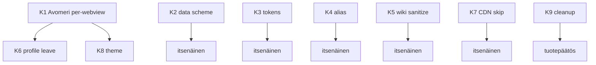

# Audit-korjaukset — toteutusspeksi

*Status: speksi valmis, koodia ei vielä muutettu.*  
*Lähde: tuotekerroksen audit (elokuu 2026).*  
*Sääntö: älä aloita toteutusta ennen kuin tämä speksi on hyväksytty; toteuta yksi korjaus kerrallaan PR:inä.*

Tämä dokumentti kuvaa **mitä** korjataan, **miksi**, **missä tiedostoissa**, **miten**, **mitä ei tehdä**, ja **miten testataan**.  
Ei koske upstream-Servo-ydintä (`components/script|layout|net` paitsi jos erikseen mainittu).

---

## Yhteenveto ja järjestys

| # | Korjaus | Vakavuus | Riski regresiolle | Arvioitu laajuus |
|---|---------|----------|-------------------|------------------|
| K1 | Avomeri per-webview + auto-leave | High | Keskitaso (UI/tilakone) | Medium |
| K2 | Rajaa `data:`-navigointi | High | Matala–keski (jos jokin polku käyttää `data:`) | Small |
| K3 | Whitelist-token TTL + satunnaisuus | High | Matala | Small |
| K4 | `resolve_address_alias` → EffectiveWhitelist | Medium | Matala | Small |
| K5 | Wiki-snapshot HTML-sanitointi | Medium | Matala | Medium |
| K6 | Profiilivaihto → `leave_avomeri_mode` | Medium | Matala | Tiny |
| K7 | CDN skip vain debugissa | Medium | Matala (dev-workflow) | Tiny |
| K8 | Avomeri-teema + sticky-flag konsistenssi | Low | Matala | Tiny |
| K9 | Siivous: Varustamo-gate / Seniori / legacy | Low | Matala | Medium (tuotepäätös) |

**Suositeltu toteutusjärjestys:** K1 → K2 → K3 → K6 → K4 → K5 → K7 → K8 → K9.

K1 ja K6 liittyvät samaan tilakoneeseen — K6 voidaan tehdä samassa PR:ssä kuin K1 tai heti sen jälkeen.

---

## Nykytila (lyhyt)

```
Navigointi sallittu jos:
  is_navigation_allowed(url)                    // whitelist + sisäiset skeemat
  TAI (AVOMERI_MODE && can_enter_avomeri())     // prosessi-laajuinen AtomicBool

Sisäiset skeemat (aina sallittu):
  about | data | servo                          // state.rs + lib.rs (duplikaatti)
```

Keskitin: `ports/servoshell/kotisatama.rs`  
Hookit: `running_app_state.rs` (`request_navigation`), `window.rs` (osoitepalkki / ensimmäinen sivu), `protocols/servo.rs` (`servo:`-reitit).

---

# K1 — Avomeri per-webview + auto-leave

## Ongelma

`AVOMERI_MODE` on **yksi** `static AtomicBool` (`kotisatama.rs` ~38–39, 457–468).  
`should_allow_navigation(webview, target)` **hylkää** `webview`-argumentin (`let _ = webview`).

Seuraus:

1. Käyttäjä avaa Avomeren välilehdessä A → `servo:avomeri/open` → `enter_avomeri_mode()`.
2. Välilehti B (Satama / Kela) voi silti navigoida whitelistin ulkopuolelle, koska tila on globaali.
3. Tila nollautuu vain `servo:avomeri/leave`-reitillä (`protocols/servo.rs` ~103–105).
4. Välilehden sulkeminen / Satama-URL:n lataus **ei** nollaa tilaa.

Tämä rikkoo Satama/Avomeri-metaforan ja Lapsi/Hopeakettu-turvallisuusmallin odotuksen (“Avomeri on tietoinen, rajattu tila”).

## Tavoitetila

| Sääntö | Käyttäytyminen |
|--------|----------------|
| Avomeri-tila on **per `WebViewId`** | Vain se webview, jossa `avomeri/open` ajettiin, saa avoimen verkon |
| Muut webview’t | Pysyvät Satamassa (vain whitelist + sisäiset) |
| Leave | Eksplisiittinen `servo:avomeri/leave` **tai** auto-leave (alla) |
| Profiili estää Avomeren | `can_enter_avomeri() == false` → ei voi asettaa tilaa; jos tila oli päällä, pakota leave (ks. K6) |

### Auto-leave-säännöt (pakolliset)

1. **Webview suljetaan** → poista id Avomeri-joukosta.
2. **Webview navigoi takaisin Satamaan** = top-level URL on whitelistattu **tai** sisäinen `servo:` / `about:` (ei Avomeri-gateway/open) → poista id Avomeri-joukosta.
3. **`servo:avomeri/leave`** → poista **kyseisen** webview’n id (ei kaikkia, ellei leave kutsuta ilman id:tä — sitten poista vain aktiivinen).

### Ei-tavoite (vältä yli-insinööröintiä)

- Ei Avomeri-tilaa erillisessä daemonissa / shared memoryssa.
- Ei “session cookie” -mallia HTML:ssä.
- Ei muutosta tuoteprofiilin `can_enter_avomeri`-logiikkaan tässä PR:ssä (paitsi K6-kutsu).

## API-muutos (ehdotus)

Korvaa nykyinen:

```rust
static AVOMERI_MODE: AtomicBool = AtomicBool::new(false);

pub fn enter_avomeri_mode() { ... }
pub fn leave_avomeri_mode() { ... }
pub fn avomeri_mode_enabled() -> bool { ... }

pub fn should_allow_navigation(webview: &WebView, target: &Url) -> bool {
    let _ = webview;
    check_url(target)
        || (avomeri_mode_enabled() && ProductProfile::current().can_enter_avomeri())
}
```

Uudella:

```rust
// Esim. Mutex<HashSet<WebViewId>> tai parking_lot; OnceLock + Mutex
static AVOMERI_WEBVIEWS: ...;

pub fn enter_avomeri_mode(webview: &WebView) { /* insert webview.id() */ }
pub fn leave_avomeri_mode(webview: &WebView) { /* remove webview.id() */ }
pub fn leave_avomeri_mode_all() { /* clear — vain hätä/profiilivaihto */ }
pub fn avomeri_mode_enabled_for(webview: &WebView) -> bool { /* contains id */ }

pub fn should_allow_navigation(webview: &WebView, target: &Url) -> bool {
    check_url(target)
        || (avomeri_mode_enabled_for(webview)
            && ProductProfile::current().can_enter_avomeri())
}

/// Kutsu on_allowed_navigation / load_url_or_blocked -polusta:
/// jos target on Satama (whitelist tai sisäiset ei-avomeri), leave tälle webview’lle.
pub fn maybe_auto_leave_avomeri(webview: &WebView, loaded_url: &Url) { ... }
```

### Apufunktio: milloin URL on “Satama” auto-leaveä varten

```text
is_satama_document(url):
  - scheme in {about, servo} JA path EI ole avomeri / avomeri/open
  - TAI is_navigation_allowed(url) == true (whitelist-host)
  - data: → EI pidetä Satamana eikä Avomerena (K2 päättää erikseen)
```

Avomeri-gateway (`servo:avomeri`) **ei** jätä Avomeri-tilaa päälle eikä poista sitä — se on porttisivu.  
`avomeri/open` asettaa tilan **ennen** redirectiä ulkoiseen hakuun.

## Tiedostot

| Tiedosto | Muutos |
|----------|--------|
| `ports/servoshell/kotisatama.rs` | Tilavarasto, API, `should_allow_navigation`, auto-leave-apuri |
| `ports/servoshell/protocols/servo.rs` | `avomeri/open` ja `avomeri/leave` aktiiviselle webview’lle (C) |
| `ports/servoshell/running_app_state.rs` | `notify_closed` → leave; `request_navigation` → auto-leave Satamaan |
| `ports/servoshell/window.rs` | **Ei** ensimmäisen sivun muutosta — `check_url` säilyy (uusi webview ei ole Avomeri-moodissa) |
| `oppiminen/kotisatama/navigointi.md` | Päivitä Avomeri-kuvaus |
| `docs/Avomeri-konsepti.md` | Jos kuvaa globaalia tilaa, korjaa |

## Toteutusrajat ja regressiot (tarkastettu 2026-08-21)

| Huomio | Ratkaisu |
|--------|----------|
| `notify_closed(webview)` (`running_app_state.rs` ~831) kutsuu `close_webview` | Auto-leave hook **tähän**, ei uuteen close-pathiin |
| `UserInterfaceCommand::CloseWebView` → `window.close_webview(id)` | Johtaa lopulta `notify_closed`-polkuun — ei erillistä leaveä |
| Ensimmäinen sivu (`window.rs` ~126–132) käyttää `check_url`, ei Avomeriä | **Pidä** — uusi webview ei ole Avomeri-moodissa |
| `should_allow_navigation` on nyt per-webview | `request_navigation` (~974) välittää jo oikean webview’n — päivitä kutsu |
| `kotisatama.rs` ~38: `static AVOMERI_MODE` | Korvaa `Mutex<HashSet<WebViewId>>` tai vastaava; ei `AtomicBool` |
| WebDriver / moni-ikkuna | Auto-leave ei riko; `leave_avomeri_mode_all()` vain K6 |

### Protocol-handler-haaste

`ResourceProtocolHandler` / `servo.rs`-reitit saavat `Request`, eivät välttämättä suoraan `WebView`-kahvaa. Toteutusvaihtoehdot (valitse yksi, dokumentoi PR:ään):

**A:** Thread-local / “pending Avomeri enter for next navigation” -lippu, jonka `load_url_or_blocked` / `request_navigation` kuluttaa aktiivisen webview’n id:llä.

**B:** Laajenna protocol-handlerin kontekstia niin, että webview id kulkee mukana (isompi Servo/servoshell-muutos — vältä jos A riittää).

**C (suositeltu v1):** `avomeri/open` asettaa tilan **aktiiviselle** webview’lle (`RunningAppState` / window active id). Desktopilla ja Androidilla “active” on yleensä oikea; dokumentoi rajoite (race jos kaksi tabia avaa samaan aikaan). **Toteutus yhdessä auto-leaven kanssa** (alla) estää tilan tarttumisen väärään tabiin pysyvästi — jos polku koskettaa Satamaa tai tabi sulkeutuu, tila lähtee.

**Toteutus speksissä v1:** **C + auto-leave**. Jos myöhemmin tarvitaan tarkempi konteksti (esim. monta rinnakkaista avomeri/openia), siirry A:han.

```text
avomeri/open:
  1. if !can_enter_avomeri → redirect error
  2. enter_avomeri_mode_for_active_webview()   // C
  3. redirect ulkoiseen hakuun

avomeri/leave:
  1. leave_avomeri_mode_for_active_webview()
  2. redirect servo:newtab
```

### Auto-leave: tarkka toteutuspaikka

Auto-leave ei riitä vain `load_url_or_blocked`-kutsussa, koska linkkiklikit kulkevat `request_navigation`-hookin kautta. Toteuta:

| Paikka | Toiminto |
|--------|----------|
| `running_app_state.rs` `notify_closed(webview)` (~831) | `leave_avomeri_mode(webview)` — kattaa UI-close + engine-close |
| `running_app_state.rs` `request_navigation` (~972) | Ennen allow: jos `avomeri_mode_enabled_for(webview)` JA `is_satama_document(target)` JA `!is_avomeri_gateway/open(target)` → `leave_avomeri_mode(webview)` |
| `load_url_or_blocked` | Sama auto-leave-tarkistus ennen latausta |
| `servo:avomeri/leave` | `leave_avomeri_mode(active_webview)` (C) |

Ei erillistä `close_webview`-patchea `window.rs`:ään — `notify_closed` kattaa.

### Kommenttikorjaus (liittyvä, ei bugi)

`running_app_state.rs` ~970 kommentti sanoo “estetty → data: blokkaussivu” — vanhentunut; nykyinen on `servo:blocked`. Päivitä kun kosket aluetta.

## Testit

Yksikkö / integraatio (uusi testimoduuli `kotisatama` tilalle tai whitelist-crateen ei tarvita — testaa `kotisatama.rs`-logiikkaa eristetyllä `HashSet`-API:lla jos puretaan `WebViewId`-riippuvuus):

| # | Case | Odotus |
|---|------|--------|
| T1 | enter(id=1); allow non-whitelist for id=1 | true |
| T2 | enter(id=1); allow non-whitelist for id=2 | false (ellei whitelist) |
| T3 | enter(id=1); leave(id=1); allow non-whitelist id=1 | false |
| T4 | enter(id=1); auto-leave kun load https://kela.fi (whitelist) | tila pois |
| T5 | enter(id=1); close webview 1 | tila pois |
| T6 | Lapsi + enter yritys | tila ei aseteta |
| T7 | enter(id=1); navigate to `servo:avomeri` (gateway) | tila säilyy (porttisivu ei triggeröi auto-leaveä) |
| T8 | enter(id=1); navigate to `servo:haku` | tila pois (Satama-sisäinen) |

Manuaali:

1. Desktop 2 välilehteä: A Avomeri, B Kela — B:ssä `https://example.com` → blocked.
2. A:ssa leave → A:ssa example.com → blocked.
3. Sulje Avomeri-välilehti ilman leave → uusi navigointi muissa tabeissa blocked.

## Hyväksyntäkriteerit

- [ ] Ei prosessinlaajuista “kaikki tabit avoimia”-tilaa.
- [ ] Dokumentaatio (`navigointi.md`) päivitetty.
- [ ] Vanha `avomeri_mode_enabled()` joko poistettu tai deprecated wrapperiksi `active_webview`-kyselyyn (älä jätä hiljaista globaalia lippua).

---

# K2 — Rajaa `data:`-navigointi

## Ongelma

`is_internal_navigation_url` (`whitelist/src/state.rs` ~217–218 ja `lib.rs` ~127–128):

```rust
matches!(url.scheme(), "about" | "data" | "servo")
```

Kaikki `data:`-navigoinnit ohittavat whitelistin. Whitelistattu sivu voi ohjata esim.:

```text
data:text/html,<script>…</script>
```

Lisähuomio: `is_blocked_page` (`kotisatama.rs` ~357–362) sisältää yhä:

```rust
|| current_location.starts_with("data:text/html")
```

Tämä viittaa vanhaan polkuun jossa blocked-sivu saattoi olla `data:`-URL. Nykyinen blocked on `servo:blocked`. `data:text/html`-haara on legacy ja sekoittaa raportointinappilogiikkaa.

## Tavoitetila

| Skeema | Navigointi |
|--------|------------|
| `about:` | Sallittu (kuten nyt) |
| `servo:` | Sallittu (kuten nyt) |
| `data:` | **Oletuksena kielletty** top-level navigaatiossa |
| Poikkeukset | Ei poikkeuksia v1:ssä, ellei löydy aktiivista tuotantopolkua joka vaatii `data:` |

### Tutkimus ennen koodia (pakollinen checklist toteutuksessa)

Etsi repossa (ja sisarusrepoissa jos tarpeen) aktiiviset top-level `data:`-lataukset:

```text
rg "data:text/html" ports/servoshell components/kotisatama resources
rg "data:" ports/servoshell/kotisatama.rs ports/servoshell/window.rs
```

Jos löytyy vain legacy / testit → poista `data` sisäisten listasta kokonaan.

### Löydetyt `data:`-riippuvuudet (tarkastus 2026-08-21)

| Paikka | Merkitys K2:lle |
|--------|-----------------|
| `ports/servoshell/kotisatama.rs:361` | `is_blocked_page` legacy `data:text/html`-haara — poistetaan |
| `ports/servoshell/running_app_state.rs:970` | Kommentti “estetty → data:” — vanhentunut, korjataan `servo:blocked` |
| `ports/servoshell/test.rs:107–115` | CLI-testi `data:text/html,a` — ei navigointiportti, mutta tarkista ettei riko |
| `components/kotisatama/report/src/lib.rs:263` | `data:` hyväksytään konteksti-URL:ksi — ei top-level navigointi, ei K2-vaikutusta |
| `resources/resource_protocol/kotisatama-i18n.js` | Merkkijono “Adressdata:” — ei URL |

**Päätös:** tuotantokoodissa ei löytynyt aktiivista top-level `data:`-polkua. Poista `data` sisäisten skeemojen listasta.

## API-muutos (K2)

Yhdistä duplikaatti: **yksi** `is_internal_navigation_url` (exportoi `state`-moduulista tai `lib.rs`:stä, älä pidä kahta kopiota).

Ehdotus:

```rust
fn is_internal_navigation_url(url: &Url) -> bool {
    matches!(url.scheme(), "about" | "servo")
    // data: EI enää
}
```

Ja `is_blocked_page`:

```rust
url.scheme() == "servo" && url.path() == "blocked"
// poista data:text/html -haara
```

## Tiedostot

| Tiedosto | Muutos |
|----------|--------|
| `components/kotisatama/whitelist/src/state.rs` | Poista `data` |
| `components/kotisatama/whitelist/src/lib.rs` | Poista `data` + päivitä testit |
| `ports/servoshell/kotisatama.rs` | `is_blocked_page` |
| Unit-testit whitelistissä | `data:text/html,...` → **ei** sallittu; `about:blank` ja `servo:blocked` → sallittu |

## Testit

| # | URL | Odotus |
|---|-----|--------|
| T1 | `about:blank` | allowed |
| T2 | `servo:haku` | allowed |
| T3 | `data:text/html,hi` | **denied** |
| T4 | `data:image/png;base64,...` top-level | **denied** (aliresurssit eivät kulje tätä polkua) |
| T5 | `https://kela.fi` whitelistissa | allowed |

Huom: aliresurssit (``) eivät käytä `is_navigation_allowed` — niitä ei pidä sekoittaa tähän korjaukseen.

## Hyväksyntäkriteerit

- [ ] Top-level `data:` ei ohita Satamaa.
- [ ] Duplikaatti `is_internal_navigation_url` poistettu tai synkattu yhteen funktioon.
- [ ] `is_blocked_page` ei enää tunnista satunnaista `data:text/html`-sivua blocked-sivuksi.

---

# K3 — Whitelist-token TTL + satunnaisuus

## Ongelma

`protocols/servo.rs` ~514–571:

- Token = `{nanos:x}-{count:x}` (ennustettava).
- `HashMap` ilman vanhenemista / kokorajoitusta.
- Hylätty confirm jättää tokenin voimaan kunnes joku käyttää oikean domain+action -parin (tai token jää ikuisesti jos ei koskaan commitoida — itse asiassa `take` poistaa vain oikealla tokenilla; väärä action/domain palauttaa `None` **mutta** nykykoodi tekee `remove` ensin ja jos mismatch, token **häviää** ilman commitia — hyvä. Ongelma on käyttämättömät tokenit jotka odottavat oikeaa commit-URL:ia ikuisesti).

CSRF-malli on muuten järkevä (kaksivaiheinen add/remove). Puutteet: TTL, entropia, max-koko.

## Tavoitetila

```rust
struct PendingWhitelistChange {
    action: &'static str,
    domain: String,
    return_url: Option<String>,
    created_at: Instant,  // tai SystemTime
}

const TOKEN_TTL: Duration = Duration::from_mins(10); // 5–15 min OK
const MAX_PENDING: usize = 64;

fn new_token() -> String {
    // 32 bytea CSPRNG → hex tai base64url
}
```

`register_pending_whitelist_change`:

1. Generoi satunnainen token.
2. Prune vanhentuneet.
3. Jos `len() >= MAX_PENDING`, poista vanhin (FIFO) tai hylkää uusi rekisteröinti soft-errorilla.
4. Insert.

`take_pending_whitelist_change`:

1. Prune.
2. Remove token.
3. Jos expired → `None` (sama kuin invalid).
4. Action/domain match kuten nyt.
5. Commit-polussa säilytä nykyinen `is_navigation_allowed`-uudelleentarkistus redirectissä.

### Epäonnistunut commit ylläpitää TTL:ää (tärkeää)

Jos `take` kutsutaan väärällä domainilla tai actionilla, token **poistetaan** mapista jo nyt (nykyinen käytös). Säilytä tämä — mutta lisää TTL-prune **myös take-polkuun**, jotta vanhat tokenit eivät kasaannu vaikka niitä ei koskaan yritettäisi käyttää.

## Tiedostot

| Tiedosto | Muutos |
|----------|--------|
| `ports/servoshell/protocols/servo.rs` | Token-rakenne, register/take, prune |
| Ei crate-riippuvuutta jos `getrandom` / `rand` jo workspaceissa — käytä olemassa olevaa CSPRNG:ää |

## Testit

| # | Case | Odotus |
|---|------|--------|
| T1 | register → take oikeilla arvoilla heti | Some |
| T2 | register → odota > TTL → take | None |
| T3 | register A → take väärällä domainilla | None (ja token ei saa jäädä hyväksyttäväksi) |
| T4 | 100 registeriä | map ≤ MAX_PENDING |

(Unit-testi: extractaa token-logiikka `#[cfg(test)]`-moduliin tai `pub(crate)`-funktioihin testattavaksi ilman HTTP:tä.)

## Hyväksyntäkriteerit

- [ ] Token ≥ 128 bittiä entropiaa.
- [ ] TTL pakollinen.
- [ ] Map ei kasva rajatta.

---

# K4 — `resolve_address_alias` → EffectiveWhitelist

## Ongelma

`kotisatama.rs` ~472–496 lataa `WhitelistDocument::load_from_path(&whitelist_base_path())` diskiltä.  
Navigointi käyttää `EffectiveWhitelist` = kuratoitu ∪ käyttäjän overlay (`state.rs`).

Seuraus: käyttäjän `servo:whitelist`-lisäys (esim. domain `esimerkki.fi`, label “Esimerkki”) **ei** resolvaudu aliasiksi `esimerkki` osoitepalkissa, vaikka navigointi URL:iin toimisi.

## Tavoitetila

```rust
pub fn resolve_address_alias(input: &str) -> Option<Url> {
    let query = input.trim().to_ascii_lowercase();
    if query.is_empty() || query.contains(char::is_whitespace) || query.contains('.') {
        return None;
    }

    // 1) Kuratoitu dokumentti muistista
    if let Some(document) = curated_document() {
        let profile = effective_whitelist_profile();
        if let Some(url) = find_alias_in_entries(document.entries_for_profile(&profile), &query) {
            return Some(url);
        }
    }

    // 2) Käyttäjän overlay: label tai domainin ensimmäinen label
    for entry in user_entries() {
        let label_ok = entry.label.as_deref()
            .is_some_and(|l| l.trim().eq_ignore_ascii_case(&query));
        let domain_alias = entry.domain.split('.').next().unwrap_or_default();
        if label_ok || domain_alias.eq_ignore_ascii_case(&query) {
            // UserWhitelistEntry:llä ei ole navigation_url() — rakenna https://{domain}/
            return Url::parse(&format!("https://{}/", entry.domain)).ok();
        }
    }
    None
}
```

Alias-match-säännöt **pidetään samoina** kuin nyt (label ignore-case TAI domainin eka osa). Älä laajenna fuzzy-hakuun tässä PR:ssä.

Jos `curated_document()` on `None` (whitelist ei init), alias → `None` (fail-closed, haku voi silti tarjota tuloksia).

**Ei uutta whitelist-API:a** — `user_entries()` on jo public (`state.rs` ~190). Rakenna URL suoraan domainista.

## Tiedostot

| Tiedosto | Muutos |
|----------|--------|
| `ports/servoshell/kotisatama.rs` | `resolve_address_alias` |
| Mahdollisesti `whitelist` public API | jos `user_entries` + navigation_url tarvii pientä apufunktiota |
| `oppiminen/kotisatama/navigointi.md` | Mainitse overlay-alias |

## Testit

| # | Case | Odotus |
|---|------|--------|
| T1 | curated `kela.fi` | `kela` → kela URL |
| T2 | user overlay `example.com` label “Esimerkki” | `esimerkki` → URL |
| T3 | user overlay ilman labelia | `example` → URL |
| T4 | whitespace / pisteellinen syöte | None |

## Hyväksyntäkriteerit

- [ ] Alias ja `is_navigation_allowed` käyttävät samaa efektiivistä lähdettä.
- [ ] Ei uutta disk-I/O:ta jokaisella Enterillä.

---

# K5 — Wiki-snapshot HTML-sanitointi

## Ongelma

`wrap_wiki_snapshot` (`kotisatama.rs` ~782–800) upottaa `article_html` sellaisenaan.  
Slug-polku on suojattu (`..`, `/`, `\`), mutta **tiedoston sisältö** luotetaan.

Uhkamalli: kompomoitu CDN / paikallinen `index-data/snapshots-*/articles/*.html` → XSS `servo:wiki`-kontekstissa.

## Tavoitetila (v1 — pragmatismi)

Ei täyttä HTML-sanitizer-cratea ellei workspace jo sisällä sopivaa. Minimibarrieri:

1. Poista / tyhjennä: `<script…>…</script>`, `<iframe…>`, `<object…>`, `<embed…>`.
2. Poista event-handler-attribuutit: `on\w+\s*=`.
3. Neutraloi `javascript:`-URL:t `href`/`src`-attribuuteissa.
4. Säilytä nykyinen CSS joka disabloi `a[href^="http"]` pointer-events (puolustus syvyydessä).
5. Escapea `slug` otsikossa (jo tehty `html_escape_minimal`).

Vaihtoehto B (vahvempi, isompi): crate `ammonia` / `html5ever` allowlist — vain jos tiimi hyväksyy riippuvuuden.

**Suositus:** v1 = kevyt strip (regex/simple parser) + dokumentoi “ei sandbox-iframe”; v2 = ammonia jos tarvitaan.

## Tiedostot

| Tiedosto | Muutos |
|----------|--------|
| `ports/servoshell/kotisatama.rs` | `sanitize_wiki_snapshot_html` ennen wrap |
| Unit-testit | script-tagi poistuu; harmiton `<p>` säilyy |

## Testit

| # | Input | Odotus |
|---|-------|--------|
| T1 | `<p>Hei</p>` | säilyy |
| T2 | `<script>alert(1)</script><p>x</p>` | ei scriptiä |
| T3 | `<a href="javascript:alert(1)">` | href neutraloitu |
| T4 | `` | onerror poissa |

## Hyväksyntäkriteerit

- [ ] Snapshot-HTML ei aja skriptejä typillisissä XSS-vektoreissa.
- [ ] Ulkoiset http-linkit edelleen CSS-disabloituina.

---

# K6 — Profiilivaihto → leave Avomeri

## Ongelma

`profile/set` (`servo.rs` ~401–409) hot-reloadaa whitelistin mutta **ei** kutsu `leave_avomeri_mode`.  
Turva nojaa siihen, että `should_allow_navigation` vaatii myös `can_enter_avomeri()`. Jos Lapsi-profiiliin vaihdetaan Avomeri-tilan ollessa `true`, avoin verkko estyy — mutta lippu jää päälle. Kun vaihdetaan takaisin Normaaliin, Avomeri voi olla **yhä päällä ilman uutta vahvistusta**.

## Tavoitetila

```text
profile/set success && profile_changed:
  1. reload whitelist (nykyinen)
  2. leave_avomeri_mode_all()   // K1:n API
```

Lisäksi: jos `!can_enter_avomeri()` missä tahansa enter-polussa, clear (puolustus).

## Tiedostot

| Tiedosto | Muutos |
|----------|--------|
| `ports/servoshell/protocols/servo.rs` | profile/set |
| `ports/servoshell/kotisatama.rs` | `leave_avomeri_mode_all` (K1) |

## Testit

| # | Case | Odotus |
|---|------|--------|
| T1 | Avomeri on → vaihda Lapsi → vaihda Normaali | ei avointa verkkoa ilman uutta `avomeri/open` |

## Hyväksyntäkriteerit

- [ ] Profiilivaihto ei “muista” vanhaa Avomeri-vahvistusta.

---

# K7 — CDN skip vain debugissa

## Ongelma

`skip_integrity_check()` (`search/src/cdn_integrity.rs` ~44–53) kunnioittaa `KOTISATAMA_CDN_SKIP_INTEGRITY` **kaikissa** buildeissa.  
`cdn.rs` varoittaa logissa, mutta release-APK:ssa lippu voidaan asettaa vahingossa / haitallisesti.

Dokumentaatio (`TURVALLISUUS-PROFIILIT.md`, `cratet.md`) sanoo jo “vain kehitys”.

`KOTISATAMA_CDN_SKIP_INTEGRITY` käytetään **kahdessa** paikassa — molemmat hyötyvät K7:stä:

| Paikka | Käyttäytyminen nyt | K7:n jälkeen |
|--------|-------------------|--------------|
| `cdn.rs` `sync_from_cdn` (~65) | Log-varoitus, jatkuu | Debugissa sama; releasessa ei pääse tänne skipillä |
| `cdn.rs` `cached_whitelist_path` (~78) | Ohittaa manifest+hash | Debugissa sama; releasessa palauttaa `None` ellei manifest OK |

## Tavoitetila

```rust
pub fn skip_integrity_check() -> bool {
    if !cfg!(debug_assertions) {
        return false; // release: ei koskaan
    }
    // ... nykyinen env-tarkistus
}
```

Vaihtoehto: salli skip releasessa vain jos **lisäksi** `cfg!(feature = "kotisatama-dev")` — turha jos debug_assertions riittää.

## Tiedostot

| Tiedosto | Muutos |
|----------|--------|
| `components/kotisatama/search/src/cdn_integrity.rs` | `skip_integrity_check` |
| Unit-testi | dokumentoi käyttäytyminen; release-testi vaikea CI:ssä ilman dual-build |

## Hyväksyntäkriteerit

- [ ] Release-binary ei ohita integriteettiä envillä.
- [ ] Dev (`debug_assertions`) säilyttää skipin.

---

# K8 — Avomeri-teema konsistenssi

## Ongelma

`current_theme` (`kotisatama.rs` ~828–838) palauttaa Avomeri-teeman vain jos URL on Avomeri-**gateway**.  
Kun käyttäjä on jo avoimessa verkossa (`avomeri_mode` + qwant.com), chrome näyttää **Satama**-teeman.

Kutsuja tällä hetkellä (`desktop/gui.rs` ~436): `current_theme(&current_location, None)` — ei webview-kontekstia. K1:n jälkeen tarvitaan aktiivinen webview.

## Tavoitetila

```rust
pub fn current_theme(
    location: &str,
    last_search: Option<&SearchOutcome>,
    webview: &WebView,   // tai aktiivinen id
) -> KotisatamaTheme {
    if matches!(last_search, Some(SearchOutcome::Error(_))) {
        return KotisatamaTheme::Myrsky;
    }
    if avomeri_mode_enabled_for(webview) || is_avomeri_gateway(url) {
        return KotisatamaTheme::Avomeri;
    }
    KotisatamaTheme::Satama
}
```

Jos webview’ä ei ole helposti saatavilla GUI-pisteessä, käytä `active_webview`-hakua `window.rs` / `running_app_state.rs` kontekstissa.

## Tiedostot

| Tiedosto | Muutos |
|----------|--------|
| `ports/servoshell/kotisatama.rs` | `current_theme` signature |
| `ports/servoshell/desktop/gui.rs` | kutsu päivitetty (~436) |

## Hyväksyntäkriteerit

- [ ] Avomeri-selaustilassa toolbar/tausta näyttää Avomeri-teeman.
- [ ] Gateway-sivu edelleen Avomeri-teemalla.

---

# K9 — Siivous (tuotepäätökset ensin)

Nämä **eivät** ole bugikorjauksia. Tee vasta kun tuoteomistaja vastaa:

| Kysymys | Jos “parkkiin” | Jos “käyttöön” |
|---------|----------------|----------------|
| Varustamo? | Feature-gate crate pois default-depsistä / älä rekisteröi reittejä | Poista “parkkeerattu”-logiikka, dokumentoi onboarding |
| Seniori? | Poista `ProductProfile::Seniori` kunnes persistointi valmis **tai** lisää `Profile::Seniori` | Toteuta persistointi + UI |
| Legacy `Whitelist` / `init_empty`? | `#[deprecated]` + poista seuraavassa siivous-PR:ssä | — |

Älä sekoita K9:ää K1–K3-PR:iin.

---

## Yhteiset toteutusohjeet

1. **Kommentit:** `// KOTISATAMA-PATCH: … — 中文` (`AGENT.md`).
2. **Ei upstream-kosketusta** ilman erillistä speksiä.
3. **Yksi korjaus / PR** (K1+K6 OK yhdessä).
4. **Päivitä** `oppiminen/kotisatama/navigointi.md` kun navigointipolitiikka muuttuu.
5. **Älä** “paranna” samalla Varustamoa, hakua, adblockia.
6. Ennen mergeä: manuaalinen smoke Windowsilla (2 tabia + Avomeri + blocked + alias).

---

## Riippuvuudet korjausten välillä



---

## Hyväksyntä

| Rooli | Mitä hyväksyy |
|-------|----------------|
| Arkkitehti / ylläpitäjä | Tämä speksi (erityisesti K1 vaihtoehto C vs A) |
| Tuote | K9 Varustamo/Seniori |
| Toteuttaja | PR checklist per korjaus |

**Seuraava askel speksin hyväksynnän jälkeen:** toteuta K1 (+ K6) erillisessä branchissa; älä aloita K2–K9 samaan commit-sarjaan.
