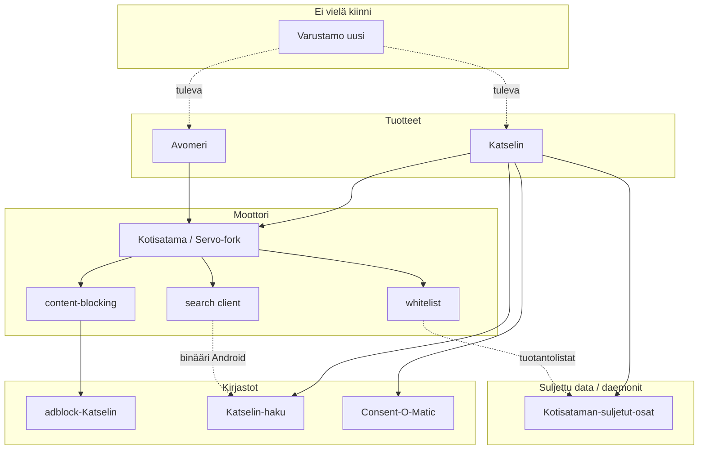

# Kotisatama-ekosysteemi — mitä on missäkin

*Päivitetty: elokuu 2026*

Tämä dokumentti on kartta koko `C:\Users\gigli\Kotisatama\`-puulle.
**Tämä repo (`Kotisatama/Kotisatama`) on moottori.** Tuotteet, datat ja sivuosat
elävät sisarusrepoissa. Älä sekoita moottoria tuotenimeen.

---

## Lyhyt vastaus

| Kansio | Rooli | Avoimuus | Integraatiotilanne |
|--------|-------|----------|-------------------|
| **Kotisatama** (tämä) | Servo-forkki: renderöinti + Kotisatama-Rust-kerros | Avoin (MPL), bisneslogiikka erillään | Kaikki kiinnittyy tähän |
| **Katselin** | Suljettu tuoteselain (Android-shell, orkestrointi) | Suljettu | Käyttää moottoria + adblock + haku + consent |
| **Avomeri** | Avoimen lähdekoodin tuoteselain | Avoin (MPL) | Käyttää moottoria + adblock; ei whitelist/hakua |
| **adblock-Katselin** | Brave adblock-rust -forkki | Avoin (MPL) | Integroitu moottoriin; molemmat selaimet |
| **Katselin-haku** | Meilisearch Android-portti | Avoin (Meilisearch-lisenssi) | Katselin käyttää |
| **Katselin-Consent-O-Matic** | Evästebannerien automatiikka | Avoin (upstream Consent-O-Matic) | Katselin käyttää |
| **Kotisataman-suljetut-osat** | Valkoiset sivut, vanha Varustamo, Pulloposti, Missä olen | Suljettu | Katselin bundlaa / syncaa |
| **Varustamo** | Uusi Freenet-pohjainen sovellusvarasto | (oma repo) | **Ei vielä integroitu** |
| **Katselin.fi** | Julkinen sivusto ja tuotedokumentaatio | Julkinen | Ei build-riippuvuus |

```
Kotisatama/                          ← sisaruscheckout-juuri
├── Kotisatama/                      ← MOOTTORI (Servo-forkki) ← olet tässä
├── Katselin/                        ← suljettu tuote (Android APK + orkestrointi)
├── Avomeri/                         ← avoin tuote (Android APK)
├── adblock-Katselin/                ← mainosten-/seurannanesto (path-dep)
├── Katselin-haku/                   ← Meilisearch Androidille
├── Katselin-Consent-O-Matic/        ← eväste-esto (JS)
├── Kotisataman-suljetut-osat/       ← whitelist-data + vanhat suljetut appit
├── Varustamo/                       ← uusi Varustamo (ei vielä kiinni)
└── Katselin.fi/                     ← katselin.fi -sivusto
```

---

## Nimien kaksi merkitystä (älä sekoita)

### Kotisatama

| Merkitys | Missä |
|----------|--------|
| **Moottorirepo** | Tämä Git-repo: Servo-forkki + `components/kotisatama/` |
| **Tuotekäsite** | Turvallinen etusivu / satamatila UI-sanastossa |

Historiallinen tuotenimi oli Kotisatama; tuotebrändi on nyt **Katselin**.
Tekniset polut, crate-nimet ja `KOTISATAMA_*`-ympäristömuuttujat säilyvät.

### Avomeri

| Merkitys | Missä |
|----------|--------|
| **Tuote** | Repo `Avomeri/` — avoimen verkon Android-selain |
| **Selaustila** | Käsite moottorissa/Katselimessa: whitelistin ulkopuolinen verkko (`servo:avomeri`, Avomeri-moodi) |

Avomeri-tuote **ei** käytä Satama-whitelistia. Katselimen Avomeri-tila on erillinen
UX-konsepti saman moottorin päällä.

### Varustamo

| Merkitys | Missä |
|----------|--------|
| **Moottoricrate** | `components/kotisatama/varustamo/` — rekisteri + `servo:varustamo` |
| **Vanha suljettu osa** | `Kotisataman-suljetut-osat/varustamo/` — poistuva muoto |
| **Uusi repo** | `Varustamo/` — Freenet-client + sovellusvälilehdet; **ei vielä integroitu** |

---

## Moottori (tämä repo)

**Tehtävä:** renderöidä web Servolla ja tarjota Kotisatama-tuotekerros
(whitelist, haku-client, content-blocking, sisäiset `servo:`-sivut, JNI).

### Missä oma koodi elää

| Polku | Tehtävä |
|-------|---------|
| `components/kotisatama/*` | Kaikki omat Rust-cratet |
| `ports/servoshell/` | Embedder-hookit (`kotisatama.rs`, navigointi, UI) |
| `ports/servoshell/egl/android/` | Android JNI |
| `resources/resource_protocol/` | Sisäiset HTML-sivut (`servo:haku`, `servo:blocked` …) |
| `config/` | Whitelist-skeema + esimerkki (ei tuotantolistaa) |
| `crawler/` | Indeksointi → Meilisearch-dump (CI) |
| `docs/`, `oppiminen/` | Dokumentaatio |

**Älä muokkaa** Servo-upstream-hakemistoja (`components/script/`, `net/`, `layout/` …)
ilman minimaalista `KOTISATAMA-PATCH`-merkintää. Katso [AGENT.md](../AGENT.md).

### Omat cratet (lyhyt)

| Crate | Tekee |
|-------|--------|
| `whitelist` | Navigoinnin sallinta, profiilit, käyttäjän overlay |
| `search` | Meilisearch HTTP-client + subprocess + CDN |
| `content-blocking` | Adapteri `adblock-Katselin`-forkin ympärillä |
| `report` | Ilmoitukset / fallback-haku-telemetria |
| `varustamo` | Luotettujen sovellusten rekisteri (UI-sivu) |
| `pulloposti` / `missa-olen` | Subprocess-clientit (daemonit suljetussa repossa) |
| `subprocess-app` | Yhteinen prosessinhallinta |
| `i18n` | FI/SV UI-tekstit |

Yksityiskohdat: [oppiminen/kotisatama/cratet.md](../oppiminen/kotisatama/cratet.md).

### Mitä moottori **ei** ole

- Ei ole Katselin-APK:n Gradle-projektin koti (se on `Katselin/android/apk`).
- Ei sisällä tuotannon whitelist-domaineja (ne ovat suljetussa repossa).
- Ei sisällä Pulloposti-/Missä olen -salauslogiikkaa (vain HTTP-client).
- Ei ole Avomeri-tuotteen brändi- tai shell-koodi (se on `Avomeri/`).

---

## Tuotteet

### Katselin (suljettu)

**Repo:** `../Katselin`

Suljetun lähdekoodin tuoteselain. Orkestroi Android-buildin, bundlaa assetit
(whitelist, wiki, consent-JS) ja kutsuu moottorin `mach`-buildia.

- Moottori: sisaruscheckout `../Kotisatama` (tai submodule)
- Adblock: moottorin `content-blocking` → `adblock-Katselin`
- Haku: `Katselin-haku` (Meilisearch Androidille)
- Evästeet: `Katselin-Consent-O-Matic` → JS asset APK:ssa
- Data: sync `Kotisataman-suljetut-osat` → APK assets

Katso Katselin-repon `AGENT.md` ja `docs/REPO-JAKO-SUUNNITELMA.md`.

### Avomeri (avoin tuote)

**Repo:** `../Avomeri`

Avoimen lähdekoodin Android-selain samalla moottorilla. **Ei patchaa moottoria
Avomeria varten.** Käyttää avointa verkkoa (`servo:avomeri/open`), Qwant-hakua
ja adblockia. Ei valkoisia sivuja, ei Meilisearchia, ei Hopeakettu/Lapsi-profiileja.

Alustakorjaukset: ensin Avomeriin → todettu OK → dokumentoidusti Katseliniin.

---

## Jaetut kirjastot

### adblock-Katselin

Brave `adblock-rust` -forkki. Moottori riippuu siitä path-depillä:

```toml
# components/kotisatama/content-blocking/Cargo.toml
adblock = { path = "../../../../adblock-Katselin", ... }
```

Molemmat tuoteselaimet saavat eston moottorin kautta. Älä vaihda crates.io-upstreamiin
ilman erillistä päätöstä.

### Katselin-haku

Meilisearchin Android-portti (NDK / bionic). Moottorin `kotisatama-search` on
vain client; binääri/kirjasto tulee täältä Katselin-buildiin.

### Katselin-Consent-O-Matic

Consent-O-Matic -forkki. Katselin injektoi/bundlaa JS:n (`consent-o-matic.js`).
Ei ole Rust-crate moottorissa.

---

## Suljetut osat ja Varustamo

### Kotisataman-suljetut-osat

| Alaosio | Sisältö |
|---------|---------|
| `valkoiset-sivut/` | Tuotannon whitelistit, offline-wiki -data |
| `varustamo/` | **Vanha** Varustamo-muoto (poistuva) |
| `Pulloposti/` | Pulloposti-daemon (salaus/BLE) |
| `Missa-olen/` | Missä olen -daemon |

Julkisessa moottorirepossa on skeema + esimerkki + client-cratet.
Tuotantodomainit ja daemon-toteutukset pysyvät täällä.

### Varustamo (uusi, erillinen repo)

**Repo:** `../Varustamo`

Uusi Freenet-pohjainen sovellusvarasto (sovellus = Varustamo-välilehti).
Suunniteltu Katselinille ja Avomerille. **Ei vielä kytketty moottoriin eikä
tuoteshelleihin.** Kun integroidaan, vanha suljetun repon `varustamo/` väistyy.

---

## Julkinen sivusto

**Repo:** `../Katselin.fi` → [katselin.fi](https://katselin.fi)

Filosofia, Majakka (ohjeet), kehittäjäsivut. Ei build-riippuvuus moottorista.
Tuote- ja käyttäjäviestinnän kanoninen paikka; tämä `docs/` on kehityskartta.

---

## Riippuvuuskaavio



---

## Mihin mennä kun…

| Tarve | Repo / polku |
|-------|----------------|
| Whitelist-logiikka / navigointihook | Tämä: `components/kotisatama/whitelist`, `ports/servoshell` |
| Mainosesto | `adblock-Katselin` + `components/kotisatama/content-blocking` |
| Android UI / APK (Katselin) | `../Katselin/android/apk` |
| Android UI / APK (Avomeri) | `../Avomeri/android/apk` |
| Tuotannon domain-lista | `../Kotisataman-suljetut-osat/valkoiset-sivut` |
| Meilisearch Android | `../Katselin-haku` |
| Evästebannerit | `../Katselin-Consent-O-Matic` |
| Uusi Freenet-Varustamo | `../Varustamo` (ei integroitu) |
| Servo-yhteensopivuus (Kela ym.) | Tämä: Telakka / upstream-korjaukset |
| Julkinen ohjeistus | `../Katselin.fi` |

---

## Liittyvät dokumentit tässä repossa

| Dokumentti | Sisältö |
|------------|---------|
| [AGENT.md](../AGENT.md) | Agenttisäännöt: älä koske upstreamia |
| [oppiminen/kotisatama/](../oppiminen/kotisatama/) | Moottorin tuotekerros syvällisemmin |
| [FILOSOFIA.md](FILOSOFIA.md) | Miksi whitelist ja Telakka |
| [TURVALLISUUS-PROFIILIT.md](TURVALLISUUS-PROFIILIT.md) | Profiilisäännöt |
| [AUDIT-KORJAUKSET.md](AUDIT-KORJAUKSET.md) | Audit-löydösten korjausspeksi (ei vielä toteutettu) |
| [Avomeri-konsepti.md](Avomeri-konsepti.md) | Avomeri selaustilana (ei Avomeri-tuotetta) |
| Katselin `docs/REPO-JAKO-SUUNNITELMA.md` | Miksi APK irrotettiin forkista |

Vanhat suunnitelmat (adblock, nykytila 6/2026, hakutulokset, Puhdistukset, Android-integraatio):
`../Kotisataman-suljetut-osat/Docs/legacy/`.

