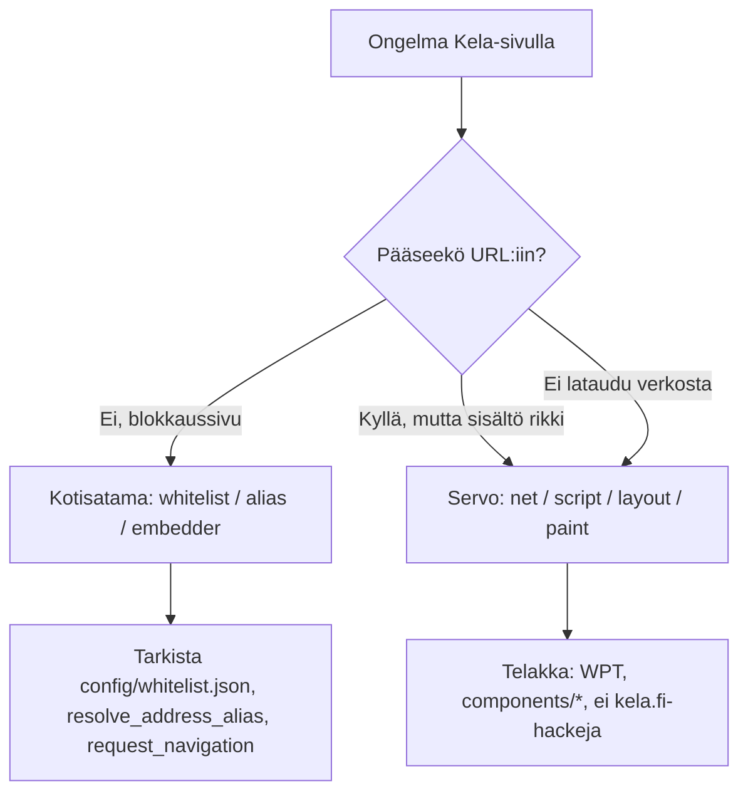

# Kotisatama vs. upstream Servo

Muistiinpanot siitä, **millä osin tämä repo eroaa** alkuperäisestä [servo/servo](https://github.com/servo/servo) -moottorista. Tarkoitus on erottaa Kotisatama-kerros Servo-ytimestä debugatessa (esim. Kela).

> Periaate: [docs/FILOSOFIA.md](../docs/FILOSOFIA.md) — *Servo on moottori, Kotisatama on satama.*

## Kolme tiedostoluokkaa

| Luokka | Missä | Upstream-merge | Kuvaus |
|--------|-------|----------------|--------|
| **Kotisatama-omat** | `components/kotisatama/`, `crawler/`, `tauri/`, `config/` | Ei konflikteja | Vain tässä forkissa |
| **Patchatut upstream-tiedostot** | `ports/servoshell/`, `resources/` | Konfliktit mahdollisia | `KOTISATAMA-PATCH`-kommentit |
| **Koskematon moottori** | `components/script/`, `layout/`, `net/`, … | Ylikirjoittuu mergessä | Servo sellaisenaan |

Lähde: [AGENT.md](../AGENT.md#tiedostoluokat).

## Mitä on täysin uutta (ei upstreamissa)

### Rust-cratet (`components/kotisatama/`)

| Crate | Tehtävä |
|-------|---------|
| `whitelist` | Whitelist JSON, domain-tarkistus, blokkaussivun URL |
| `search` | Paikallinen haku (Meilisearch-subprocess) |
| `report` | Anonyymi ilmoitus (rikkinäinen sivu / ehdotus) |
| `pulloposti` | Pulloposti-sovelluksen subprocess-client |
| `varustamo` | Luotettujen sovellusten rekisteri |
| `missa-olen` | Missä olen -sovelluksen client |
| `i18n` | Suomenkieliset UI-tekstit |
| `subprocess-app` | Yhteinen subprocess-kehytys |

Nämä **eivät muuta** moottorin sisäistä logiikkaa — ne kutsutaan embedderistä (`ports/servoshell/kotisatama.rs`).

### Muut fork-omaiset hakemistot

| Hakemisto | Tehtävä |
|-----------|---------|
| `crawler/` | CI: Playwright → Meilisearch-dump → CDN |
| `tauri/` | Hallintapaneeli (ei selainmoottori) |
| `config/whitelist.json` | Paikallinen whitelist kehitykseen |
| `assets/themes/` | Satama / Avomeri / Myrsky -taustat |
| `worker/` | Raportointi-API (Cloudflare Worker) |

## Mitä on muutettu upstream-tiedostoissa

Kaikki muutokset on merkitty `KOTISATAMA-PATCH`-kommentilla. Ilman `kotisatama`-featurea build käyttää upstream-käyttäytymistä.

### Feature ja oletukset (`ports/servoshell/Cargo.toml`)

- `kotisatama` on **oletusfeature** (`default`-listassa).
- Feature aktivoi Kotisatama-cratet ja `mod kotisatama` (`lib.rs`).

Build ilman featurea:

```bash
cargo build -p servoshell --no-default-features
```

### Embedder — navigointi ja käynnistys

| Tiedosto | Muutos |
|----------|--------|
| `ports/servoshell/kotisatama.rs` | **Uusi tiedosto** — integraatio (whitelist, haku, raportti, teemat) |
| `running_app_state.rs` | `init()`, `load_url_or_blocked()`, `request_navigation()`-hook |
| `window.rs` | Ensimmäinen sivu whitelistin kautta; osoitepalkin Go → alias/haku/whitelist |
| `prefs.rs` | Etusivu `https://katselin.fi/fi/`; kokeelliset web-prefit päällä; hakusivu `servo:avomeri` |
| `parser.rs` | Kotisatama-spesifiset CLI/liput |
| `desktop/gui.rs` | Suomenkielinen työkalupalkki, teemat, Ilmoita-dialogi |
| `desktop/protocols/servo.rs` | Sisäiset sivut: `servo:haku`, `servo:blocked`, `servo:varustamo`, … |
| `egl/android/mod.rs` | Android-JNI hakuun ja raportointiin |

### Resurssit

| Tiedosto | Muutos |
|----------|--------|
| `resources/resource_protocol/newtab.html` | Katselin-brändätty uusi välilehti |

### Juuri-Cargo.toml

Workspace-listaan lisätty `kotisatama-*`-cratet — ei muutoksia `components/script/` tms.

## Käyttäytymiseroja käyttäjän näkökulmasta

| Tilanne | Upstream Servo | Kotisatama (oletusbuild) |
|---------|----------------|--------------------------|
| Käynnistys | `about:blank` tai annettu URL | Kotisataman etusivu (`katselin.fi`) |
| Mielivalainen URL | Ladataan | Estetty → `servo:blocked` jos ei whitelistissä |
| Osoitekenttä `kela` | Ei erityistä | Resolvataan whitelist-alias → `https://kela.fi` |
| Osoinekenttä hakusana | Oletushakukone | Paikallinen indeksi / `servo:haku` |
| Avoin internet | Sallittu | Vain Avomeri-tilassa (tai gateway-URL) |
| UI-kieli | Englanti | Suomi (työkalupalkki, virhesivut) |
| Taustateema | Ei | Satama / Avomeri / Myrsky |

## Mitä **ei** ole muutettu

Nämä ovat **sama Servo-moottori** kuin upstreamissa:

- `components/script/` — HTML, DOM, JavaScript
- `components/layout/` — CSS-asettelu
- `components/net/` — HTTP, TLS, evästeet
- `components/paint/`, `fonts/`, `canvas/`
- `components/constellation/` — prosessit ja navigointi (pl. embedder-hook)
- `tests/wpt/` — testisarja

**Kela-etusivun layout- tai JS-bugi** on siis lähes aina upstream-puute, ei whitelist-ongelma. Poikkeus: jos sivu ei lataudu ollenkaan koska URL estetään väärin.

## Debuggaus: kumpi kerros?



### Nopea testi: erottele kerrokset

1. Varmista että `https://www.kela.fi/` on sallittu (`kela.fi` whitelistissä, alidomainit mukaan).
2. Jos osoitepalkki `kela` avaa väärän sivun → **Kotisatama** (`resolve_address_alias`, `open_search_or_results`).
3. Jos URL on oikea mutta sivu valkoinen / rikki → **Servo** (avaa devtools, tarkista konsoli, vertaa upstream-Servoon jos mahdollista).

## Ympäristömuuttujat (vain Kotisatama)

| Muuttuja | Vaikutus |
|----------|----------|
| `KOTISATAMA_WHITELIST_PATH` | Paikallinen whitelist JSON |
| `KOTISATAMA_CDN_BASE` | Whitelist + hakuindeksin synkronointi |
| `KOTISATAMA_MEILISEARCH_BIN` | Paikallinen haku |

## Liittyvät dokumentit

- [telakka/oppimispäiväkirja/2026-06-29-kela-etusivu.md](telakka/oppimispäiväkirja/2026-06-29-kela-etusivu.md) — käytännön debuggausesimerkki
- [servo/embedder-ja-ports.md](servo/embedder-ja-ports.md) — hookin paikka ketjussa
- [servo/sivun-lataus.md](servo/sivun-lataus.md) — koko latausketju
