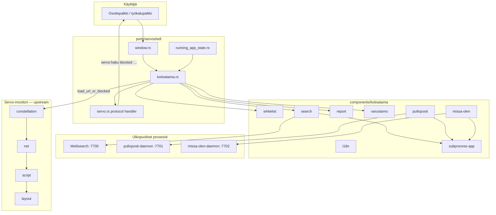

# Kotisatama-arkkitehtuuri

Katselin rakentuu Servo-moottorin päälle oman kerroksen, joka hallitsee **mitä sivuja saa avata**, **miten haku toimii** ja **miten sisäiset sivut renderöidään**. Tämä kerros ei muuta HTML:n jäsentämistä, CSS-asettelua tai HTTP-stackia.

## Kerrokset



## Kolme integraatiotapaa

Kotisatama ei koske moottorin ydintä (`components/script/`, `net/`, `layout/`). Sen sijaan se käyttää kolmea selkeää rajapintaa:

### 1. Embedder-hook (navigointi)

`ports/servoshell/kotisatama.rs` on keskitin. Se kutsuu `kotisatama-whitelist`-cratetta ja päättää, saako navigointi jatkua.

Keskeiset funktiot:

| Funktio | Tehtävä |
|---------|---------|
| `init()` | Lataa whitelistin, synkronoi CDN:stä, lukee Varustamo-rekisterin |
| `should_allow_navigation()` | Whitelist + Avomeri-tila |
| `load_url_or_blocked()` | Lataa URL:n tai ohjaa `servo:blocked` |
| `open_search_or_results()` | Osoitepalkin haku/alias |
| `resolve_address_alias()` | Esim. `kela` → `https://kela.fi` |

Hook kutsutaan `running_app_state.rs`:stä (`request_navigation`, `load_url_or_blocked`) ja `window.rs`:stä (osoitepalkin Go / Search).

### 2. Protocol handler (sisäiset sivut)

`servo:`-skeema palvelee sisäisiä sivuja ilman verkkopyyntöä. Käsittelijä on `ports/servoshell/desktop/protocols/servo.rs`.

HTML-tiedostot ovat `resources/resource_protocol/`-hakemistossa (`haku.html`, `blocked.html`, `varustamo.html` …). Kotisatama lisää reittejä `KOTISATAMA-PATCH`-kommenteilla — logiikka pysyy `kotisatama.rs`:ssä ja cratessa.

### 3. Omat cratet (liiketoimintalogiikka)

Kaikki Kotisatama-spesifinen Rust-koodi on `components/kotisatama/`-alla. Uutta toiminnallisuutta lisätään **aina uutena cratenä**, ei muokkaamalla upstream-komponentteja. Katso [cratet.md](cratet.md).

## Subprocess-malli

Meilisearch, Pulloposti ja Missä olen eivät ole upotettuja kirjastoja. Ne ovat erillisiä HTTP-palvelimia, joita Katselin käynnistää tai joihin liittyy subprocessina:

| Palvelu | Oletusportti | Crate | Binääriympäristö |
|---------|--------------|-------|------------------|
| Meilisearch (haku) | 7700 | `search` | `KOTISATAMA_MEILISEARCH_BIN` |
| Pulloposti | 7701 | `pulloposti` | `KOTISATAMA_PULLOPOSTI_BIN` |
| Missä olen | 7702 | `missa-olen` | `KOTISATAMA_MISSA_OLEN_BIN` |

Yhteinen kehys: `subprocess-app` (health check, binäärihaku, prosessin sammutus `Drop`:issa).

**Miksi näin?** Meilisearch käyttää LMDB-tietokantaa ja on suunniteltu palvelinprosessiksi. Mobiiliin upottaminen kirjastotasolla ei ole realistinen vaihtoehto (ks. [AGENT.md](../../AGENT.md#haku--meilisearch-subprocess)).

## CDN ja paikallinen data

Tuotannossa whitelist ja hakuindeksi tulevat CDN:stä OTA-päivityksenä:

1. Crawler (CI) indeksoi whitelist-sivustot → Meilisearch-dump
2. Dump + `whitelist.json` CDN:ään
3. Laitteella `kotisatama-search::sync_from_cdn()` lataa tiedostot paikalliseen välimuistiin
4. Meilisearch importaa dumpin käynnistyksessä

Paikallinen kehitys:

```bash
cp config/whitelist.example.json config/whitelist.json
export KOTISATAMA_WHITELIST_PATH=config/whitelist.json
```

## Feature flag `kotisatama`

`ports/servoshell/Cargo.toml`:ssa `kotisatama` on oletusfeature. Ilman sitä servoshell käyttää upstream-käyttäytymistä (ei whitelistia, ei Kotisatama-UI:ta):

```bash
cargo build -p servoshell --no-default-features
```

Tämä varmistaa, että upstream-merge ei riko buildia vaikka Kotisatama-cratet olisivat pois päältä.

## Tiedostoluokat (muistutus)

| Luokka | Esimerkki | Dokumentoi täällä? |
|--------|-----------|-------------------|
| Kotisatama-omat | `components/kotisatama/` | Kyllä — [cratet.md](cratet.md) |
| Patchatut upstream | `ports/servoshell/kotisatama.rs` | Kyllä — tämä sivu |
| Koskematon moottori | `components/script/` | Ei — [servo/](../servo/) |

## Seuraavaksi

- [navigointi.md](navigointi.md) — mitä tapahtuu kun käyttäjä painaa Enter osoitepalkissa
- [cratet.md](cratet.md) — crate-kohtaiset yksityiskohdat
- [sisaiset-sivut.md](sisaiset-sivut.md) — `servo:`-URL-rekisteri
