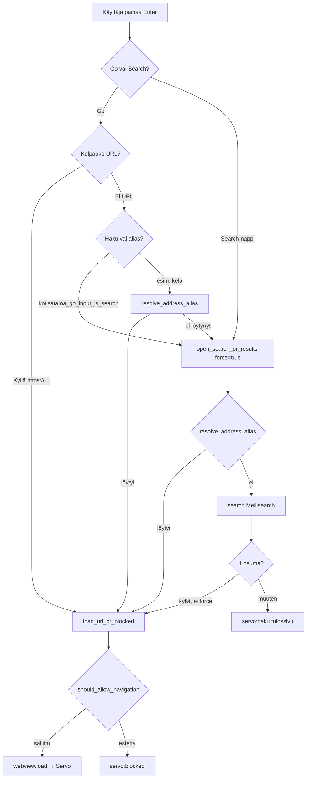

# Navigointi — osoitepalkista sivulle

Tämä sivu selittää, mitä tapahtuu kun käyttäjä syöttää tekstiä osoitepalkkiin tai klikkaa linkkiä. Navigointilogiikka on **Kotisatama-kerroksessa** — Servo-moottori saa pyynnön vasta kun embedder on hyväksynyt sen.

> Whitelistin jälkeinen ketju (HTTP, DOM, layout) on kuvattu [servo/sivun-lataus.md](../servo/sivun-lataus.md).

## Kokonaiskuva



## Kaksi syöttötapaa

Osoitepalkissa on kaksi komentoa (`window.rs`):

| Komento | Käyttäjän toiminto | Kutsuu |
|---------|-------------------|--------|
| `Go` | Enter osoitekentässä | URL-lataus tai haku/alias |
| `Search` | Hakupainike | Aina hakutulossivu (`force_results_page = true`) |

## Milloin syöte tulkitaan hakuna

Funktio `kotisatama_go_input_is_search()` (`window.rs`) päättää, onko Go-syöte haku vai URL:

| Syöte | Tulkitaan |
|-------|-----------|
| `https://kela.fi` | URL (parsittavissa) |
| `kela.fi` | URL (sisältää pisteen) |
| `localhost` | URL (erikoistapaus) |
| `kela` | Alias (ei pisteitä, ei välilyöntejä) |
| `eläke hakemus` | Haku (sisältää välilyönnin) |
| `/polku` | URL (alkaa `/`) |

## Alias-resoluutio

Kun syöte on yksi sana ilman pistettä (esim. `kela`), `resolve_address_alias()` etsii whitelist-dokumentista:

1. **Label-osuma** — `label`-kenttä vastaa syötettä (kirjainkoolla ei väliä)
2. **Domain-alias** — whitelist-domainin ensimmäinen osa (ennen pistettä) vastaa syötettä

Esim. whitelistissä `{ "domain": "kela.fi", "label": "Kela" }`:

- `kela` → `https://kela.fi` (tai entryn `navigation_url()`)
- `Kela` → sama

Jos alias löytyy, navigointi menee suoraan `load_url_or_blocked()`:iin.

## Hakupolku

Kun syöte on haku (`open_search_or_results`):

1. Tarkista alias (sama kuin yllä)
2. Kysy Meilisearchia (`search()` → `SearchClient::search()`)
3. Tulosten perusteella:
   - **Täsmälleen 1 osuma** ja ei `force_results_page` → avaa suoraan (`open_search_hit`)
   - **Useita / ei tuloksia / virhe** → `servo:haku?q=...` (tulossivu)
   - **Search-nappi** → aina tulossivu, vaikka olisi yksi osuma

Jos hakua ei löydy, `log_fallback_search()` kirjaa anonymisoidun tapahtuman analytiikkaan.

## Whitelist-tarkistus

Jokainen ulkoinen navigointi käy `load_url_or_blocked()`:n kautta:

```rust
// Konseptuaalinen esimerkki — ports/servoshell/kotisatama.rs
pub fn load_url_or_blocked(webview: &WebView, url: Url) {
    if should_allow_navigation(webview, &url) {
        webview.load(url);
    } else {
        note_blocked_url(&url);
        webview.load(blocked_page_url(&url));
    }
}
```

### Mitä aina sallitaan

Sisäiset URL:t ohittavat whitelistin (`is_internal_navigation_url`):

- `about:` (esim. `about:blank`)
- `data:` (esim. data-URI-blokkaussivu mobiilissa)
- `servo:` (kaikki sisäiset sivut)

### Domain-tarkistus

Muille URL:ille `is_navigation_allowed()` tarkistaa hostin kuratoitua listaa ja käyttäjän overlayta vasten. Alidomainit sallitaan (`www.kela.fi` kun `kela.fi` on listalla), mutta lookalike-domainit estetään (`kela.fi.example.com`).

## Linkkien seuraaminen

Kun käyttäjä klikkaa linkkiä sivulla, `request_navigation`-hook (`running_app_state.rs`) kutsuu `should_allow_navigation()`:

- **Sallittu** → `request.allow()` — moottori jatkaa normaalisti
- **Estetty** → `request.deny()` — navigointi pysähtyy

Lisäksi `load_url_or_blocked` käytetään suorissa latauksissa (osoitepalkki, webdriver).

## Avomeri-tila

Avomeri on tietoinen poikkeus whitelististä. Se **ei** avaa internetiä automaattisesti — käyttäjän täytyy vahvistaa siirtyminen.

### Portit ja tilat

| URL / toiminto | Merkitys |
|----------------|----------|
| `servo:avomeri?q=…` | Sisäinen porttisivu (vahvistus) |
| `servo:avomeri/open?q=…` | Vahvistus → `enter_avomeri_mode()` → ulkoinen hakukone |
| `servo:avomeri/leave` | `leave_avomeri_mode()` → `servo:newtab` |

Kun Avomeri-tila on päällä (`AVOMERI_MODE`) **ja** tuoteprofiili sallii sen (`can_enter_avomeri()`), `should_allow_navigation()` hyväksyy myös whitelistin ulkopuoliset URL:t.

Oletushakukone Avomeressä: Qwant (`https://www.qwant.com/?q=%s`). Prefissä: `shell.searchpage` → `servo:avomeri?q=%s`.

### Teemat navigoinnin mukaan

`current_theme()` (`kotisatama.rs`) valitsee UI-taustan:

| Teema | Milloin |
|-------|---------|
| Satama | Normaali whitelist-navigointi |
| Avomeri | `servo:avomeri`-porttisivu tai Avomeri-tila |
| Myrsky | Hak virhe (`SearchOutcome::Error`) |

## Estosivu

Kun navigointi estetään:

1. `note_blocked_url()` tallentaa estetyn URL:n raporttilomakkeen esitäyttöön
2. Selain lataa `servo:blocked?u=<alkuperäinen-url>`
3. Käyttäjä voi ehdottaa sivun lisäämistä whitelistiin (Lokikirja-ilmoitus)

## Käynnistyksen ensimmäinen sivu

Oletuksena Katselin avaa Kotisataman etusivun (`https://katselin.fi/fi/`), ei `about:blank`. Tämä on `prefs.rs`:n `KOTISATAMA_DEFAULT_HOMEPAGE` ja `window.rs`:n käynnistyslogiikka.

Ensimmäinen sivu käy silti whitelistin kautta — jos etusivu ei olisi listalla, näytettäisiin blokkaussivu.

## Debuggaus: missä katsoa

| Oire | Tarkista |
|------|----------|
| `kela` ei avaa Kelaa | `resolve_address_alias`, `config/whitelist.json` |
| Haku ei löydä mitään | Meilisearch subprocess, `KOTISATAMA_MEILISEARCH_BIN` |
| Oikea URL mutta blokkaus | `is_navigation_allowed`, käyttäjän overlay |
| Linkki sivulla ei toimi | `request_navigation` hook, `should_allow_navigation` |
| Avomeri ei avaudu | `product_profile().can_enter_avomeri()` |

Katso myös [kotisatama-vs-servo.md](../kotisatama-vs-servo.md) — päätöspuu Kotisatama vs. Servo.

## Seuraavaksi

- [sisaiset-sivut.md](sisaiset-sivut.md) — `servo:blocked`, `servo:haku` jne.
- [cratet.md](cratet.md) — whitelist- ja search-cratejen yksityiskohdat
- [servo/sivun-lataus.md](../servo/sivun-lataus.md) — mitä tapahtuu `webview.load()`:n jälkeen
