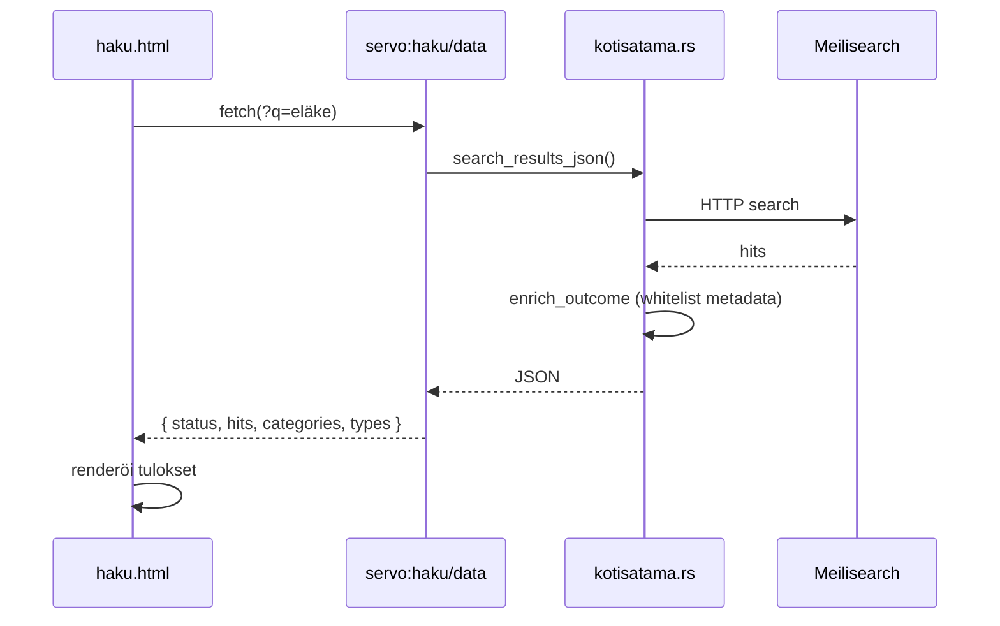

# Sisäiset sivut — `servo:`-protokolla

Katselin käyttää `servo:`-skeemaa sisäisille sivuille, jotka eivät vaadi verkkoyhteyttä. Ne palvellaan Servon protocol handlerista (`ports/servoshell/desktop/protocols/servo.rs`) ja renderöidään HTML-tiedostoista (`resources/resource_protocol/`).

> Upstream-Servossa on joitain `servo:`-reittejä (config, newtab). Kotisatama lisää omat reitit `KOTISATAMA-PATCH`-kommenteilla.

## Miten protokolla toimii

```
servo:haku?q=eläke
  │      │   └── query-parametrit
  │      └── polku (path)
  └── skeema (ei verkko-pyyntöä)
```

Handler vastaa polun (`path`) perusteella. HTML-sivut ladataan `ResourceProtocolHandler`:lla; API-reitit palauttavat JSON:ia suoraan Rustista.

## Kotisatama-sivut

### Navigointi ja haku

| URL | Tyyppi | HTML / logiikka | Kuvaus |
|-----|--------|-----------------|--------|
| `servo:haku?q=…` | HTML | `haku.html` | Hakutulossivu |
| `servo:haku/data?q=…` | JSON API | `kotisatama::search_results_json()` | Tulosten data frontendille |
| `servo:blocked?u=…` | HTML | `blocked.html` | Estetty navigointi |
| `servo:avomeri?q=…` | HTML | `avomeri.html` | Avomeri-portti (vahvistus) |
| `servo:avomeri/open?q=…` | Redirect | `enter_avomeri_mode()` → ulkoinen URL | Käyttäjä vahvisti Avomeren |
| `servo:avomeri/leave` | Redirect | `leave_avomeri_mode()` → `servo:newtab` | Paluu satamaan |

### Sovellukset

| URL | Tyyppi | HTML / logiikka | Kuvaus |
|-----|--------|-----------------|--------|
| `servo:varustamo` | HTML | `varustamo.html` | Luotettujen sovellusten lista |
| `servo:varustamo/registry` | JSON API | `varustamo::load_registry_json()` | Rekisterin data |
| `servo:varustamo/app?id=…` | Redirect | Käynnistää subprocessin → sovellussivu | Esim. `pulloposti`, `missa-olen` |
| `servo:pulloposti` | HTML | `pulloposti.html` | Pulloposti-sovellus |
| `servo:pulloposti/app` | HTML | `pulloposti-app.html` | Pulloposti UI |
| `servo:missa-olen` | HTML | `missa-olen.html` | Missä olen -sovellus |

### Whitelist-hallinta (käyttäjän overlay)

| URL | Tyyppi | Kuvaus |
|-----|--------|--------|
| `servo:whitelist` | HTML (`my-sites.html`) | Omat sivut -näkymä |
| `servo:whitelist/list` | JSON API | Käyttäjän domainit |
| `servo:whitelist/add?domain=…` | Vahvistussivu | Lisäyksen vahvistus (token) |
| `servo:whitelist/commit-add?domain=…&token=…` | Redirect | Tallentaa domainin |
| `servo:whitelist/remove?domain=…` | Vahvistussivu | Poiston vahvistus |
| `servo:whitelist/commit-remove?domain=…&token=…` | Redirect | Poistaa domainin |

Whitelist-muutokset vaativat vahvistustokenin (`register_pending_whitelist_change`) estääkseen CSRF-tyyppiset hyökkäykset sisäisestä navigoinnista.

Tuoteprofiili voi estää käyttäjän lisäykset: `product_profile().can_add_user_domain()` → `servo:whitelist?error=disabled`.

### Lokalisointi

| URL | Tyyppi | Kuvaus |
|-----|--------|--------|
| `servo:locale?set=fi\|sv\|auto` | Redirect → `servo:config` | Tallentaa kielivalinnan |

## Upstream-sivut (myös Katselinissä)

Nämä ovat osa Servoa, mutta Katselin käyttää niitä:

| URL | Kuvaus |
|-----|--------|
| `servo:newtab` | Uusi välilehti (`newtab.html` — Katselin-brändätty) |
| `servo:config` | Asetussivu |
| `servo:preferences` | Preferenssit |
| `servo:license` | Lisenssitiedot |
| `servo:default-user-agent` | JSON API — user agent -merkkijono |
| `servo:experimental-preferences` | JSON API — kokeelliset pref-määritykset |

## Hakutulossivun datavirta



JSON-rakenne (`SearchResultsData`):

- `query` — hakusana
- `status` — `hits` / `no_results` / `error`
- `hits` — rikastetut tulokset (URL, otsikko, kategoria, tyyppi)
- `categories` / `types` — whitelist-metadatan ikonit ja värit UI:ssa

## Blokkaussivu

`servo:blocked?u=https://example.com/` näyttää:

- Estetyn URL:n (query-parametri `u`)
- Linkin takaisin satamaan
- Mahdollisuuden ehdottaa sivun lisäämistä (Lokikirja)

`note_blocked_url()` tallentaa alkuperäisen URL:n, jotta raporttilomake (`Ilmoita`-dialogi) esitäyttää domainin.

## Varustamo → sovellus

Kun käyttäjä avaa sovelluksen Varustamosta:

1. `servo:varustamo/app?id=pulloposti`
2. Handler käynnistää subprocessin taustalla (`ensure_pulloposti`)
3. Redirect → `servo:pulloposti`
4. HTML-sivu kommunikoi daemonin kanssa HTTP:llä (`127.0.0.1:7701`)

Sama malli `missa-olen`:lle portissa 7702.

## HTML-tiedostojen sijainti

```
resources/resource_protocol/
├── haku.html
├── blocked.html
├── avomeri.html
├── varustamo.html
├── pulloposti.html
├── pulloposti-app.html
├── missa-olen.html
├── my-sites.html
├── newtab.html          ← KOTISATAMA-PATCH: Katselin-brändätty
├── kotisatama-i18n.js   ← käännökset sisäisille sivuille
└── …
```

Kun muokkaat sisäisen sivun ulkoasua, muokkaa HTML/JS-tiedostoa täällä — ei Servon layout-komponentteja.

## Sisäiset sivut vs. verkko-URL:t

| | `servo:haku` | `https://kela.fi` |
|---|-------------|-------------------|
| Verkko-pyyntö | Ei | Kyllä |
| Whitelist | Aina sallittu | Tarkistetaan |
| Renderöinti | HTML resurssiprotokollasta | Servo-moottori (net → script → layout) |
| Debuggaus | `servo.rs` + HTML | [servo/sivun-lataus.md](../servo/sivun-lataus.md) |

## Seuraavaksi

- [navigointi.md](navigointi.md) — miten päädytään näille sivuille
- [cratet.md](cratet.md) — backend-logiikka cratessa
- [arkkitehtuuri.md](arkkitehtuuri.md) — protocol handlerin paikka kokonaisuudessa
