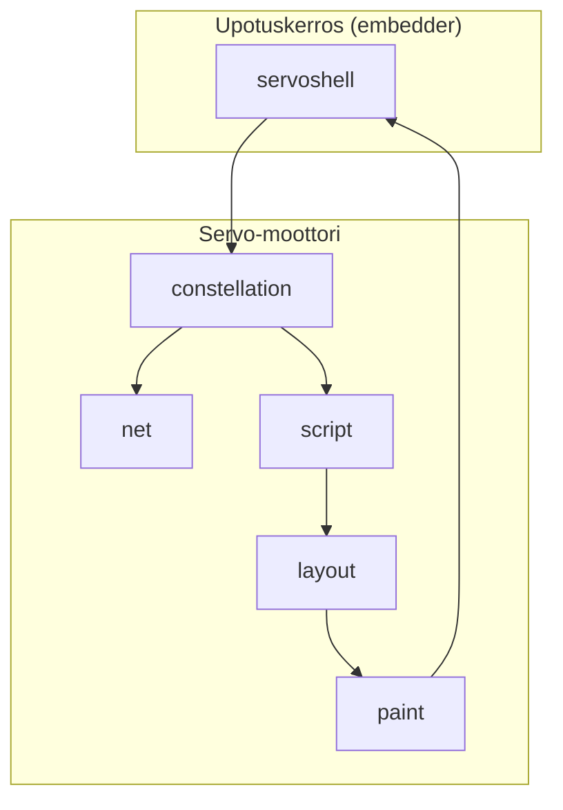

# Servo-arkkitehtuuri (yleiskuva)

Tämä dokumentti kuvaa Servo-moottorin korkean tason rakenteen. Yksityiskohtia: [komponentit.md](komponentit.md), [sivun-lataus.md](sivun-lataus.md).

## Perusidea

Servo on **moniprosessinen selainmoottori** Rustilla. Vastuu on jaettu cratetena (`components/`-hakemisto). Sovellus (embedder) käyttää moottoria `ports/servoshell`- tai vastaavan kautta.

## Kerrokset

| Kerros | Vastuu | Tyypillinen hakemisto |
|--------|--------|------------------------|
| Embedder | Ikkuna, syöte, navigointipäätökset | `ports/servoshell/` |
| Orkestrointi | Välilehdet, prosessit, historia | `components/constellation/` |
| Verkko | HTTP, evästeet, välimuisti | `components/net/` |
| Skripti | DOM, JavaScript | `components/script/` |
| Asettelu | CSS, layout-puu | `components/layout/` |
| Piirto | Pikselit, tekstit, kuvat | `components/paint/`, `components/canvas/` |

## Katselinin näkökulma

- **Kotisatama-logiikka** (`components/kotisatama/`) on erillään moottorin ytimestä.
- **Whitelist** toteutetaan embedder-hookissa (`ports/servoshell/`), ei `net`- tai `script`-tasolla.
- Kun opiskelet moottoria, erota mielessäsi **upstream** (`components/script/`, `layout/`, …) ja **omat patchit** (`kotisatama/`, `KOTISATAMA-PATCH`-merkinnät).

## Prosessit

Servo käyttää useita prosesseja turvallisuuden ja vakauden vuoksi. Yksityiskohdat: [prosessit-ja-säikeet.md](prosessit-ja-säikeet.md).

## Seuraavaksi

- [sivun-lataus.md](sivun-lataus.md) — mitä tapahtuu kun avaat URL:n
- [constellation-ja-navigointi.md](constellation-ja-navigointi.md) — pipeline ja IPC
- [script-layout-ja-reflow.md](script-layout-ja-reflow.md) — DOM ja reflow
- [verkko-ja-piirto.md](verkko-ja-piirto.md) — verkko ja WebRender
- [komponentit.md](komponentit.md) — taulukko kaikista `components/`-hakemistoista
- [embedder-ja-ports.md](embedder-ja-ports.md) — servoshell ja Katselin-hookit
