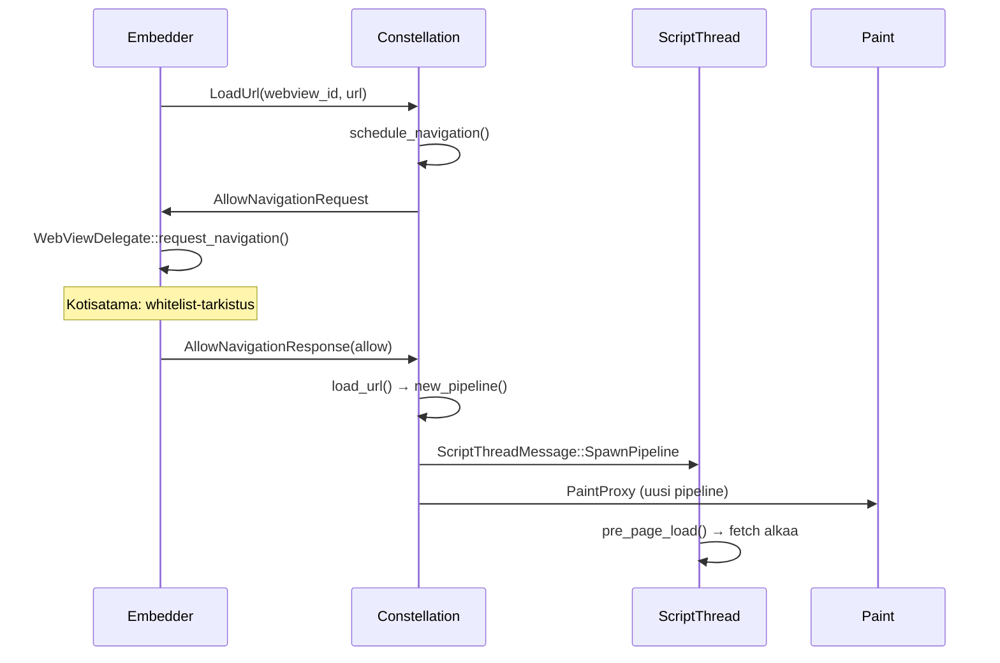
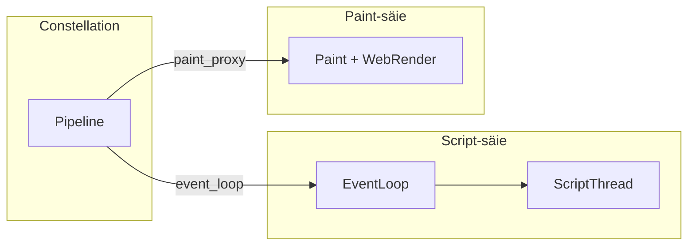

# Constellation ja navigointi

Constellation on Servo-moottorin **orkestroija**: se hallitsee välilehtiä, selauskonteksteja (`Pipeline`), historiaa ja viestintää script-, layout- ja paint-osien välillä. Tämä sivu syventää [sivun-lataus.md](sivun-lataus.md):n constellation-vaiheen.

> Constellation ei tee HTTP-pyyntöjä eikä jäsentä HTML:ää — se koordinoi niitä tekeviä osia.

## Keskeiset käsitteet

| Käsite | Mitä tarkoittaa | Missä koodissa |
|--------|-----------------|----------------|
| **Pipeline** | Constellationin näkymä yhdestä selauskontekstista (ikkuna tai iframe) | `components/constellation/pipeline.rs` |
| **BrowsingContext** | Selauskonteksti — yksi dokumentti kerrallaan | `servo_base::id::BrowsingContextId` |
| **EventLoop** | Kanava script-säikeeseen; yksi säie voi hoitaa useita pipelineja | `components/constellation/event_loop.rs` |
| **WebView** | Embedderin näkymä yhdestä selainikkunasta | `components/servo/webview.rs` |
| **PaintProxy** | Kanava pipelinesta paint-säikeeseen | `components/shared/paint/` |

### Pipeline yhdellä lauseella

`Pipeline` on constellationin näkymä yhdestä `Window`-objektista: sillä on oma `PipelineId`, `BrowsingContextId`, URL, historia, event loop ja paint-proksi. Kommentti lähdekoodissa:

```23:24:components/constellation/pipeline.rs
/// A `Pipeline` is the constellation's view of a `Window`. Each pipeline has an event loop
/// (executed by a script thread). A script thread may be responsible for many pipelines.
```

## Viestityypit — kolme suuntaa

Constellation kommunikoi kolmen suunnan kanssa. Etsi näitä kun luet koodia:

### Embedder → Constellation

Tyyppi: `EmbedderToConstellationMessage` (`components/shared/constellation/lib.rs`)

| Viesti | Milloin |
|--------|---------|
| `LoadUrl` | Käyttäjä avaa URL:n (`WebView::load()`) |
| `AllowNavigationResponse` | Embedder vastasi navigointilupaan (allow/deny) |
| `ForwardInputEvent` | Hiirenäppäin, kosketus, näppäimistö |
| `TickAnimation` | Animaatioiden päivityspyyntö |
| `TraverseHistory` | Eteen-/taaksepäin historiassa |

### Constellation → Embedder

Tyyppi: `ConstellationToEmbedderMsg` (`components/constellation/embedder.rs`)

| Viesti | Milloin |
|--------|---------|
| `AllowNavigationRequest` | Constellation kysyy lupaa ennen navigointia |
| `HistoryChanged` | Historia päivittyi (takaisin-nappi tila) |
| `WebViewFocused` | Fokus vaihtui |

### Script → Constellation

Tyyppi: `ScriptToConstellationMessage` (`components/shared/constellation/from_script_message.rs`)

| Viesti | Milloin |
|--------|---------|
| `LoadUrl` | JavaScript-initiated navigointi (`location.href = …`) |
| `LoadComplete` | Sivu ladattu kokonaan |
| `ChangeRunningAnimationsState` | Animaatiot käynnissä/pysähtyneet |

> Vanhoissa dokumenteissa saatat nähdä nimen `ConstellationMsg` — käytännössä se viittaa usein `EmbedderToConstellationMessage`:en Debug-tulostuksessa.

## Navigointiketju — top-level URL

Kun embedder kutsuu `WebView::load(url)`, tapahtuu tämä ketju:



### Vaiheet suomeksi

1. **`LoadUrl`** — embedder lähettää navigointipyynnön constellationille.
2. **`schedule_navigation`** — constellation kysyy embedderiltä luvan (`AllowNavigationRequest`). Tässä kohdassa Katselinin whitelist-hook (`request_navigation`) päättää allow/deny.
3. **`load_url`** — jos sallittu, constellation luo uuden pipelinen.
4. **`new_pipeline` / `Pipeline::spawn`** — uusi `PipelineId`, event loop, paint-proksi.
5. **`SpawnPipeline`** — script-säie saa viestin ja aloittaa sivun latauksen.

Top-level-navigoinnissa constellation **korvaa** vanhan pipelinen uudella. Iframe-navigoinnissa viesti menee vanhemmalle: `ScriptThreadMessage::NavigateIframe`. Katso [iframe-ja-upotetut-kontekstit.md](iframe-ja-upotetut-kontekstit.md).

## Pipeline-rakenne



Yksi script-säie voi hoitaa useita pipelineja, jos ne jakavat saman originin. Tämä säästää muistia ja prosessirajoja.

## Historia ja iframe

| Tilanne | Mitä tapahtuu |
|---------|---------------|
| Takaisin-nappi | `TraverseHistory` → constellation palauttaa vanhan `HistoryStateId`:n |
| Iframe lataa URL:n | `NavigateIframe(parent_pipeline, browsing_context, load_data)` |
| JS-navigointi | Script lähettää `ScriptToConstellationMessage::LoadUrl` |
| Sivu suljetaan | `ExitPipeline` → script, layout ja paint siivotaan |

## Mitä constellation **ei** tee

| Tehtävä | Oikea paikka |
|---------|--------------|
| HTTP-pyyntö | `components/net/` |
| HTML-jäsennys | `components/script/dom/servoparser/` |
| CSS-laskenta | `components/layout/` |
| Pikselien piirto | `components/paint/` |
| Whitelist | `ports/servoshell/kotisatama.rs` (embedder) |

## Debuggaus

| Oire | Tarkista |
|------|----------|
| Navigointi ei ala | `AllowNavigationResponse` — tuleeko deny embedderistä? |
| Sivu jää "latautumaan" | `LoadComplete` — tuleeko scriptiltä? |
| Iframe ei lataudu | `NavigateIframe` vs. `SpawnPipeline` — oikea polku? |
| Historia ei toimi | `TraverseHistory`, `history_state_id` pipelinessä |

Lisälokit: `./mach run` + book.servo.org debugging-luvut.

## Harjoitus

1. Avaa `components/constellation/pipeline.rs` ja lue `Pipeline`-rakenteen kentät.
2. Etsi `components/constellation/constellation.rs`:stä `schedule_navigation` ja `load_url`.
3. Seuraa ketjua: `ports/servoshell/running_app_state.rs` → `request_navigation` → `AllowNavigationResponse`.
4. Kirjaa havainnot [telakka/oppimispäiväkirja/](../telakka/oppimispäiväkirja/).

## Seuraavaksi

- [javascript-moottori.md](javascript-moottori.md) — mitä `SpawnPipeline` käynnistää (JS-puoli)
- [iframe-ja-upotetut-kontekstit.md](iframe-ja-upotetut-kontekstit.md) — iframe-navigointi (`NavigateIframe`)
- [prosessit-ja-säikeet.md](prosessit-ja-säikeet.md) — prosessi- ja säierajat
- [embedder-ja-ports.md](embedder-ja-ports.md) — navigointihook embedderissä
