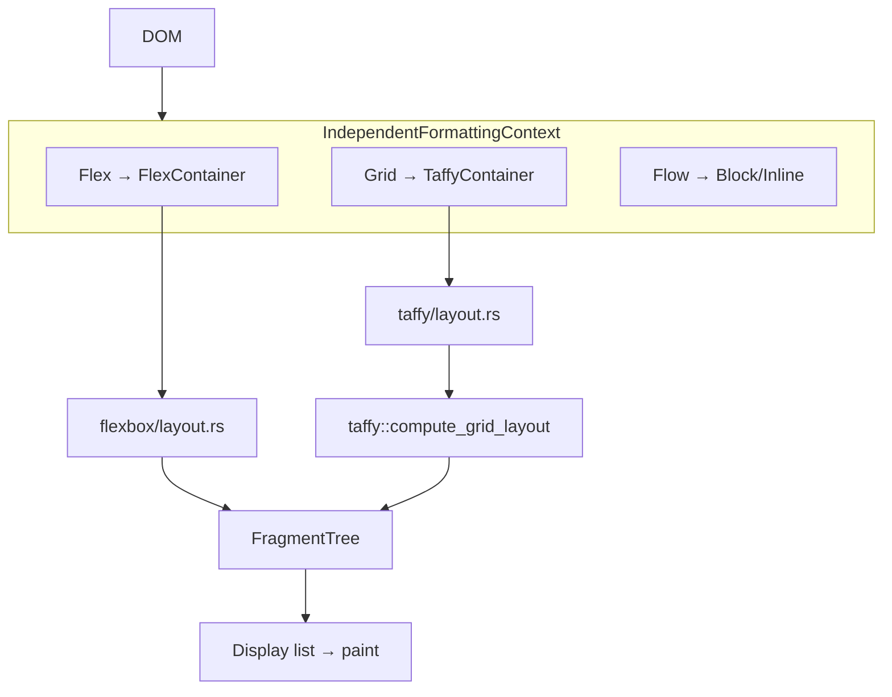
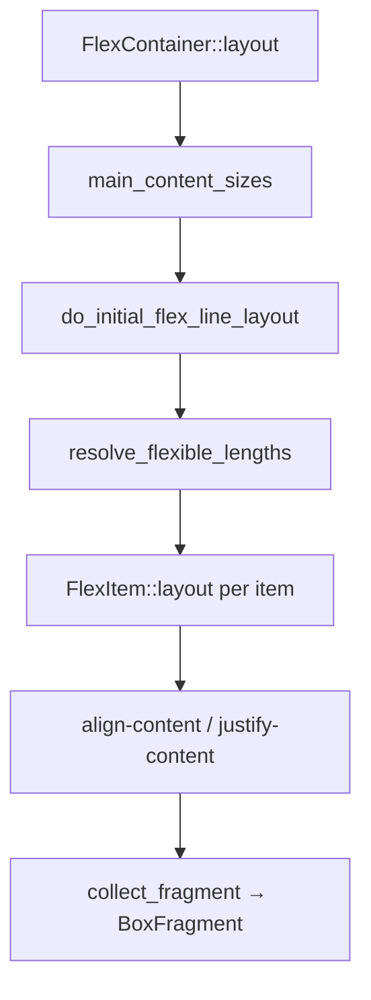
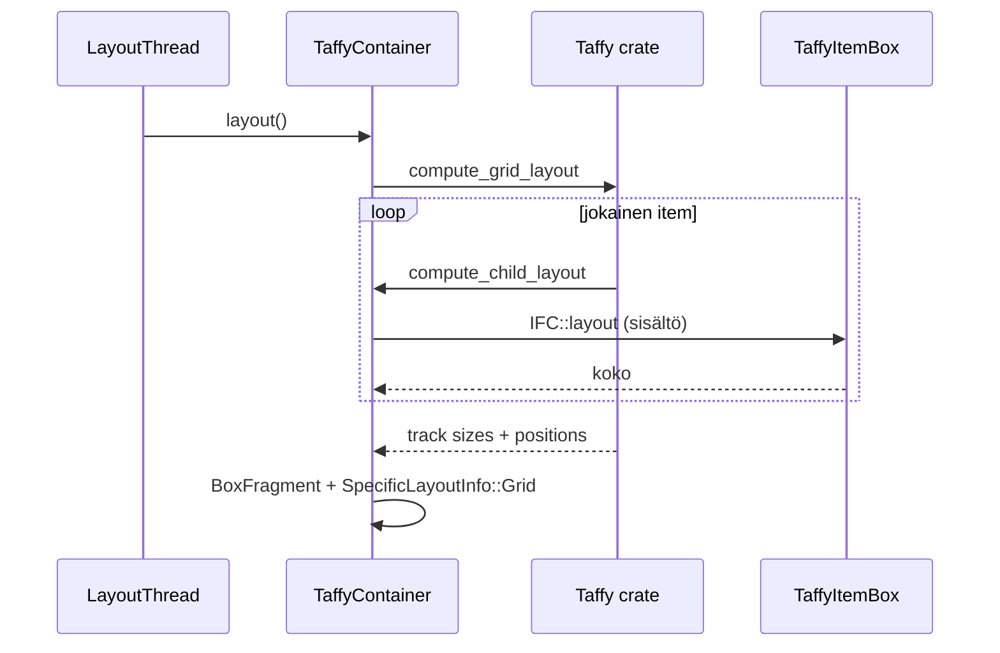

# CSS Flex ja Grid

Tämä sivu syventää [script-layout-ja-reflow.md](script-layout-ja-reflow.md):n layout-osaa: miten `display: flex` ja `display: grid` lasketaan Servossa, mitä eroa on box treellä ja fragment treellä, ja miten script kysyy geometriaa.

> **Tärkeä jako:** Flex on **natiivi Servo-toteutus**. Grid delegoidaan **Taffy**-kirjastolle — Servon rooli on DOM→Taffy-silta ja fragmenttien muunnos.

## Arkkitehtuurinen jako



| Ominaisuus | Flex | Grid |
|------------|------|------|
| Toteutus | `components/layout/flexbox/` | `components/layout/taffy/` |
| Algoritmi | CSS Flexbox spec (natiivi) | Taffy-kirjasto |
| Pääentry | `FlexContainer::layout` | `TaffyContainer::layout` |
| ~rivimäärä | ~2600 (`flexbox/layout.rs`) | Silta + Taffy |

## Hakemistorakenne

### Flexbox (natiivi)

| Polku | Rooli |
|-------|-------|
| `flexbox/mod.rs` | `FlexContainer`, `FlexItemBox`, `FlexLevelBox` |
| `flexbox/layout.rs` | Koko flex-algoritmi, intrinsic sizing |
| `flexbox/geom.rs` | `FlexAxis`, main/cross -akselit |

### Grid (Taffy)

| Polku | Rooli |
|-------|-------|
| `taffy/mod.rs` | `TaffyContainer`, `TaffyItemBox` |
| `taffy/layout.rs` | `TaffyContainerContext`, `compute_grid_layout`-kutsu |
| `taffy/stylo_taffy/wrapper.rs` | `TaffyStyloStyle` — Stylo → Taffy |
| `taffy/stylo_taffy/convert.rs` | Alignment, gaps, grid tracks, placements |

### Yhteinen infra

| Polku | Rooli |
|-------|-------|
| `formatting_contexts.rs` | `IndependentFormattingContext` — dispatch Flex/Grid/Flow |
| `construct_modern.rs` | Yhteinen lapsien box-tree-rakentaja |
| `style_ext.rs` | `DisplayInside::Flex` / `Grid` |
| `fragment_tree/` | Lopullinen geometria (`BoxFragment`, `Fragment`) |
| `query.rs` | `getBoundingClientRect`, `getComputedStyle` |
| `traversal.rs` | Inkrementaalinen damage / box-tree rebuild |

## Box tree vs fragment tree

Tämä erottelu on kriittinen debuggauksessa ja script-API:n ymmärtämisessä.

### Box tree (rakenne, input)

**Milloin rakennetaan:** DOM- tai tyyli-muutos (box damage).

**Mitä sisältää:** Rakenteellinen esitys — tyylit, lapset, välimuistit. Ei lopullisia sijainteja (paitsi Taffy scratch `taffy_layout` gridissä).

```
IndependentFormattingContext (IFC)
├── Flex(FlexContainer)
│   └── children: Vec<FlexLevelBox>
│       └── FlexItem(FlexItemBox { nested IFC })
└── Grid(TaffyContainer)
    └── children: Vec<TaffyItemBox>
```

### Fragment tree (geometria, output)

**Milloin rakennetaan:** Jokainen layout-pass (reflow).

**Mitä sisältää:** Lopulliset sijainnit ja koot — piirto, hit-test, script-API.

```
Fragment::Box(BoxFragment)
├── content_rect, padding, border, margin
├── children (sisäkkäiset fragmentit)
├── FragmentFlags::IS_FLEX_OR_GRID_ITEM
└── SpecificLayoutInfo::Grid (grid-kontainerilla — resolved track sizes)
```

### Vertailu

| | Box tree | Fragment tree |
|---|----------|---------------|
| Kysely scriptistä | Ei suoraan | `getBoundingClientRect`, `offsetWidth` |
| Säilyy reflowien välillä | Kyllä (jos ei damagea) | Päivittyy jokaisella reflowilla |
| Yksikkö per DOM-lapsi | Yksi `FlexLevelBox` / `TaffyItemBox` | Yksi `BoxFragment` per layoutattu item |

## display: flex — käsittely

### Style → sisäinen malli

`style_ext.rs`:

```rust
enum DisplayInside { Flow {..}, FlowRoot {..}, Flex, Grid, Table }
// stylo::DisplayInside::Flex => DisplayInside::Flex
// display: inline-flex => DisplayOutside::Inline + inside Flex
```

### Box tree -rakentaminen

`formatting_contexts.rs` → `construct_contents`:

```
DisplayInside::Flex
  → IndependentFormattingContextContents::Flex
  → FlexContainer::construct
      → ModernContainerBuilder::traverse (construct_modern.rs)
      → FlexLevelBox per lapsi
```

### inline-flex vs flex

| `display` | Sijoittuminen |
|-----------|---------------|
| `flex` | `BlockLevelBox::Independent(IFC)` — block-tason laatikko |
| `inline-flex` | Sama IFC, mutta `InlineItem::Atomic` inline-kontekstissa |

`inline-flex` osallistuu rivinvaihtoon kuten atomilaatikko; flex-algoritmi ajetaan kun atomic layoutataan.

### Flex-algoritmi (natiivi, spec-linkitetty)

`FlexContainer::layout` (`flexbox/layout.rs`) seuraa CSS Flexbox -spesifikaation vaiheita:

| Vaihe | Funktio | Spec-viite |
|-------|---------|------------|
| Intrinsic main sizes | `main_content_sizes` | intrinsic main sizes |
| Container main size | `FlexContainer::layout` ~633 | algo-main-container |
| Rivinvaihto | `do_initial_flex_line_layout` | algo-line-break |
| Flexible lengths | `resolve_flexible_lengths` | resolve-flexible-lengths |
| Cross-axis | `cross_size`, align-content | algo-cross-line |
| Fragment placement | `FlexLineItem::collect_fragment` | algo-main/cross-align |



## display: grid — käsittely

### Box tree

```
DisplayInside::Grid
  → TaffyContainer::construct
  → TaffyItemBox per lapsi
```

### Layout (Taffy)

`TaffyContainer::layout` (`taffy/layout.rs`):

1. Rakenna `TaffyContainerContext` (puuadapteri)
2. Kutsu `taffy::compute_grid_layout(&mut container_ctx, …)`
3. Taffy kutsuu takaisin `compute_child_layout` jokaiselle grid-itemille
4. Muunna `taffy::Layout` → Servo `BoxFragment`
5. Tallenna `SpecificLayoutInfo::Grid` kontainerin fragmenttiin (resolved track sizes)



### Stylo → Taffy -silta

`taffy/stylo_taffy/convert.rs` muuntaa:
- `align-items`, `justify-items`, `align-content`, `justify-content`
- `grid-template-rows/columns`, `grid-gap`
- `grid-column/row` placements

**Tunnettuja rajoituksia:**
- Subgrid ja masonry: ei toteutettu
- `position: sticky/fixed`: approksimoitu relativeksi Taffyssa
- `overflow: clip`: disabled

## Reflow ja inkrementaalinen layout

### Globaali polku

`layout_impl.rs` → `LayoutThread::reflow` → damage → fragment tree rebuild.

### Damage-eristys (`dom.rs`)

`isolates_damage_for_damage_propagation` palauttaa `true`:

| Laatikko | Merkitys |
|----------|----------|
| `FlexLevel` | Flex-item eristää damagea |
| `TaffyItemBox` | Grid-item eristää damagea |
| `BlockLevelBox::Independent` | Flex/grid-kontaineri IFC-rajana |

Kun vain yksi flex-item muuttuu, koko dokumenttia ei tarvitse rakentaa uudelleen.

### Reflow-laukaisijat flex/gridille

| `RestyleReason` | Esimerkki |
|-----------------|-----------|
| `DOMChanged` | Lapsi lisätty flex-kontaineriin |
| `StylesheetsChanged` | `flex-direction: column` vaihtui |
| `ViewportChanged` | Ikkunan leveys muuttui → flex wrap |
| Parent block size | `depends_on_block_constraints` — itemin koko riippuu parentista |

Grid asettaa `depends_on_block_constraints: true` konservatiivisesti (TODO tarkemmalle).

## Script-API ja geometria

Script **ei** lue box treea. Se lukee fragment treea `LayoutBoxBase`:stä.

### getBoundingClientRect

```
process_box_area_request (query.rs:93)
  → node.fragments_for_pseudo(None)  (dom.rs)
  → fragment.cumulative_box_area_rect
  → scroll tree + transform
```

### getComputedStyle — grid-erikoistapaus

`grid-template-columns` / `grid-template-rows` resolved-arvot tulevat `SpecificLayoutInfo::Grid`:stä (Taffyn laskemat track-koot), ei pelkästä computed stylesta:

```rust
// query.rs ~376 — konseptuaalinen
if let Some(SpecificLayoutInfo::Grid(info)) = fragment.specific_layout_info() {
    resolve_grid_template(info)  // todelliset käytetyt koot
}
```

### Flex/grid-item tunnistus

`FragmentFlags::IS_FLEX_OR_GRID_ITEM` vaikuttaa:
- `z-index` stacking contextiin
- `min-size: auto` -resoluutioon
- effective overflow -käyttäytymiseen

## Tunnettuja bugimalleja

### Flex — koodin TODO/FIXME:t

| Alue | Ongelma | Tiedosto |
|------|---------|----------|
| Intrinsic sizing | Multi-line column max-content | `layout.rs` ~444 |
| Alignment | Kaikki align/justify-arvot ei toteutettu | `layout.rs` ~811 |
| `visibility: collapse` | Ei collapsed line layoutissa | `layout.rs` ~1531 |
| Writing modes | Baseline väärin eri WM:ssä | `layout.rs` ~2581 |
| Flex basis | Tapaukset C/D puutteellisia | `layout.rs` ~2236 |

### Grid — rajoitukset

| Alue | Ongelma |
|------|---------|
| Subgrid | Ei toteutettu |
| Masonry | Ei toteutettu |
| min/max child sizes | Ei välitetä Taffy-callbackiin |
| Anchor sizing | `AnchorSizeFunction` unreachable |

### WPT — missä testata

| Aihe | Testihakemisto |
|------|----------------|
| Flexbox | `tests/wpt/tests/css/css-flexbox/` |
| Flex epäonnistumiset | `tests/wpt/meta/css/css-flexbox/` |
| Grid | `tests/wpt/tests/css/css-grid/` |
| Grid epäonnistumiset | `tests/wpt/meta/css/css-grid/` |

Yleisimmät flex-epäonnistumiset: `abspos/`, `alignment/`, `percentage-heights/`, `table-as-item/`.

Yleisimmät grid-epäonnistumiset: `abspos/`, `subgrid/`, `placement/`, `stretch/`.

```bash
# Esimerkki: yksi flex-testi
./mach test-wpt tests/wpt/tests/css/css-flexbox/flex-direction-row.html

# Grid placement
./mach test-wpt tests/wpt/tests/css/css-grid/placement/
```

## Kymmenen konkreettista polkua

| # | Polku | Avaintiedosto |
|---|-------|---------------|
| 1 | `display: flex` ensimmäinen layout | `formatting_contexts.rs:241` → `FlexContainer::layout` |
| 2 | `display: inline-flex` kappaleessa | `flow/inline/mod.rs` → `layout_into_line_items` |
| 3 | `display: grid` layout | `taffy/layout.rs:377` → `compute_grid_layout` |
| 4 | Grid item sizing callback | `taffy/layout.rs:133` — `compute_child_layout` |
| 5 | Flex intrinsic max-content | `flexbox/layout.rs:408` — `compute_inline_content_sizes` |
| 6 | Tyyli muuttuu flex-kontainerissa | `traversal.rs:92` → `IFC::rebuild` |
| 7 | Vain flex-item damage | `dom.rs:608` — `FlexLevel` eristää |
| 8 | getBoundingClientRect flex-itemillä | `query.rs:93` → fragment tree |
| 9 | getComputedStyle grid-template | `query.rs:463` — `SpecificLayoutInfo::Grid` |
| 10 | Anonyymi flex-item tekstistä | `construct_modern.rs:207` — text → IFC |

## Debuggaus Katselin-kontekstissa

| Oire | Epäilty kerros | Toimi |
|------|----------------|-------|
| Flex-elementit päällekkäin | flex wrap / intrinsic size | WPT `css-flexbox/flex-wrap*` |
| Grid ei täytä kontaineria | Taffy track sizing | WPT `css-grid/grid-definition/` |
| `getBoundingClientRect` väärin | fragment tree, scroll | `query.rs`, ei `flexbox/` |
| Responsiivisuus rikki resize jälkeen | `ViewportChanged` reflow | `layout_impl.rs` reflow-loki |
| Kela-sivun layout | aloita `css-flexbox` + `css-grid` WPT:stä | [telakka/miten-debugataan.md](../telakka/miten-debugataan.md) |

## Harjoitus

1. Avaa `components/layout/flexbox/layout.rs` — etsi `resolve_flexible_lengths` ja lue spec-kommentit.
2. Avaa `components/layout/taffy/layout.rs` — seuraa `compute_grid_layout`-kutsua.
3. Aja yksi flex-WPT ja yksi grid-WPT (komennot yllä).
4. Vertaa: miksi `getBoundingClientRect` lukee `fragment_tree/`, ei `flexbox/`?
5. Kirjaa havainnot [telakka/oppimispäiväkirja/](../telakka/oppimispäiväkirja/).

## Seuraavaksi

- [script-layout-ja-reflow.md](script-layout-ja-reflow.md) — reflow-ketju yleisesti
- [javascript-moottori.md](javascript-moottori.md) — JS → layout-kutsut
- [testaus-wpt.md](testaus-wpt.md) — WPT-työskentelymalli
- [telakka/miten-debugataan.md](../telakka/miten-debugataan.md) — Kela-layout debuggaus
