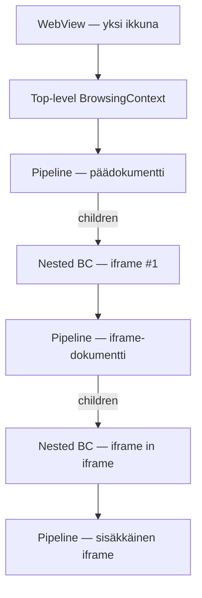
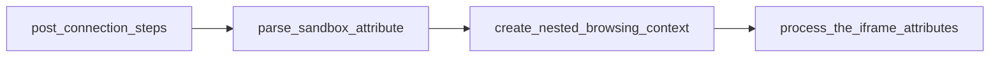
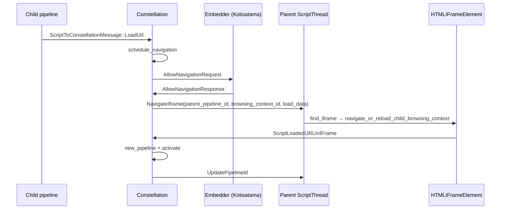
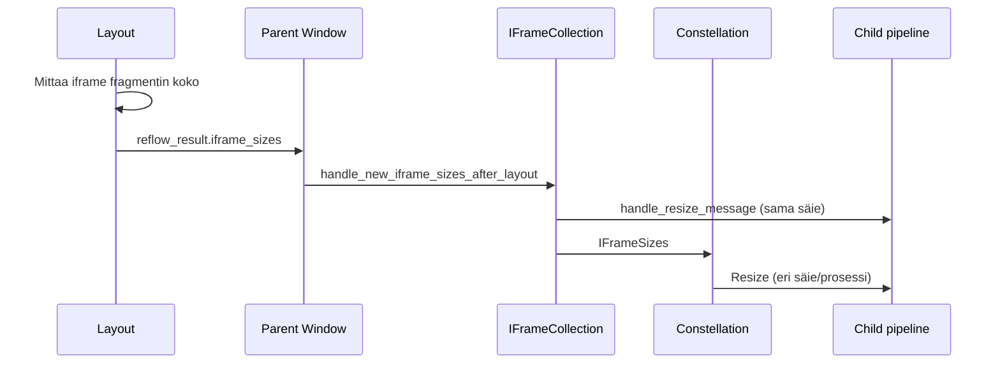
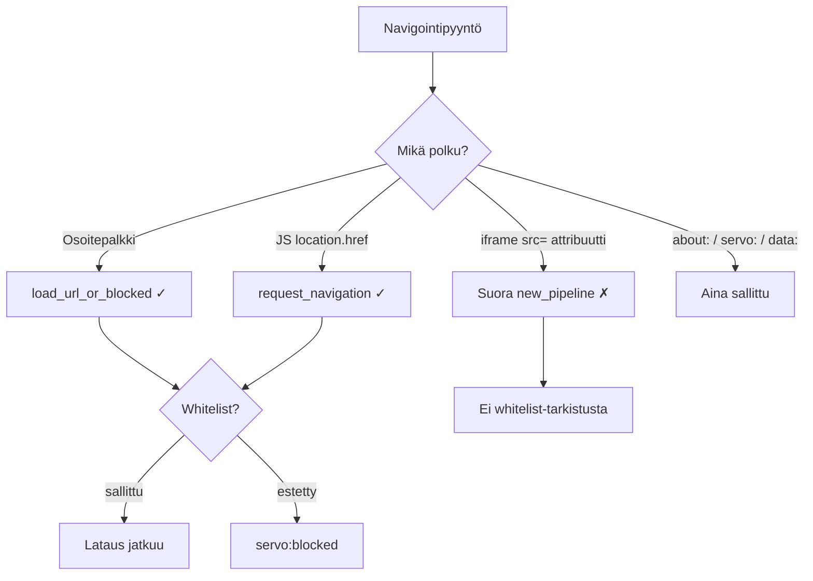

# Iframe ja upotetut selauskontekstit

Tämä sivu syventää [constellation-ja-navigointi.md](constellation-ja-navigointi.md):n iframe-navigointia: miten `<iframe>` luo uuden selauskontekstin, miten parent- ja child-pipelinet liittyvät toisiinsa, ja mitä Kotisataman whitelist tarkoittaa upotetuille sivuille.

> Iframe ei ole erillinen selainikkuna — se on **sisäkkäinen browsing context** samassa WebView:ssä, jolla on oma `Pipeline`, `BrowsingContextId` ja usein oma script-prosessi.

## Keskeiset käsitteet

| Käsite | Mitä tarkoittaa |
|--------|-----------------|
| **BrowsingContext** | Yksi dokumentti kerrallaan — ikkuna tai iframe |
| **BrowsingContextId** | Yksilöllinen tunniste (`BrowsingContext(ns, idx)`) |
| **Pipeline** | Constellationin näkymä yhdestä dokumentista |
| **Top-level BC** | Välilehti / pääikkuna (`BrowsingContextId` = WebView:n BC) |
| **Nested BC** | Iframe (`BrowsingContextId::new()` iframe-elementin luonnissa) |

### Hierarkia



Constellationin kommentti (`constellation.rs`):

> There are two kinds of browsing context: top-level ones (for example tabs), and nested ones (typically caused by `iframe` elements). Browsing contexts have a hierarchy, giving rise to a forest whose roots are top-level browsing contexts.

## Iframen elinkaari

### 1. Elementti liitetään DOM:iin

`HTMLIFrameElement::post_connection_steps` (`dom/html/htmliframeelement.rs`):



| Vaihe | Tehtävä |
|-------|---------|
| `parse_sandbox_attribute` | Lukee `sandbox=""` -attribuutin |
| `create_nested_browsing_context` | Uusi `BrowsingContextId`, alustava `about:blank` |
| `process_the_iframe_attributes` | Käsittelee `src`, `srcdoc`, lazy loading |

### 2. Nested browsing context luodaan

`create_nested_browsing_context`:

1. `BrowsingContextId::new()` — uusi tunniste
2. Perii `webview_id` parent-ikkunasta
3. Rakentaa `LoadData` (`about:blank`, sandbox-flagit, policy container)
4. `start_new_pipeline` → `PipelineType::InitialAboutBlank`
5. Lähettää constellationille `ScriptNewIFrame`

**Huom:** `BrowsingContext`-rakenne luodaan vasta kun dokumentti aktivoidaan (`handle_activate_document_msg`), ei heti spawnissa. Siihen asti metadata on `NewBrowsingContextInfo`:ssa.

### 3. src / srcdoc ladataan

Kun `src`-attribuutti on asetettu:

```
process_the_iframe_attributes
  → ScriptLoadedURLInIFrame (constellation)
  → handle_script_loaded_url_in_iframe_msg
  → new_pipeline + pending_changes
  → ActivateDocument
  → UpdatePipelineId parent-iframe-elementille
```

### 4. Layout mittaa iframen koon

```
layout/replaced.rs (IFrame fragment)
  → reflow_result.iframe_sizes
  → IFrameCollection::handle_new_iframe_sizes_after_layout
  → resize child pipeline + IFrameSizes → constellation
  → resize_browsing_context
```

### 5. Load-event

```
handle_subframe_loaded
  → DispatchIFrameLoadEvent
  → iframe_load_event_steps (parent-dokumentissa)
```

## Pipeline-rakenteet

### Pipeline.children

```rust
// pipeline.rs
/// The child browsing contexts of this pipeline (these are iframes in the document).
pub children: Vec<BrowsingContextId>,
```

Kun nested BC aktivoidaan, parent saa:

```rust
parent.add_child(browsing_context_id);
```

### BrowsingContext

```rust
// browsingcontext.rs — kentät
pub pipeline_id: PipelineId,              // aktiivinen pipeline
pub parent_pipeline_id: Option<PipelineId>, // None = top-level
pub pipelines: FxHashSet<PipelineId>,     // kaikki historian pipeline-id:t
pub viewport_details: ViewportDetails,    // iframe-koko
pub throttled: bool,                       // piilotettu / throttled
```

### Iframe-elementin löytäminen scriptissä

Parent-dokumentti ylläpitää `IFrameCollection`:a (`iframe_collection.rs`):

```rust
document.iframes().get(browsing_context_id) → HTMLIFrameElement
```

`find_iframe(parent_pipeline_id, browsing_context_id)` toimii vain **samalla script-säikeellä** kuin parent.

## NavigateIframe — navigointi iframestä

Kun navigointi alkaa **lapsesta** (esim. `location.href` iframe-dokumentissa), constellation ei luo suoraan uutta pipelinea. Se lähettää viestin **parent-säikeelle**:



### Miksi näin?

`<iframe>`-elementti elää **parent-dokumentin** script-säikeessä. Constellation ei voi suoraan käsitellä iframe-elementtiä child-prosessista — se delegoi parentille.

### Viestityyppi

```rust
// shared/script/lib.rs
NavigateIframe(
    PipelineId,           // parent pipeline (jossa iframe-elementti on)
    BrowsingContextId,    // nested browsing context
    LoadData,
    NavigationHistoryBehavior,
    TargetSnapshotParams,
)
```

### Top-level vs iframe

`constellation.rs` `load_url`:

| `parent_pipeline_id` | Toiminta |
|---------------------|----------|
| `None` | Top-level: uusi pipeline korvaa vanhan |
| `Some(parent)` | Iframe: `NavigateIframe` parent-säikeelle, ei uutta top-level pipelinea |

## Cross-origin vs same-origin

### Event loop / prosessi-eristys

`get_event_loop_for_new_pipeline` (`constellation.rs`):

| Tilanne | Event loop |
|---------|------------|
| `sandbox` + `allow-origin` puuttuu | **Uusi prosessi** (aina erillinen) |
| `about:blank` / `about:srcdoc` | Jakaa parentin event loopin |
| Sama registrable domain | Usein sama script-säie (useita pipelineja) |
| Eri origin | Tyypillisesti erillinen script-prosessi |

### contentDocument / contentWindow

```rust
// htmliframeelement.rs — GetContentDocument
if !self.owner_document().origin().same_origin_domain(&document.origin()) {
    return None;  // cross-origin → null
}
```

| API | Cross-origin |
|-----|--------------|
| `contentDocument` | `null` |
| `contentWindow` | `WindowProxy` (rajoitettu pääsy) |

### Käytännön vaikutukset

- Cross-origin iframe: parent ei näe lapsen DOM:ia
- `javascript:` URL navigointi estetty cross-origin (`check_load_origin`)
- Snapshot-parametrit (sandbox, referrer): "doesn't work for cross-origin parent frames"
- Same-origin: `UpdatePipelineId` päivitetään aikaisin, jotta `contentDocument` toimii parsingin aikana

## Sandbox ja throttling

### iframe sandbox

| `sandbox=""` | Merkitys |
|--------------|----------|
| Attribuutti puuttuu | Ei sandbox-lippuja |
| Tyhjä `sandbox=""` | Täysi sandboxaus |
| `allow-scripts`, `allow-same-origin` jne. | Yksittäiset poikkeukset |

Sandbox-flagit:
- Parsitaan elementissä (`parse_sandbox_attribute`)
- Yhdistetään parent-dokumentin aktiivisiin flageihin (`determine_creation_sandboxing_flags`)
- Viedään `LoadData.creation_sandboxing_flag_set`:iin
- `SANDBOXED_ORIGIN_BROWSING_CONTEXT_FLAG` → pakottaa uuden prosessin

### Throttling

Piilotetut tai offscreen-iframet saavat rajoitetun animaatio-/timer-taajuuden:

```
Pipeline::set_throttled
  → SetThrottled (script + paint)
  → SetThrottledComplete → constellation
  → SetThrottledInContainingIframe → parent iframe element
```

Uudet iframet perivät parentin throttle-tilan (`is_parent_throttled`).

## Iframe-koko → child viewport



| Vaihe | Tiedosto |
|-------|----------|
| Mittaus | `layout/replaced.rs` — `ReplacedContentKind::IFrame` |
| Parent käsittely | `iframe_collection.rs:118` |
| Constellation | `resize_browsing_context` (`constellation.rs:5444`) |

**Nollakokoiset iframet** (`viewport_details.size == zero`) ohitetaan screenshot-valmiudessa — ne eivät koskaan piirry.

## Kotisatama-whitelist ja iframet

Tämä on kriittinen osa Katselinin turvallisuusmallia.

### Missä whitelist tarkistetaan

| Navigointitapa | Whitelist? | Mekanismi |
|----------------|------------|-----------|
| Osoitepalkki / `WebView::load` | **Kyllä** | `load_url_or_blocked` ennen moottoria |
| JS-navigointi (`location.href`, klikkaus) | **Kyllä** | `request_navigation` → `should_allow_navigation` |
| Upotettu `<iframe src="…">` | **EI** | `ScriptLoadedURLInIFrame` → suoraan `new_pipeline` |
| `about:blank` / `servo:` / `data:` | Aina sallittu | `is_navigation_allowed` |
| Aliresurssit iframe-sivulla (kuvat, XHR) | **EI** | Normaali verkko, ei navigointi-gatea |

### Miksi `src=`-attribuutti ohittaa whitelistin?

Kun parent-sivu sisältää:

```html
<iframe src="https://example.com/"></iframe>
```

Lataus kulkee:

```
process_the_iframe_attributes
  → ScriptLoadedURLInIFrame
  → handle_script_loaded_url_in_iframe_msg
  → new_pipeline (EI schedule_navigation / request_navigation)
```

Whitelist tarkistetaan vain kun **embedder kysytään lupaa** (`AllowNavigationRequest`). Attribuuttiohjattu iframe-lataus ei käy tätä polkua.

**Käytännön johtopäätös:** Jos parent-sivu on whitelistissä ja saa sisältää mielivaltaisen HTML:n, se voi upottaa iframeen domainin, joka ei ole whitelistissä.

### JS-initiated iframe-navigointi

Kun käyttäjä tai script **lapsesta** navigoi (`location.href`):

```
schedule_navigation → AllowNavigationRequest → request_navigation
```

Tässä Kotisatama **tarkistaa whitelistin**. Jos estetty:

1. `request.deny()` — iframe-lataus pysähtyy
2. `StopDelayingLoadEventsMode` — parentin load-eventit vapautuvat
3. **Huom:** `running_app_state.rs` kutsuu myös `webview.load(blocked_page_url)` — **koko top-level sivu** korvautuu estosivulla, ei vain iframe

```rust
// running_app_state.rs — konseptuaalinen
fn request_navigation(&self, webview: WebView, request: NavigationRequest) {
    if should_allow_navigation(&webview, &url) {
        request.allow();
    } else {
        request.deny();
        webview.load(blocked_url_for(&url));  // top-level!
    }
}
```

### Avomeri-tila

`should_allow_navigation` hyväksyy whitelistin ulkopuoliset URL:t Avomeri-tilassa (`kotisatama.rs`). Tämä koskee myös iframe-scriptin navigointia, joka menee `request_navigation`:in kautta.

### Mitä Kotisatama ei tee

- Ei per-iframe whitelist-sääntöjä (`should_allow_navigation` ei erottele top-level vs subframe)
- Ei `kotisatama.rs`:ssä iframe-spesifistä logiikkaa — kaikki URL-pohjaista
- Ei estä `src=`-attribuuttiohjaista latausta (upstream-rajoitus + arkkitehtuuri)

## Kymmenen konkreettista polkua

| # | Polku | Avaintiedosto |
|---|-------|---------------|
| 1 | `<iframe>` lisätään DOM:iin | `htmliframeelement.rs:post_connection_steps` |
| 2 | Nested BC + about:blank | `create_nested_browsing_context` → `ScriptNewIFrame` |
| 3 | `src`-attribuutti asetetaan | `ScriptLoadedURLInIFrame` |
| 4 | JS `location.href` iframessa | `navigation.rs` → `NavigateIframe` |
| 5 | Child aktivoidaan | `UpdatePipelineId` → `htmliframeelement.rs` |
| 6 | Load-event | `handle_subframe_loaded` → `DispatchIFrameLoadEvent` |
| 7 | Iframe poistetaan | `destroy_child_navigable` → `RemoveIFrame` |
| 8 | Koko päivittyy layoutista | `replaced.rs` → `IFrameSizes` |
| 9 | Kotisatama estää JS-navigoinnin | `request_navigation` → deny + top-level blocked |
| 10 | Cross-origin contentDocument | `GetContentDocument` → `None` |

## Debuggaus

### Lokitus

```bash
RUST_LOG=constellation=debug,script::dom::html::htmliframeelement=debug ./mach run
```

Constellation trace-targetit: `ScriptNewIFrame`, `ScriptLoadedURLInIFrame`, `NavigateIframe`, `IFrameSizes`, `RemoveIFrame`.

### Yleiset oireet

| Oire | Todennäköinen syy | Missä katsoa |
|------|------------------|--------------|
| Tyhjä iframe | `find_iframe` palautti None (eri script-prosessi) | `handle_navigate_iframe` |
| Iframe ei koskaan piirry | Nollakokoinen viewport | `replaced.rs`, layout |
| Load-event ei tule | `pending_navigation`-lippu | `iframe_load_event_steps` |
| Navigointi hiljaa epäonnistuu | Embedder deny | `AllowNavigationResponse` |
| Estetty URL korvaa koko sivun | Kotisatama deny-handler | `running_app_state.rs:910` |
| `contentDocument` on null | Cross-origin (odotettu) | `GetContentDocument` |
| Vanha sisältö iframessa | `UpdatePipelineId` puuttuu | `pending_changes` jumissa |
| Whitelist ohitettu | `src=`-attribuuttipolku | `handle_script_loaded_url_in_iframe_msg` |

### Kotisatama-spesifinen

| Tarkistus | Komento / paikka |
|-----------|------------------|
| Estetty URL | `note_blocked_url`, `servo:blocked?u=…` |
| Whitelist-tila | `config/whitelist.json`, `KOTISATAMA_WHITELIST_PATH` |
| Onko parent luotettu? | Jos parent on whitelistissä, `src=`-iframe voi ladata mitä tahansa |

## Turvallisuusmallin yhteenveto



**Telakka-työssä:** Jos iframe näyttää väärää sisältöä, tarkista ensin onko kyse `src=`-polusta (whitelist-aukko) vai JS-navigoinnista (whitelist toimii).

## Harjoitus

1. Avaa `components/script/dom/html/htmliframeelement.rs` — lue `create_nested_browsing_context` ja `process_the_iframe_attributes`.
2. Etsi `components/constellation/constellation.rs`:stä `handle_navigate_iframe` ja `load_url` (parent_pipeline_id-haara).
3. Lue `ports/servoshell/running_app_state.rs` — `request_navigation` ja mitä tapahtuu deny:ssä.
4. Testaa: luo HTML, jossa `<iframe src="https://…">` whitelistin ulkopuoliselle domainille — toistuuko?
5. Kirjaa havainnot [telakka/oppimispäiväkirja/](../telakka/oppimispäiväkirja/) ja [kotisatama/navigointi.md](../kotisatama/navigointi.md).

## Seuraavaksi

- [constellation-ja-navigointi.md](constellation-ja-navigointi.md) — top-level navigointi
- [javascript-moottori.md](javascript-moottori.md) — `location.href`, `window.open`
- [kotisatama/navigointi.md](../kotisatama/navigointi.md) — whitelist embedderissä
- [css-flex-ja-grid.md](css-flex-ja-grid.md) — iframe fragmentin koko layoutissa
