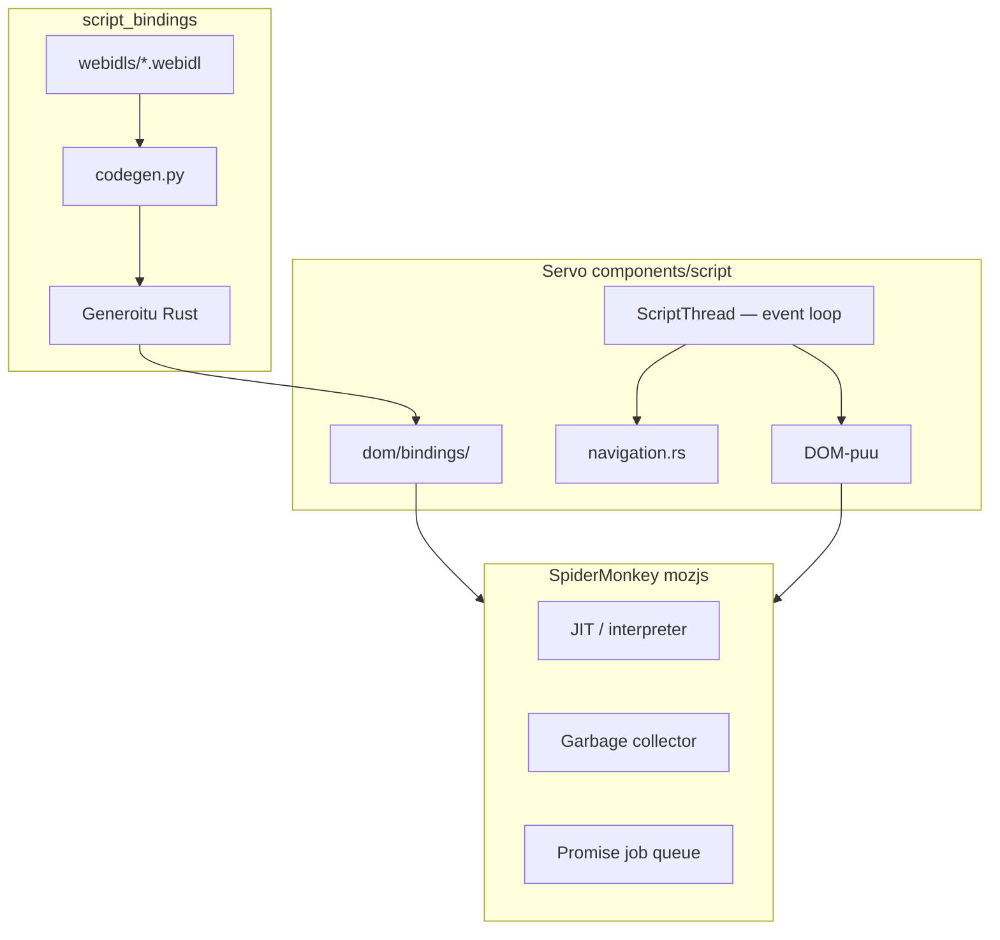
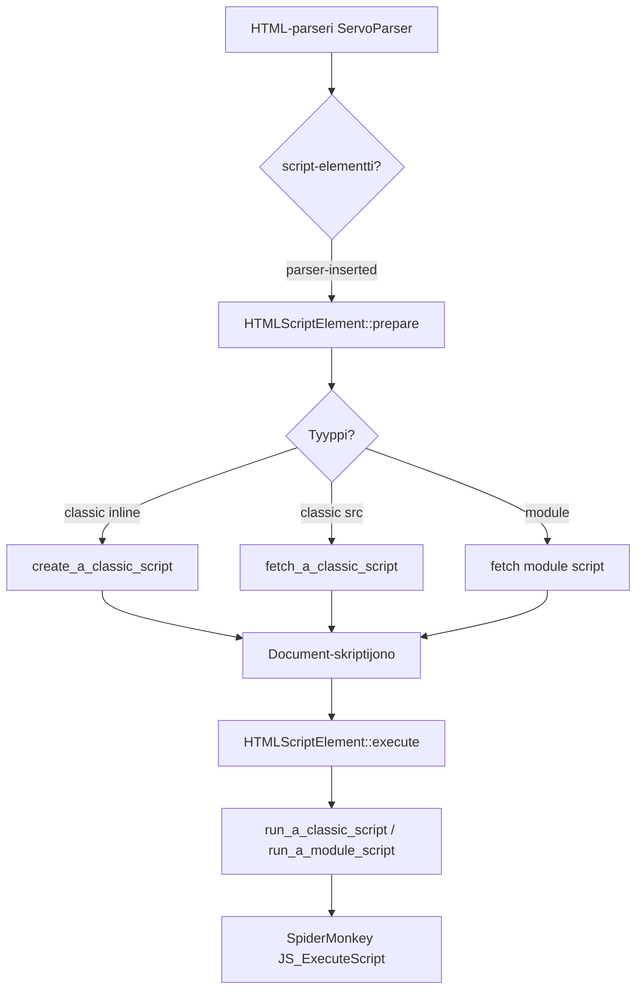
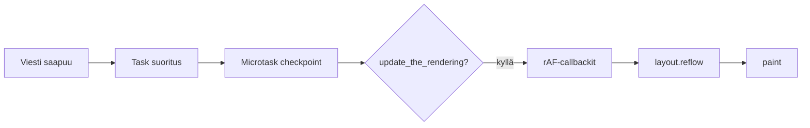
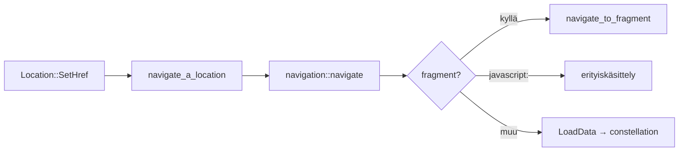
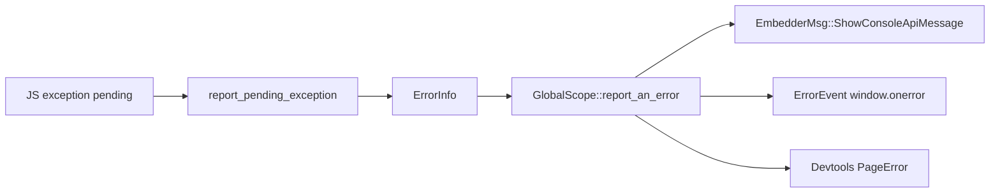

# JavaScript-moottori

Tämä sivu syventää [script-layout-ja-reflow.md](script-layout-ja-reflow.md):n script-osaa: miten Servo suorittaa JavaScriptiä, miten DOM-sidokset toimivat ja miten tapahtumasilmukka pyörii.

> Servo **ei** toteuta omaa JS-moottoria. Se käyttää Mozillan **SpiderMonkeyä** Rust-sidoksen (`mozjs`) kautta ja toteuttaa HTML-spesifikaation päällä (skriptien lataus, event loop, navigointi).

## Kerrokset



| Kerros | Crate / hakemisto | Rooli |
|--------|-------------------|-------|
| C++-moottori | SpiderMonkey (ESR) | Parsinta, JIT, GC, Promise-job queue |
| Rust FFI | `mozjs` v0.17 (`js`-crate) | `JSContext`, `Runtime`, `Compile1` |
| Servo init | `components/script/init.rs` | JIT-asetukset, proxy handlerit, staattiset alustukset |
| Runtime | `components/script/script_runtime.rs` | Job queue, microtaskit, GC-callbackit |
| DOM-sidokset | `components/script_bindings/` | WebIDL → generoitu Rust-glue |
| DOM-toteutus | `components/script/dom/` | Window, Document, HTML-elementit |

## Keskeiset tyypit

### Perintähierarkia

```
EventTarget
  └── GlobalScope          ← kaikkien globaalien yhteinen pohja
        ├── Window         ← pääikkuna (sisältää GlobalScope-kentän)
        ├── DedicatedWorkerGlobalScope
        ├── SharedWorkerGlobalScope
        └── ServiceWorkerGlobalScope

Node → Element → HTMLElement → HTMLScriptElement, HTMLIFrameElement, …
Document (oma puu, ei Node-perintää samalla tavalla)
```

### GlobalScope

`components/script/dom/globalscope/globalscope.rs` — kaikkien globaalien yhteinen pohja:

| Kenttä / vastuu | Merkitys |
|-----------------|----------|
| `module_map` | ES-moduulien tila |
| `script_to_constellation_sender` | Navigointi constellationille |
| `script_to_embedder_chan` | Konsoli, otsikko, kursori |
| `in_error_reporting_mode` | Suojaa `window.onerror`-silmukkaa |
| `uncaught_rejections` | Promise rejection -seuranta |

### Window

`components/script/dom/window/window.rs` — aktiivinen dokumentin JS-global:

```rust
pub(crate) struct Window {
    globalscope: GlobalScope,
    window_proxy: MutNullableDom<WindowProxy>,
    document: MutNullableDom<Document>,
    location: MutNullableDom<Location>,
    // ...
}
```

- **`Window`** = Rust-rakenne, joka omistaa dokumentin ja layout-yhteyden
- **`window` JS-objektissa** = usein `WindowProxy` (erityisesti cross-origin-tapauksissa)

### WindowProxy

`components/script/dom/window/windowproxy.rs` — browsing context -identiteetti:

| Kenttä | Merkitys |
|--------|----------|
| `browsing_context_id` | Selauskonteksti (ikkuna tai iframe) |
| `webview_id` | Ylätason WebView |
| `currently_active: PipelineId` | Aktiivinen dokumentti |

### DomObject / Reflector -malli

Jokainen DOM-tyyppi on Rust-rakenne heapilla + SpiderMonkeyn JSObject:

- `Reflector { object: Heap<*mut JSObject> }` — SM omistaa JS-objektin
- `Dom<T>`, `DomRoot<T>`, `Root<T>` — GC-turvallinen juuritus
- DOM-objektit elävät GC:n alla, ei refcountilla (ks. `components/script/docs/JS-Servos-only-GC.md`)

## Skriptien lataus ja suoritus

### Kokonaiskuva



### defer, async, module — luokittelu

`HTMLScriptElement::get_script_kind` (`dom/html/htmlscriptelement.rs`):

| Syöte | `ExternalScriptKind` | Document-metodi |
|-------|----------------------|-----------------|
| `async` tai non-parser | `Asap` | `asap_script_loaded` |
| Dynaaminen (ei parser) | `AsapInOrder` | `asap_in_order_script_loaded` |
| `defer` tai `type=module` | `Deferred` | `deferred_script_loaded` |
| Parser, ei async/defer | `ParsingBlocking` | `pending_parsing_blocking_script_loaded` |

**Parsing-blocking:** parser pysähtyy (`servoparser/mod.rs`), kunnes skripti on ladattu ja suoritettu. Tämä on syy miksi `<script>` `<head>`:ssä viivästyttää bodyn renderöintiä.

**Deferred:** käsitellään vasta `document.finish_load`:n jälkeen — DOM on valmis ennen suoritusta.

### Prepare → Execute

| Vaihe | Tiedosto | Tehtävä |
|-------|----------|---------|
| `prepare` | `htmlscriptelement.rs:584` | CSP, Trusted Types, MIME, fetch käynnistys |
| `create_a_classic_script` | `globalscope/script_execution.rs:81` | `Compile1` (SpiderMonkey) |
| `execute` | `htmlscriptelement.rs:955` | `currentScript`, suoritus, `load`/`error`-eventit |
| `run_a_classic_script` | `script_execution.rs:148` | `JS_ExecuteScript` |

### ES-moduulit

`components/script/script_module.rs`:

- `CompileModule1` — moduulin kääntäminen
- `fetch_an_external_module_script` — ulkoinen moduuli
- Import map: `register_import_map` execute-vaiheessa
- Moduulihookit: `EnsureModuleHooksInitialized` (`script_runtime.rs`)

### Muut suorituspolut

| Lähde | Polku |
|-------|-------|
| `setTimeout` / `setInterval` | `timers.rs` → `create_a_classic_script` + `run_a_classic_script` |
| Event handlerit | Generoitu glue → `ExceptionHandling::Report` |
| Workers | `dom/workers/workerglobalscope.rs` — oma `GlobalScope` |
| Embedder eval | `ScriptThread::handle_evaluate_javascript` |

## Tapahtumasilmukka

`ScriptThread` on HTML-spesifikaation "agent" event loop. Pääsilmukka:

```rust
// script_thread.rs — konseptuaalinen
pub(crate) fn start(&self, cx: &mut JSContext) {
    while self.handle_msgs(cx) {
        // jatka kunnes shutdown
    }
}
```

### `handle_msgs` — yksi kierros

1. Odota viestejä (constellation, verkko, timer, devtools…)
2. Suorita taskit oikeassa realmissa (`TaskQueue`)
3. **Microtask checkpoint** (`perform_a_microtask_checkpoint`)
4. DOM GC checkpoint
5. **`update_the_rendering`** — resize, scroll, animaatiot, **rAF**, intersection observer, paint



### Microtaskit — kaksi integraatiota

**A) Servo `MicrotaskQueue`** (`microtask.rs`):
- `queueMicrotask`, Promise-reaktiot, mutation observers, custom element reactions
- Checkpoint: HTML spec step 1–7

**B) SpiderMonkey job queue** (`script_runtime.rs`):
- `JOB_QUEUE_TRAPS`: `enqueuePromiseJob`, `runJobs`
- SM:n Promise-microtaskit ohjataan Servon `MicrotaskQueue`:een

### Timerit

| Komponentti | Rooli |
|-------------|-------|
| `components/script/timers.rs` | `setTimeout` / `setInterval` toteutus |
| `components/timers/` | Ajastin-IPC script-threadille |
| `OneshotTimers::fire_timer` | HTML timer initialisation steps |

Timer-callbackit suoritetaan event loopissa kuten `<script>`-sisältö: `create_a_classic_script` + `run_a_classic_script`.

### requestAnimationFrame

rAF **ei** ole erillinen SM-primitiivi — se on `update_the_rendering` -vaiheen osa:

1. `Window::RequestAnimationFrame` → `Document::request_animation_frame`
2. `schedule_update_the_rendering_timer_if_necessary`
3. `update_the_rendering` → `document.run_the_animation_frame_callbacks`

## script_bindings — WebIDL → Rust

```
components/script_bindings/
├── webidls/              ← ~700+ WebIDL-tiedostoa (Window, Document, fetch, …)
├── codegen/codegen.py    ← build-time generaattori
├── reflector.rs          ← DomObject, Reflector-malli
├── wrap.rs               ← Objektien käärintä SM:ään
├── proxyhandler.rs       ← JS Proxy (Window named properties)
├── conversions.rs        ← JS ↔ Rust tyypit
└── OUT_DIR (build)       ← Generoitu: Bindings/, RegisterBindings.rs
```

### Generointiputki

1. `cargo build -p servo-script-bindings` → Python `codegen/run.py`
2. Tuottaa geneeriset bindingit
3. `servo-script` build generoi konkreettiset `DomTypeHolder`-sidokset → `dom/bindings/codegen/`

Käynnistyksessä (`init.rs`):

```rust
RegisterBindings::RegisterProxyHandlers::<crate::DomTypeHolder>();
RegisterBindings::InitAllStatics::<crate::DomTypeHolder>();
```

Kun muutat Web API:ta, muokkaa `webidls/`-tiedostoa — ei käsin kirjoitettua glue-koodia.

## Navigointi JavaScriptistä

### `location.href = "..."`



`navigation::navigate` (`navigation.rs:360`):
- Tarkistaa unloading-tilan ja historian (push/replace)
- Fragment (`#osio`) → scroll, ei täyttä reloadia
- Muu URL → `ScriptToConstellationMessage::LoadUrl` → constellation → embedder-lupa

### Muut navigointipisteet

| API | Tiedosto | Huomio |
|-----|----------|--------|
| `window.open()` | `window.rs` → `WindowProxy::open` | Uusi browsing context |
| `history.pushState` | `dom/window/history.rs` | Ei täyttä navigointia |
| `<a>` klikkaus | `dom/html/` | Oma navigate-kutsu |
| Lomakkeen submit | `dom/html/htmlformelement.rs` | Navigate tai fetch |

Kotisataman whitelist koskee `request_navigation`-hookia ennen kuin constellation jatkaa. Katso [iframe-ja-upotetut-kontekstit.md](iframe-ja-upotetut-kontekstit.md) iframe-erikoistapauksista.

## Virheenkäsittely ja konsoli

### Virheiden raportointiketju



| Tiedosto | Tehtävä |
|----------|---------|
| `dom/bindings/error.rs` | `report_pending_exception`, `throw_dom_exception` |
| `globalscope.rs` | `report_an_error` — embedder + onerror + devtools |
| `dom/console.rs` | `console.log/warn/error` → embedder + devtools |

### Classic script -virheet

`run_a_classic_script` (`script_execution.rs`):
- `RethrowErrors::No` (normaali `<script>`): raportoi, ei rethrowaa sivulle
- `RethrowErrors::Yes`: palauttaa `Error::JSFailed`
- **Muted errors** (cross-origin script): `"Script error."` ilman yksityiskohtia (CORS)

### Promise rejection

`notify_about_rejected_promises` (`script_runtime.rs`):
- `unhandledrejection`-event
- Microtask checkpointin jälkeen

## Kymmenen konkreettista polkua

| # | Polku | Avaintiedosto |
|---|-------|---------------|
| 1 | Sovelluksen JS-init | `init.rs:164` — `InitAllStatics` |
| 2 | Script thread käynnistyy | `script_thread.rs:1079` — `while handle_msgs` |
| 3 | Runtime + job queue | `script_runtime.rs:879` — `CreateJobQueue` |
| 4 | Parser kohtaa `<script>` | `servoparser/mod.rs:728` — `prepare`, parser suspend |
| 5 | Script prepare | `htmlscriptelement.rs:584` — CSP, fetch |
| 6 | Classic compile | `script_execution.rs:81` — `Compile1` |
| 7 | Classic execute | `htmlscriptelement.rs:1007` — `run_a_classic_script` |
| 8 | setTimeout callback | `timers.rs:326` — `fire_timer` |
| 9 | Microtask checkpoint | `script_thread.rs:4314` — `perform_a_microtask_checkpoint` |
| 10 | location.href | `location.rs:426` → `navigation.rs:360` |

## Debuggaus

### Lokitus

```bash
RUST_LOG=script=debug ./mach run
# tai tarkemmin:
RUST_LOG=script::dom::html::htmlscriptelement=trace,script::navigation=debug ./mach run
```

### SpiderMonkey-debug

| Feature / työkalu | Käyttö |
|-------------------|--------|
| `debugmozjs` | GC zeal (`script_runtime.rs`) |
| `profilemozjs` | SM-profilointi |
| `js_backtrace` | DOM-poikkeuksiin JS+Rust stack |
| `js_disable_jit` pref | JIT pois päältä (helpompi debug) |
| `dump_js_stack` | GDB/LLDB:stä script threadin CX:llä (`window.rs`) |

### Käytännön workflow

1. Toista bugi (`./mach run` tai WPT)
2. Etsi `script=`-lokit prepare/execute-vaiheista
3. JS-virhe → embedder-konsoli (tiedosto:rivi) + `report_an_error`
4. Navigointi → `navigation.rs` + constellation-lokit
5. Timer/rAF → `timers.rs` + `update_the_rendering`
6. Binding-muutos → `webidls/` → `cargo build -p servo-script`

### Yleisiä oireita

| Oire | Epäilty syy | Missä etsiä |
|------|-------------|-------------|
| Sivu jää tyhjäksi | Parsing-blocking script ei valmistu | `servoparser`, `htmlscriptelement` |
| `Script error.` ilman riviä | Cross-origin muted error | CORS, script origin |
| Promise ei resolvdu | Microtask checkpoint ei aja | `microtask.rs`, event loop |
| `location.href` ei navigoi | Embedder deny | `request_navigation`, Kotisatama |
| Lomake ei lähetä | Event handler tai submit-logiikka | `htmlformelement.rs` |

## Harjoitus

1. Avaa `components/script/dom/html/htmlscriptelement.rs` — lue `get_script_kind` ja `execute`.
2. Etsi `components/script/script_thread.rs`:stä `update_the_rendering` — mitä se kutsuu?
3. Avaa yksinkertainen sivu, jossa on `defer` ja `async` skriptit — seuraa lokitusta.
4. Muuta `components/script_bindings/webidls/Console.webidl` (tai lue sitä) — ymmärrä codegen-polku.
5. Kirjaa havainnot [telakka/oppimispäiväkirja/](../telakka/oppimispäiväkirja/).

## Seuraavaksi

- [script-layout-ja-reflow.md](script-layout-ja-reflow.md) — DOM → layout
- [iframe-ja-upotetut-kontekstit.md](iframe-ja-upotetut-kontekstit.md) — iframe ja JS-navigointi
- [css-flex-ja-grid.md](css-flex-ja-grid.md) — layout CSS:llä
- [testaus-wpt.md](testaus-wpt.md) — `tests/wpt/tests/html/semantics/scripting/`
