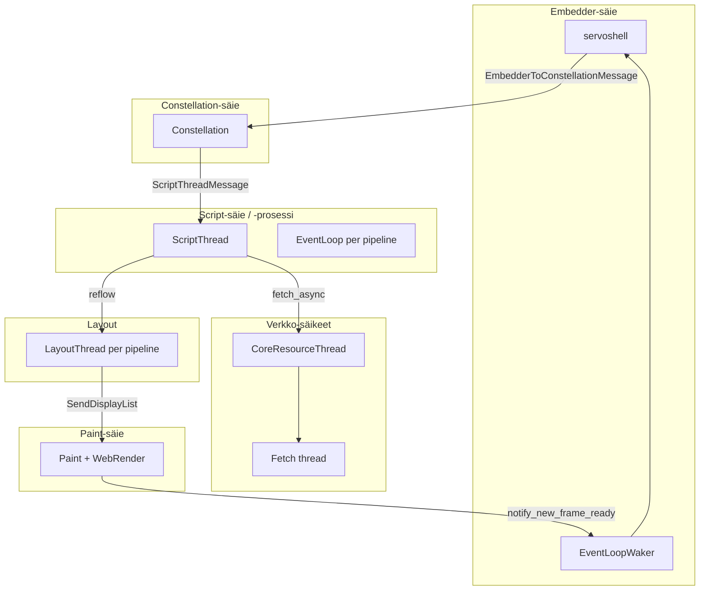

# Prosessit ja säikeet

Servo käyttää useita prosesseja ja säikeitä eristämään crashit, parantamaan turvallisuutta ja hyödyntämään rinnakkaisuutta. Tämä sivu kuvaa konkreettiset rajat ja viestikanavat — ei vain yleiskuvaa.

> Tarkat prosessirajat voivat muuttua upstreamissa. Tarkista aina lähdekoodista: `components/constellation/`, `components/script/`, `components/net/`.

## Miksi useita prosesseja ja säikeitä?

| Syy | Selitys |
|-----|---------|
| Turvallisuus | Epäluotettavan sivun JS ei pääse kaatamaan koko selainta |
| Vakaus | Yhden välilehden kaatuminen ei välttämättä tapa muita |
| Rinnakkaisuus | Fetch, layout ja piirto voivat edetä rinnakkain |
| Eristys | Verkko- ja script-oikeudet erotettu toisistaan |

## Kuka tekee mitä?

## Prosessi- vs. säierakenne

| Osapuoli | Tyypillisesti | Huomio |
|----------|---------------|--------|
| Embedder (servoshell) | Pääprosessin säie | Ikkuna, syöte, `spin_event_loop` |
| Constellation | Oma säie | Orkestroi kaikki pipeline-prosessit |
| Script | Säie tai erillinen prosessi | `Pipeline::spawn` voi käynnistää multiprocess-tilan |
| Resource / fetch | Omat säikeet | Erillinen HTTP-käsittely |
| Layout | Säie per pipeline | Kutsutaan script-säikeestä |
| Paint | Oma säie | WebRender, kaikki webviewit |

Script voi ajaa omassa prosessissaan (`spawn_multiprocess`). Tällöin constellation ja script kommunikoivat IPC:n kautta, ei jaetulla muistilla.

## Pipeline — constellationin näkymä

`Pipeline` (`components/constellation/pipeline.rs`) on keskeinen abstraktio:

| Kenttä | Merkitys |
|--------|----------|
| `id: PipelineId` | Yksilöllinen tunniste |
| `browsing_context_id` | Selauskonteksti (ikkuna tai iframe) |
| `event_loop` | Kanava script-säikeeseen |
| `paint_proxy` | Kanava paint-säikeeseen |
| `url` | Viimeisin ladattu URL |
| `children` | Iframe-browsing contextit |

Yksi script-säie voi hoitaa **useita pipelineja** (sama origin). Tämä säästää resursseja.

Lue lisää: [constellation-ja-navigointi.md](constellation-ja-navigointi.md).

## Viestikanavat — pikaopas

Prosessit ja säikeet kommunikoivat **viesteillä**, ei jaetulla muistilla. Etsi koodista:

| Viestityyppi | Suunta | Dokumentti |
|--------------|--------|------------|
| `EmbedderToConstellationMessage` | embedder → constellation | [constellation-ja-navigointi.md](constellation-ja-navigointi.md) |
| `ConstellationToEmbedderMsg` | constellation → embedder | [constellation-ja-navigointi.md](constellation-ja-navigointi.md) |
| `ScriptThreadMessage` | constellation → script | [constellation-ja-navigointi.md](constellation-ja-navigointi.md) |
| `ScriptToConstellationMessage` | script → constellation | [constellation-ja-navigointi.md](constellation-ja-navigointi.md) |
| `CoreResourceMsg` / `FetchResponseMsg` | script ↔ net | [verkko-ja-piirto.md](verkko-ja-piirto.md) |
| `PaintMessage` | layout → paint | [verkko-ja-piirto.md](verkko-ja-piirto.md) |
| `EmbedderMsg` | script → embedder | [verkko-ja-piirto.md](verkko-ja-piirto.md) |

> Vanhoissa viittauksissa `ConstellationMsg` = käytännössä `EmbedderToConstellationMessage` Debug-muodossa.

## Event loop embedderissä

Embedderin pääsilmukka on `Servo::spin_event_loop()` (`components/servo/servo.rs`). Se:

1. Käsittelee constellation-viestit (navigointi, historia)
2. Käsittelee paint-viestit (uusi kehys valmis)
3. Käsittelee net-viestit (evästeet, tiedostovalitsin)
4. Kutsuu `notify_new_frame_ready` delegaatille

Käyttäjä ei näe mitään ennen kuin tämä silmukka pyörii ja embedder kutsuu `WebView::paint()`.

## Mitä tämä tarkoittaa debuggauksessa

| Havainto | Selitys |
|----------|---------|
| Konsolivirhe "väärästä" prosessista | Script voi olla erillisessä prosessissa — tarkista script-loki |
| Navigointi jumittaa | Constellation odottaa `AllowNavigationResponse`:ia embedderiltä |
| Sivu latautuu mutta ei piirry | Paint-säie tai `notify_new_frame_ready` ei herätä embedderiä |
| WPT menee läpi, UI ei | WPT ajaa yksinkertaisemmassa konfiguraatiossa kuin täysi desktop |

Lisälokit: book.servo.org debugging + `./mach run` liput.

## Harjoitus

1. Avaa `components/constellation/pipeline.rs` — lue `Pipeline`-rakenteen kentät ja `spawn`-funktion kommentit.
2. Etsi `components/shared/constellation/lib.rs`:stä `EmbedderToConstellationMessage` — montako varianttia?
3. Etsi `components/servo/servo.rs`:stä `spin_event_loop` — mitä säikeitä se herättää?
4. Kirjaa havainnot [telakka/oppimispäiväkirja/](../telakka/oppimispäiväkirja/).

## Seuraavaksi

- [constellation-ja-navigointi.md](constellation-ja-navigointi.md) — Pipeline ja navigointi
- [javascript-moottori.md](javascript-moottori.md) — script-säie ja event loop
- [iframe-ja-upotetut-kontekstit.md](iframe-ja-upotetut-kontekstit.md) — iframe-prosessit
- [script-layout-ja-reflow.md](script-layout-ja-reflow.md) — script-säie ja reflow
- [verkko-ja-piirto.md](verkko-ja-piirto.md) — verkko- ja paint-säikeet
- [book.servo.org — design documentation](https://book.servo.org/design-documentation/)
