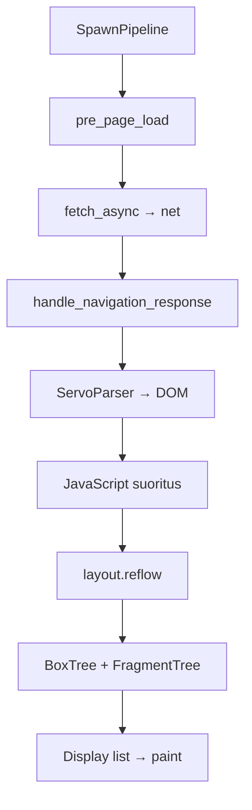
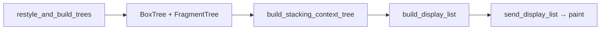

# Script, DOM ja reflow

Tämä sivu selittää mitä tapahtuu constellationin `SpawnPipeline`-viestin jälkeen: HTML haetaan verkosta, jäsennetään DOM-puuksi, JavaScript suoritetaan ja CSS lasketaan layout-puuksi.

> Script ja layout ovat erillisiä crateta, mutta script **omistaa** DOM:n ja **kutsuu** layoutia. Layout ei koskaan suoraan muokkaa DOM:ia.

## Kokonaiskuva



## Script — kaksivaiheinen sivulataus

`components/script/script_thread.rs` toteuttaa HTML-spesifikaation kaksivaiheisen latauksen:

1. **Fetch käynnistyy** — `pre_page_load()` lähettää HTTP-pyynnön ennen kuin `Window`/`Document` on luotu.
2. **Vastaus saapuu** — `handle_navigation_response()` luo dokumentin ja syöttää tavua parserille.

Tämä mahdollistaa streamatun latauksen: sivu voi alkaa renderöityä ennen kuin koko HTML on saapunut.

### Keskeiset moduulit

| Moduuli | Polku | Tehtävä |
|---------|-------|---------|
| `ScriptThread` | `script_thread.rs` | DOM:n omistaja, tapahtumasilmukka, layout-kutsut |
| `ServoParser` | `dom/servoparser/mod.rs` | HTML-jäsennys (html5ever) |
| `DocumentLoader` | `document_loader.rs` | CSS, JS, kuvat — aliresurssien lataus |
| `TaskQueue` | `task_queue.rs` | HTML event loop -tehtäväjono |
| `timers` / `microtask` | `timers.rs`, `microtask.rs` | `setTimeout`, Promise-mikrotehtävät |

### ServoParser

Parseri rakentaa DOM-puun html5ever-kirjaston `TreeSink`-rajapinnan kautta:

```
parse_html_document()     → uusi dokumentti
parse_bytes_chunk(data)   → streamattu data saapuessa
```

Kun parseri kohtaa `<link rel="stylesheet">` tai `<script>`, se käynnistää aliresurssien latauksen `DocumentLoader`:in kautta.

## Tapahtumasilmukka

Script-säie pyörittää HTML-spesifikaation tapahtumasilmukkaa. Viestit tulevat useista lähteistä:

| Lähde | Esimerkki |
|-------|-----------|
| Constellation | `Resize`, `ForwardInputEvent`, `NavigateIframe` |
| Net | `FetchResponseMsg` (vastauksen palat) |
| Sisäinen | `TaskQueue` — DOM-tapahtumat, ajastimet |

Tapahtumasilmukan vaiheet (yksinkertaistettu):

1. Käsittele yksi viesti (esim. klikkaus, fetch-chunk)
2. Suorita mikrotehtävät (Promiset)
3. Suorita ajastimet (`setTimeout`, `requestAnimationFrame`)
4. Tarvittaessa pyydä reflow

Monimutkaiset sivut (SPA:t, lomakkeet) debugataan usein script-tasolla — konsolivirheet ja tapahtumaketjut ovat täällä.

## Layout — BoxTree, FragmentTree, display list

`components/layout/layout_impl.rs` sisältää `LayoutThread`:in — yksi per pipeline.

### Reflow-ketju

Kun DOM tai CSS muuttuu, script kutsuu `layout.reflow(ReflowRequest)`. Layout suorittaa:



| Vaihe | Tulos |
|-------|-------|
| Restyle | CSS-säännöt sovelletaan DOM-solmuihin |
| Box tree | Asettelulaatikot (block, inline, flex, grid) |
| Fragment tree | Rivitetyt fragmentit (teksti, kuvat) |
| Stacking context | Z-järjestys, opacity, transform |
| Display list | WebRender-yhteensopiva piirtolista |

### Milloin reflow laukeaa?

`RestyleReason` kertoo syyn (`components/shared/layout/`):

| Syy | Esimerkki |
|-----|-----------|
| `DOMChanged` | Elementti lisätty/poistettu |
| `StylesheetsChanged` | CSS ladattu tai muuttunut |
| `ViewportChanged` | Ikkunan koko muuttui |
| `ThemeChanged` | Tumma/vaalea tila vaihtui |

`ReflowGoal` määrittää tarkoituksen:

| Tavoite | Käyttö |
|---------|--------|
| `UpdateTheRendering` | Normaali piirto (vsync) |
| `LayoutQuery` | JS kysyy elementin kokoa (`getBoundingClientRect`) |
| `UpdateScrollNode` | Scroll-sijainnin päivitys |

## Script ↔ Layout -raja

Script ei tunne layoutin sisäisiä rakenteita. Se käyttää `Layout`-traitia (`layout_api`):

```rust
// Konseptuaalinen — script kutsuu, layout toteuttaa
layout.reflow(ReflowRequest {
    goal: ReflowGoal::UpdateTheRendering,
    restyle_reason: RestyleReason::DOMChanged,
    // ...
});
```

Layout palauttaa `ReflowResult`:in, jossa voi olla iframe-koot, scroll-tilat ja odottavat kuvat.

## Aliresurssien lataus

Kun päädokumentti on jäsennetty, `DocumentLoader` hakee rinnakkain:

| Resurssi | `LoadType` | Vaikutus |
|----------|------------|----------|
| CSS | stylesheet | Uusi reflow (`StylesheetsChanged`) |
| JavaScript | script | Suoritus → DOM-muutokset → reflow |
| Kuvat | image | Layout odottaa (`pending_images`) |
| Fontit | web font | Fonttilataus → reflow |

Jokainen aliresurssi käyttää samaa `fetch_async` → `CoreResourceMsg::Fetch` -infraa kuin päädokumentti. Katso [verkko-ja-piirto.md](verkko-ja-piirto.md).

## Missä bugi usein piilee

| Oire | Epäilty kerros | Missä etsiä |
|------|----------------|-------------|
| Tyhjä sivu, konsolivirhe | script | `script_thread.rs`, parseri |
| Lomake ei lähetä | script | event loop, `submit`-käsittely |
| Flex/grid väärin | layout | `components/layout/flow/` |
| Teksti leikkaantuu | layout | fragment tree, line breaking |
| Kuva ei näy | layout + net | `pending_images`, image cache |
| Animaatio ei toimi | script + layout | `TickAnimation`, `requestAnimationFrame` |

## Harjoitus

1. Avaa `components/script/dom/servoparser/mod.rs` — etsi `parse_bytes_chunk`.
2. Avaa `components/layout/layout_impl.rs` — etsi `handle_reflow`.
3. Lataa yksinkertainen sivu (`./mach run`) ja seuraa mitä tapahtuu kun muutat ikkunan kokoa (`Resize` → reflow).
4. Etsi WPT-testi aiheesta: [testaus-wpt.md](testaus-wpt.md).

## Seuraavaksi

- [javascript-moottori.md](javascript-moottori.md) — SpiderMonkey, event loop, skriptien suoritus
- [css-flex-ja-grid.md](css-flex-ja-grid.md) — flex ja grid layout syvällisesti
- [iframe-ja-upotetut-kontekstit.md](iframe-ja-upotetut-kontekstit.md) — iframe-koko ja nested BC
- [verkko-ja-piirto.md](verkko-ja-piirto.md) — fetch ja WebRender
- [constellation-ja-navigointi.md](constellation-ja-navigointi.md) — miten pipeline syntyy
- [telakka/miten-debugataan.md](../telakka/miten-debugataan.md) — käytännön debuggaus
