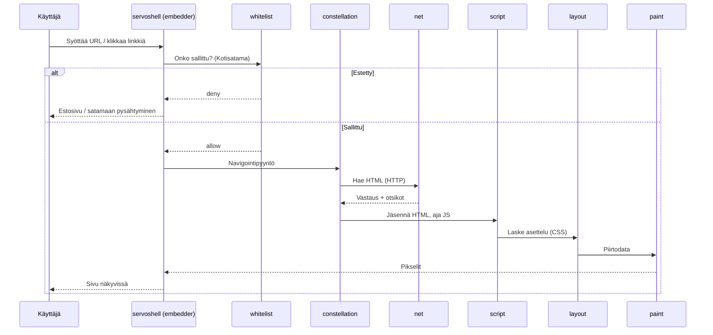

# Sivun lataus — URL:sta näytölle

Käytännönläheinen kuvaus siitä, mitä tapahtuu kun käyttäjä avaa sivun Katselimessä (esim. `https://www.kela.fi/`).

## Kokonaiskuva

## Vaiheet suomeksi

### 1. Käyttäjän syöte

Käyttäjä kirjoittaa osoitekenttään tai klikkaa linkkiä. Embedder (`ports/servoshell/`) vastaanottaa tapahtuman.

### 2. Whitelist (Kotisatama)

Ennen moottorin varsinaista navigointia embedder kutsuu whitelist-logiikkaa (`components/kotisatama/whitelist/`). Tämä **ei ole** osa upstream-Servoa — se on Katselinin kerros.

- Sallittu → jatketaan
- Estetty → navigointi pysähtyy (satama)

### 3. Constellation — orkestrointi

`components/constellation/` hallitsee selauskontekstia: mikä välilehti, mikä historia, mihin prosessiin viesti menee.

### 4. Verkko (`net`)

`components/net/` tekee HTTP(S)-pyynnön: DNS, TLS, otsikot, evästeet, uudelleenohjaukset. Aliresurssit (CSS, JS, kuvat) haetaan rinnakkain myöhemmin.

### 5. Skripti (`script`)

HTML jäsennetään DOM-puuksi. JavaScript suoritetaan. Tapahtumat (`click`, `load`, …) käsitellään tapahtumasilmukassa.

### 6. Asettelu (`layout`)

CSS säännöt lasketaan: elementtien koot, sijainnit, flex/grid. Tulos on layout-puu.

### 7. Piirto (`paint`)

Layout-puu muutetaan pikseleiksi: tekstit, taustat, kuvat. Tulos välitetään embedderille näytettäväksi.

### 8. Näyttö

`servoshell` piirtää kehyksen ja välittää käyttäjän syötteen takaisin moottoriin.

## Missä bugi usein piilee

| Oire | Epäilty kerros | Missä etsiä |
|------|----------------|-------------|
| Sivu ei lataudu ollenkaan | verkko, TLS | `components/net/` |
| Tyhjä sivu, konsolivirhe | skripti | `components/script/` |
| Sisältö näkyy mutta layout rikki | asettelu | `components/layout/` |
| Fontit/ värit väärin | piirto, fontit | `components/paint/`, `fonts/` |
| Linkki ei avaudu | embedder, whitelist | `ports/servoshell/`, `kotisatama/whitelist/` |

## Harjoitus

1. Avaa `https://www.kela.fi/` Katselimessä.
2. Kirjaa ylös mikä vaihe **näyttää** epäonnistuvan (ei lataudu / layout / JS).
3. Avaa vastaava komponentti [komponentit.md](komponentit.md) -taulukosta.
4. Kirjaa havainnot [telakka/oppimispäiväkirja/](../telakka/oppimispäiväkirja/).

## Seuraavaksi

- [embedder-ja-ports.md](embedder-ja-ports.md) — whitelist-hookin paikka
- [telakka/miten-debugataan.md](../telakka/miten-debugataan.md) — käytännön debuggaus
