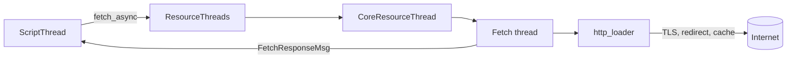
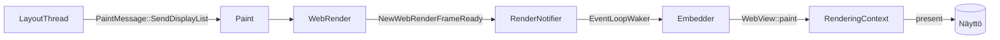
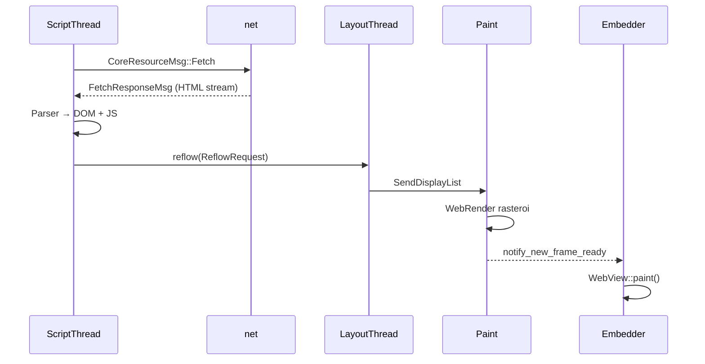

# Verkko ja piirto

Tämä sivu syventää kahta kerrosta: miten Servo hakee resursseja verkosta (`net`) ja miten layout-puu muuttuu näytön pikseleiksi (`paint` → embedder).

## Verkko — fetch-ketju

Servo toteuttaa [Fetch-spesifikaation](https://fetch.spec.whatwg.org/) `components/net/`-cratessa. Script ei tee HTTP:ää suoraan — se käyttää `ResourceThreads`-rajapintaa.

### Arkkitehtuuri



### Keskeiset tiedostot

| Tiedosto | Tehtävä |
|----------|---------|
| `net/resource_thread.rs` | `CoreResourceThread` — vastaanottaa fetch-pyynnöt |
| `net/fetch/methods.rs` | `fetch()` — Fetch-specin toteutus |
| `net/http_loader.rs` | HTTP(S), uudelleenohjaukset |
| `net/http_cache.rs` | HTTP-välimuisti |
| `net/cookie_storage.rs` | Evästeet |
| `shared/net/lib.rs` | `CoreResourceMsg`, `fetch_async()`, `FetchResponseMsg` |

### Viestityypit

| Viesti | Suunta | Sisältö |
|--------|--------|---------|
| `CoreResourceMsg::Fetch` | script → net | Pyyntö: URL, metodi, otsikot |
| `FetchResponseMsg::ProcessResponse` | net → script | Vastauksen metadata (status, otsikot) |
| `FetchResponseMsg::ProcessResponseChunk` | net → script | Body-pala (streamattu) |
| `FetchResponseMsg::ProcessResponseEOF` | net → script | Vastaus valmis |

### Navigoinnin fetch

Kun constellation lähettää `SpawnPipeline`, script käynnistää:

```
pre_page_load()
  → NavigationListener::initiate_fetch()
  → fetch_async(core_thread, RequestBuilder, callback)
  → CoreResourceMsg::Fetch
  → fetch() [CORS, cache, redirect, http_fetch]
  → FetchResponseMsg stream → handle_navigation_response()
```

Aliresurssit (CSS, JS, kuvat) käyttävät samaa infraa `DocumentLoader::fetch_async`:n kautta.

### Erityisprotokollat

`components/net/protocols/` käsittelee skeemat, joille ei tarvita HTTP:ää:

| Skeema | Käyttö |
|--------|--------|
| `data:` | Inline-data (esim. mobiilin blokkaussivu) |
| `blob:` | Blob-URL:t |
| `file:` | Paikalliset tiedostot (kehitys) |

Katselinin `servo:`-sivut eivät käytä `net`-cratetta — ne palvellaan protocol handlerista. Katso [kotisatama/sisaiset-sivut.md](../kotisatama/sisaiset-sivut.md).

### Säikeet

`new_resource_threads()` luo erilliset säikeet:

| Säie | Tehtävä |
|------|---------|
| Public core thread | Julkiset fetch-pyynnöt |
| Private core thread | Navigointi, arkaluonteiset pyynnöt |
| Fetch thread | Varsinainen HTTP-käsittely |

Tämä erottelu parantaa turvallisuutta: sivun JavaScript ei pääse suoraan fetch-säikeeseen.

## Piirto — layout-puu → pikselit

Paint muuttaa layoutin display listin WebRender-piirrokseksi ja herättää embedderin päivittämään näytön.

### Arkkitehtuuri



### Keskeiset tiedostot

| Tiedosto | Tehtävä |
|----------|---------|
| `paint/paint.rs` | `Paint` — WebRender-instanssit, viestien käsittely |
| `paint/painter.rs` | Yksi `RenderingContext` / painter |
| `paint/webview_renderer.rs` | WebView-kohtainen renderöinti |
| `paint/render_notifier.rs` | WebRender → `NewWebRenderFrameReady` |
| `paint/refresh_driver.rs` | Animaatiot, vsync |
| `shared/paint/lib.rs` | `PaintMessage`, `PaintProxy` |

### Piirtoketju vaiheittain

1. **Layout** rakentaa display listin ja lähettää `PaintMessage::SendDisplayList`.
2. **Paint** päivittää WebRender-scenen display listillä.
3. **WebRender** rasteroi kehyksen (GPU:lla tai CPU:lla).
4. **RenderNotifier** lähettää `NewWebRenderFrameReady`.
5. **EventLoopWaker** herättää embedderin event loopin.
6. **`Servo::spin_event_loop()`** kutsuu `WebViewDelegate::notify_new_frame_ready()`.
7. **Embedder** kutsuu `WebView::paint()` → `RenderingContext::present()`.

### Servo-crate — embedderin API

`components/servo/` tarjoaa julkinen rajapinnan:

| Tyyppi / funktio | Tehtävä |
|------------------|---------|
| `ServoBuilder` | Luo moottori: asetukset, protocol registry |
| `Servo::spin_event_loop()` | Pääsilmukka: paint + constellation + net |
| `WebView::load()` | Lähettää `LoadUrl` constellationille |
| `WebView::paint()` | Piirtää `RenderingContext`:iin |
| `WebViewDelegate::notify_new_frame_ready()` | "Aika repaintata" |
| `RenderingContext` | Ikkunan pinta (WebRender + surfman) |

`servo.rs` kokoaa käynnistyksessä: constellation, paint, resource threads, storage, fonts, image cache.

### Kaksi embedder-viestityyppiä

| Tyyppi | Lähde | Esimerkkejä |
|--------|-------|-------------|
| `ConstellationToEmbedderMsg` | Constellation | `AllowNavigationRequest`, `HistoryChanged` |
| `EmbedderMsg` | Script | `SetCursor`, `ChangePageTitle`, `NotifyLoadStatusChanged` |

Script voi lähettää embedderille suoraan UI-päivityksiä (otsikko, kursori) ilman constellationin välikättä.

## Kokonaisketju: verkko → näyttö



## Missä bugi usein piilee

| Oire | Epäilty kerros | Missä etsiä |
|------|----------------|-------------|
| Sivu ei lataudu | net | `http_loader.rs`, TLS-asetukset |
| Uudelleenohjaus jumittaa | net | redirect-ketju `fetch/methods.rs` |
| Evästeet eivät toimi | net | `cookie_storage.rs` |
| CORS-virhe | net | CORS-logiikka `fetch/methods.rs` |
| Musta/vaalea näyttö | paint | WebRender, `RenderingContext` |
| Scroll ei toimi | paint + layout | scroll states, `SetScrollStates` |
| Fontit väärin | paint + fonts | `components/fonts/` |

## Harjoitus

1. Etsi `components/net/fetch/methods.rs`:stä funktio `fetch()` — mitä vaiheita se suorittaa?
2. Etsi `components/servo/servo.rs`:stä `spin_event_loop` — mitä viestejä se käsittelee?
3. Vertaa: `servo:haku` (ei verkko-pyyntöä) vs. `https://kela.fi` (koko ketju).
4. Aja WPT-testi verkkoaiheesta: `./mach test-wpt tests/wpt/tests/fetch/...`

## Seuraavaksi

- [script-layout-ja-reflow.md](script-layout-ja-reflow.md) — DOM ja reflow
- [constellation-ja-navigointi.md](constellation-ja-navigointi.md) — navigointi
- [embedder-ja-ports.md](embedder-ja-ports.md) — servoshell
- [testaus-wpt.md](testaus-wpt.md) — automaattitestit
