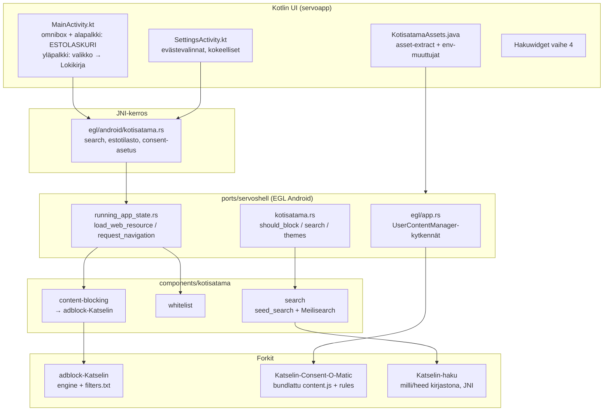

# Katselin Android – Integraatiosuunnitelma

**Päivämäärä:** 1.8.2026
**Versio:** 2 – tarkennettu koodivarmistuksella ja AGENT.md-yhteensopivuustarkastuksella (§ 9)
**Haara:** `android-integraatio` (Kotisatama-repo, julkaistu origin:iin)
**Perustuu:** [Testit/Android 0.1 testit.md](Testit/Android%200.1%20testit.md), `AGENT.md`

> **v2-tarkennukset pähkinänkuoressa:** init-ketju varmistettu EGL-polulla (adblock-palvelu käynnistyy mutta menee `Inactive`-tilaan); nykyinen `filters.txt` on 78-rivinen maltillinen lista, joka **ei kata EFF:n testidomaineja** (`trackersimulator.org`, `eviltracker.net`) – pelkkä latauskorjaus ei riitä Cover Your Tracks -testiin; `BlockingStatistics` laskee vain sivukohtaisen määrän (kokonaislaskuri puuttuu); kolmen pisteen valikkoa ei ole vielä olemassa (luodaan); consent-injektiopiste ja asetusputki nimetty tasan; emoji-ongelman lähde paikallistettu (`haku-icons.js`); välilehtikapin hook-piste nimetty.

---

## 1. Tavoite

Android-versio on nyt toimivassa perusversiossa. Tässä haarassa integroidaan kolme forkkia yhdeksi toimivaksi kokonaisuudeksi Androidille ja ratkaistaan Android 0.1 -testausraportin havainnot:

| Forkki | Rooli | Testiraportin linkitys |
|---|---|---|
| `adblock-Katselin` | Seurannanesto (Brave adblock-rust 0.13.2) | #8 Cover Your Tracks (🔴) |
| `Katselin-Consent-O-Matic` | Evästeiden automaattinen käsittely (Consent-O-Matic 1.1.5) | #14 Evästeiden hyväksyntä (💡) |
| `Katselin-haku` | Meilisearch Androidille (Meilisearch 1.51.0) | Kokonaisarvio: "meilisearch pitää saada toimimaan androidilla" |

Lisäksi mukana testiraportin muut huomiot (nimi, kuvake, Google-kierontie, Satama/Telakka, emojit, välilehdet, hakuwidget, whitelist-lisäykset).

---

## 2. Lähtötilanne – kartoitus 1.8.2026

### 2.1 Mitä jo toimii Androidilla

- Whitelist-navigoinnin valvonta (`components/kotisatama/whitelist`, hook `running_app_state.rs::request_navigation()`) – sama Rust-polku desktopin kanssa.
- Hakusivu `servo:haku` + `seed_search`-varahaku (`components/kotisatama/search`).
- Huijausviestien blokkaus (testi #1, 10/10) ja linkkien blokkaus (#2).
- Asset-paketointi APK:hon (`copyKotisatamaAssets` `build.gradle.kts:143`) + ajonaikainen purku (`KotisatamaAssets.java`).

### 2.2 Seurannanesto – juurisyy löydetty 🔍

Testiraportin #8 (Cover Your Tracks: *Blocking tracking ads? No / Blocking invisible trackers? No*) ei johdu puuttuvasta moottorista vaan **suodatinlistan latautumisesta laitteella**:

- `components/kotisatama/content-blocking/src/filter_store.rs` muodostaa polun käännös**aikaisesta** `env!("CARGO_MANIFEST_DIR")`-makrosta ja lukee listan **tiedostojärjestelmästä ajonaikaisesti**.
- Android-laitteella tuo polku (build-koneen WSL-polkua vastaava merkkijono) ei ole olemassa → `load()` epäonnistuu → `service.rs::from_bundled_filters()` lokittaa varoituksen ja palauttaa `Self::inactive()` (**fail-open**).
- `copyKotisatamaAssets` (`build.gradle.kts:143–173`) kopioi whitelistin, documents.json:n, resource_protocolin ja meilisearch-binäärin – **mutta ei `filters.txt`:tä**. Ympäristömuuttujaa listalle ei ole.

Eli Androidilla estoja ei tehdä lainkaan. Moottori (`adblock`-crate, path-riippuvuus `../../../../adblock-Katselin`) ja sieppauspiste (`running_app_state.rs::load_web_resource()` → `kotisatama::should_block_web_resource()`) ovat alustariippumattomia ja toimivat, kun lista latautuu.

**Varmistettu init-ketju (v2):** `running_app_state.rs:255` kutsuu `kotisatama::init()` → `kotisatama.rs:110` `from_bundled_filters()` → `kotisatama.rs:111` lokittaa tilan. EGL/Android-polku käyttää samaa `RunningAppState`:a (`egl/app.rs:357`), joten palvelu **käynnistyy laitteella, mutta jää `Inactive`-tilaan**. Diagnoosi on varmistettavissa suoraan: `adb logcat | grep content-blocking` → `"Kotisatama content-blocking: Inactive"`.

**Toinen, erillinen puute (v2): listan kattavuus.** Nykyinen `assets/filters.txt` on 78-rivinen "moderate"-lista (Google Ads, ~20 mainosverkkoa, ~25 seurantadomainia, polkukaavoja). Cover Your Tracks käyttää kolmea simulointidomainia:

| EFF:n testidomain | Simuloi | Vaatimus |
|---|---|---|
| `trackersimulator.org` | Näkyvä mainosseurain | **Pitää estää** |
| `eviltracker.net` | Näkymätön tracking beacon | **Pitää estää** |
| `do-not-tracker.org` | DNT-politiikan noudattava domain | **Pitää latautua** (ei saa estää) |

Nykylista ei kata kahta ensimmäistä → Cover Your Tracks näyttäisi "No" **vaikka latauskorjaus tehtäisiin**. Listaa on siis laajennettava (vähintään näillä kahdella; suositus: EasyPrivacy-pohjainen kattavuus, ks. vaihe 1 tehtävä 2).

### 2.3 Consent-O-Matic – ei vielä kytkettyä

- Servossa on valmis injektiomekanismi: `UserContentManager::add_script()` (`components/servo/user_content_manager.rs`), kytketty **vain desktopilla** (`ports/servoshell/desktop/app.rs:115–124`, `--userscripts`-lippu).
- Android EGL-polulla (`ports/servoshell/egl/app.rs`) userskriptejä ei rekisteröidä lainkaan.
- Forkki on muuttamaton upstream v1.1.5. Ydinmoottori (`Extension/ConsentEngine.js` + `CMP/Detector/Action/Consent/Matcher/Tools`) on puhdasta DOM-JS:ää; WebExtension-riippuvuudet (`chrome.storage`, `chrome.runtime`-viestintä, sääntöjen haku GitHubista ajonaikaisesti) pitää shimata/bundlata.
- Hyvä uutinen: kategoriat A/B/D/E/F/X ovat oletuksena `false` (`GDPRConfig.defaultValues`) – eli "Hyväksy vain pakolliset" on jo moottorin oletuskäytös.

### 2.4 Meilisearch – binäärispawn ei toimi Androidilla

Vastaus testiraportin kokonaisarvion kysymykseen ("mitä tarkoitettiin, ettei meilisearch onnistu android-versiossa"):

1. Viralliset Meilisearch-binäärit on dynaamisesti linkitetty **glibc**:hen; Androidin **bionic**-libc ei suorita niitä → spawn epäonnistuu → haku käyttää `seed_search`-varahakua (dokumentoitu `support/android/README.md`).
2. Lisärajoite: Android 10+ (targetSdk 29+) estää SELinux-politiikalla koodin suorittamisen sovelluksen yksityisestä **datahakemistosta** – nykyinen `KotisatamaAssets`-malli (purkaa `files/bin/meilisearch` + `setExecutable`, `KotisatamaAssets.java:67–69`) on siksi epäluotettava. **Mutta** sovelluksen **native library directory** (`ApplicationInfo.nativeLibraryDir`) on exec-sallittu: tunnettu malli on paketoida suoritettava binääri APK:hon nimellä `libmeilisearch.so` (jniLibs + `extractNativeLibs`), jolloin asennusohjelma sijoittaa sen native-lib-hakemistoon ja `exec()` onnistuu. Spawn-arkkitehtuuri on siis pelastettavissa ilman kirjastomallia.
3. **AGENT.md-rajoite (määräävä):** AGENT.md kieltää eksplisiittisesti kirjastotason upotuksen: *"Älä yritä upottaa Meilisearchia kirjastotasolla – `components/kotisatama/search/` on HTTP-client ja prosessinhallinta, ei Meilisearch-core."* Arkkitehtuuri pysyy siis: bundlattu binääri → subprocess → `kotisatama-search` kysyy HTTP:llä `127.0.0.1:7700`. Kirjastomalli (JNI, prosessin sisään) on sallittu vain jos AGENT.md:tä päätetään erikseen muuttaa.
4. `Katselin-haku`-forkissa ei ole vielä mitään Android-build-tukea (ei target-konfiguraatiota, CI-jobia tai NDK-ohjeita). Forkin koodi-poikkeama upstreamista: MIT-only-lisenssi (LICENSE-EE poistettu) + tuotu EE-portainen network/sharding-kokeilu (CE-stubien takana) – ei Android-työtä.

Cross-käännöksen pääesteet (riippuvuuspuusta): `heed/lmdb-master-sys` (C-käännös, todennäköisesti tarvitsee `lmdb-posix-sem`-featuren bionicille), `onig_sys` (tokenizers), `libmimalloc-sys`, `candle/tokenizers`-ML-pino (koko/muisti), `actix-web`-palvelinmalli (korvattava kirjastorajapinnalla).

### 2.5 Komponenttien valmiustilanne

| Komponentti | Desktop | Android tänään | Pääpuute |
|---|---|---|---|
| Seurannanesto (verkko) | ✅ Toimii | 🔴 Fail-open (lista ei lataudu) | Listan paketointi + latauspolku |
| Estolaskuri-UI | ✅ Työkalurivissä | ❌ Ei UI:ta | JNI + alapalkki; `BlockingStatistics` vain sivulaskuri (kokonaislaskuri lisättävä) |
| Cosmetic-esto | ❌ Ei toteutettu | ❌ | Uusi työ (voi myöhemmäksi) |
| Whitelist-valvonta | ✅ | ✅ | – |
| Haku (seed) | ✅ | ✅ | Laatu/kattavuus (Satama-kohteet) |
| Haku (Meilisearch) | ✅ localhost:7700 | ❌ glibc-binääri | Kirjastomalli + NDK-käännös |
| JS-injektio | ✅ `--userscripts` | ❌ Ei kytketty | EGL-kytkennät + JNI |
| Consent-O-Matic | – | ❌ | Bundle + shimit + kytkennät |

---

## 3. Haarat ja repot

| Repo | Haara | Tarkoitus |
|---|---|---|
| `Kotisatama/Kotisatama` | **`android-integraatio`** ✅ luotu | Pääintegraatiohaara – kaikki Android-työ |
| `Katselin-Consent-O-Matic` | `katselin-bundle` (luodaan vaiheessa 2) | Standalone JS-bundlen build-kohde |
| `Katselin-haku` | `android-ndk` (luodaan vaiheessa 3) | NDK-käännös ja kirjastorajapinta |
| `adblock-Katselin` | ei muutoksia aluksi | Käytetään sellaisenaan path-riippuvuutena |

Huomioita:

- `kotisatama-content-blocking` riippuu forkista **path-riippuvuutena** `../../../../adblock-Katselin` → forkkien checkout-asettelu (`C:\Users\gigli\Kotisatama\*`) on säilytettävä myös WSL-buildissa. Dokumentoi vaatimus build-ohjeisiin; CI:ssä myöhemmin git-riippuvuus.
- Työskentely: ominaisuuskohtaiset alahaarat → `android-integraatio`. Testit 0.2 -kierros ennen mergeä mainiin.

---

## 4. Kokonaisarkkitehtuuri

---

## 5. Toteutus vaiheittain

### Vaihe 0 – Haara ja pikakorjaukset (testit #7, #10, #12, #3 väliaikainen)

1. **Sovelluksen nimi → Katselin** (#7, 🔴):
   - `support/android/apk/servoapp/src/main/res/values/strings.xml:2` ja `values-sv/strings.xml:2`: `app_name` → `Katselin`.
   - Tarkista samalla muut `Kotisatama`-merkkijonot res- ja manifest-tasoilla (mm. `AndroidManifest.xml` label viittaa `@string/app_name`, riittää).
2. **Sovelluskuvake** (#10): musta tausta – graafinen assets-päivitys (`res/mipmap*`), ei koodia.
3. **Whitelist-lisäykset** (#12): Servo-kirja, Kirja, kirjapino.fi, Finlandia Kirja → whitelist-lähdeputkeen (sync `index-data/cache/whitelist.json`, ks. `scripts/build-android.sh`).
4. **Google pois whitelistiltä** (#3, väliaikainen): poisto whitelististä → Googlen kautta ei pääse enää kiertämään Satamaa. Kokeillaan käytännössä (hakukokemus vs. tiukkuus), pidempi ratkaisu vaiheessa 4.

### Vaihe 1 – Seurannanesto Androidille (#8, 🔴 kriittinen)

**Tavoite:** Cover Your Tracks → *Yes/Yes*.

1. **Korjaa listan lataus** (ydinkorjaus):
   - `filter_store.rs`: ensisijaiseksi `include_str!("../assets/filters.txt")` (kääntyy binääriin, toimii kaikkialla; suhteellinen polku on oikea `src/`-sijainnista).
   - Säilytä tiedostopolku valinnaisena ohituksena: `KOTISATAMA_FILTER_LIST_PATH` (OTA-päivityksiä ja testausta varten). Järjestys `service.rs`:ssä: env-polku → include_str → `inactive()`.
   - Fail-open säilyy, mutta `status()` pitää näkyä: logi (`kotisatama.rs:111` lokittaa jo) + UI-merkki ("Suojaus: pois"), jotta regressio huomataan heti.
   - **Asset-huomio (v2):** `KotisatamaAssets.extractAsset` ei korvaa olemassa olevaa tiedostoa (palaa heti jos `dest.exists()`) – APK-päivitys ei siis päivitä yksittäistiedostoja. Jos lista siirretään myöhemmin APK-assettien kautta (env-polku), käytä `extractAssetTree`-polkua (korvaa aina) tai `assetSizeMatches`-tarkistusta.
2. **Listan sisältö ja kattavuus**:
   - Vähimmäisvaatimus Cover Your Tracks -testiin: lisää `||trackersimulator.org^` ja `||eviltracker.net^`; varmista ettei `do-not-tracker.org` esty.
   - Suositus: laajenna lista EasyPrivacy-pohjaiseksi (maltillinen versio, jotta whitelist-sivustot eivät hajoa). Päivitysputki myöhemmin: `adblock-Katselin/data/update-lists.js` → CI → **serialisoitu engine** (`Engine::serialize()` / `deserialize()`) → nopeampi käynnistys ja pienempi parsintakuorma laitteella (78-rivisen listan parsinta on vielä kevyt, mutta EasyPrivacy-skalassa serialisointi kannattaa).
3. **Estolaskuri-UI** (testiraportin UI-toive):
   - Rust: `BlockingStatistics` (`statistics.rs`) laskee **vain sivukohtaisen määrän** (`blocked_on_page`, nollautuu `on_allowed_navigation` → `kotisatama.rs:186`). Laajenna: lisää `blocked_total: AtomicU64` (ei nollaudu) ja yksityiskohtanäkymää varten esim. pieni rengaspuskuri viimeisimmistä estetyistä hosteista.
   - Wrapperit ovat valmiina: `kotisatama.rs:190` `blocked_count_on_page()` ja `:195` `content_blocking_active()` → lisää `blocked_count_total()`.
   - JNI: uusi funktio `egl/android/kotisatama.rs`:ään (nyt siellä on vain `kotisatamaSearch`, `kotisatamaSubmitReport`, `kotisatamaShouldShowReport`), esim. `kotisatamaBlockedStats` palauttamassa `(page_count, total, active)`. Kotlin-puoli: `JNIServo`-ulkoinen funktio + Compose-tila, päivitys sivunlatauksen jälkeen.
   - Kotlin/UI (`MainActivity.kt`): **alapalkin Lokikirja-itemi (rivit 180–182) korvautuu estolaskurilla**; klikkaus → yksityiskohtanäkymä (estot tällä sivulla / yhteensä / suojauksen tila / poikkeussivustot).
   - **Kolmen pisteen valikkoa ei ole vielä olemassa (v2)** → luodaan yläpalkkiin `DropdownMenu` + `MoreVert`-ikoninappi; Lokikirja sinne. Raportointilogiikka (`KotisatamaUi.showReportDialog()` + `onReportMenuItemClicked`, `MainActivity.kt:274`) siirtyy sellaisenaan.
   - **AGENT.md-merkinnät:** `MainActivity.kt`/`SettingsActivity.kt`/`strings.xml` ovat upstream-johdannaisia → kaikki uudet/muokatut blokit merkitään `KOTISATAMA-PATCH`-kommentilla suomeksi + kiinan käännös (mallia `MainActivity.kt:131`; kommenttiformaatti ks. AGENT.md). Tarkista ennen muokkausta `docs/Puhdistukset (1).md`, ettei tiedosto ole jo käsitelty tarkoituksellisesti.
4. **Varmistus**: `adb logcat` → `"Kotisatama content-blocking: Active"`; Cover Your Tracks -uusinta laitteella (tavoite Yes/Yes + DNT-kohta läpi); vertailu Windows-tulokseen; `cargo test -p kotisatama-content-blocking`.
5. **Myöhempänä (ei tämän vaiheen blokki):** cosmetic-esto (`url_cosmetic_resources` + `UserContentManager.add_stylesheet`).

**Hyväksymiskriteerit (vaihe 1):** logcat näyttää `Active`; Cover Your Tracks: *Blocking tracking ads? Yes*, *Blocking invisible trackers? Yes*; alapalkissa laskuri joka kasvaa estoista; Lokikirja avautuu valikosta; yksikkötestit vihreät.

### Vaihe 2 – Evästeautomaatti Consent-O-Matic (#14, 💡)

**Tavoite:** pakollisten evästeiden automaattinen hyväksyntä, oletuksena päällä.

1. **Forkkiin (`Katselin-Consent-O-Matic`, haara `katselin-bundle`)** uusi build-kohde, esim. `npm run build-katselin`:
   - Webpack-entry, joka bundleaa `ConsentEngine.js`-puun yhdeksi itsenäiseksi tiedostoksi (ei `background.js`/`popup.js`).
   - **Säännöt bundlataan build-aikana**: `rules-list.json` + ~204 kpl `rules/*.json` sulautetaan yhdeksi JSON:ksi bundleen → ei GitHub-hakua ajonaikaisesti (offline-ensimmäisyys + Satama-filosofia).
   - **Shimat**: `GDPRConfig` korvautuu kovakoodatulla/embedderin antamalla konfiguraatiolla (oletus A/B/D/E/F/X = `false` → "Hyväksy pakolliset"); `chrome.runtime`-viestintä no-opiksi tai embedder-callbackiin; `GetTabUrl` iframe-tapauksessa injektorilta.
2. **Kotisatama-kytkentä** (injektiopiste varmistettu v2):
   - `egl/app.rs:356` luo jo `UserContentManager`:in (`egl/app.rs:20` import) → rekisteröi bundle heti sen jälkeen, ennen `RunningAppState::new`:ää (rivi 357).
   - **Patch-muoto AGENT.md:n mukaan:** upstream-tiedostoon vain yksi feature-flagin taakse käärity kutsu – `#[cfg(all(feature = "kotisatama", target_os = "android"))]`-blokki (mallia `egl/app.rs:313` ja `:332`) joka kutsuu `crate::kotisatama::register_consent_script(&user_content_manager)`; varsinainen logiikka (env-luku, tiedoston lataus, `UserScript::new(source, None)` → `add_script`, tyyppi `components/shared/embedder/user_contents.rs:103`) elää `ports/servoshell/kotisatama.rs`:ssä. Blokki merkitään `KOTISATAMA-PATCH`-kommentilla (suomi — 中文) + `Revisit:`-rivi.
   - Lähde: luetaan `KOTISATAMA_CONSENT_SCRIPT`-env:n osoittamasta tiedostosta (KotisatamaAssets purkaa APK-assetin), `include_str!` varmuuden vuoksi varalla. Mallia voi peilata desktopin `desktop/app.rs:115–124` -kytkennöistä.
   - Injektio tapahtuu `<head>`-sidosvaiheessa ≈ `document_start` (`components/script/dom/userscripts.rs`) – sama ajoitus kuin laajennoksen manifestissa.
   - Paketointi: bundle APK-assetteihin (`copyKotisatamaAssets`), purku `extractAssetTree`-polkuun (korvaa aina → päivitykset toimivat, ks. vaiheen 1 asset-huomio).
3. **Asetukset** (testiraportin mukaisesti "asetuksiin valinta, oletuksena Hyväksy pakolliset"):
   - `SettingsActivity.kt`: uusi valinta *Evästeiden automaattikäsittely*: **Hyväksy pakolliset (oletus)** / Hyväksy kaikki / Pois käytöstä. Säilytys SharedPreferencesiin (malli: `experimental`-switch, avain esim. `consent_mode`).
   - Asetusputki: `MainActivity` lukei prefenssin → `Os.setenv("KOTISATAMA_CONSENT_MODE", ...)` ennen Servo-initiä (sama ketju kuin muille `KOTISATAMA_*`-muuttujille `KotisatamaAssets.prepare`:ssä) → `egl/app.rs` rekisteröi skriptin vain jos tila ei ole "pois", ja konsenttivalinnat annetaan bundlelle init-parametrina.
4. **Testit**: yle.fi, hs.fi, is.fi, terveyskirjasto (rules-valmiudet olemassa) + sivusto, jolla ei sääntöä (ei saa hajota sivua).

**Hyväksymiskriteerit (vaihe 2):** yle.fi:n ja hs.fi:n evästepanneri käsitellään automaattisesti pakollisilla; asetusvalinta vaikuttaa uudelleenkäynnistyksessä; sivu ilman CMP-sääntöä toimii normaalisti; ei uusia virheitä logcatissa.

### Vaihe 3 – Meilisearch Androidille (`Katselin-haku`, kokonaisarvion vaatimus)

**Strateginen valinta (AGENT.md-yhteensopiva, lukittu):** arkkitehtuuri säilyy **subprocess + HTTP** kuten AGENT.md määrää (`kotisatama-search` = HTTP-client + prosessinhallinta, `127.0.0.1:7700`). Kirjastotason upotusta (JNI, prosessin sisään) **ei tehdä** – AGENT.md kieltää sen eksplisiittisesti. Exec-rajoitus kiertyy paketoimalla NDK-binääri **native library directoryyn** (`libmeilisearch.so`-malli), ei app-private-hakemistoon.

Vaiheistus forkissa (haara `android-ndk`):

- **M1 – NDK-käännös:** `cargo build --target aarch64-linux-android --release` koko meilisearch-binäärille. Toimenpiteet: `lmdb-posix-sem`-feature päälle (bionic), `onig`-feature pois (tokenizers-fallback), embeddings/`candle` pois kokonaan aluksi (binary size + muisti), `mimalloc` kääntyy NDK:lla tai vaihtuu system-allocatoriin Android-targetissa. Binäärin on oltava **PIE** (Rust tuottaa oletuksena; Android vaatii).
- **M2 – APK-paketointi exec-sallivasti:** binääri mukaan nimellä `libmeilisearch.so`: `support/android/apk/servoapp/src/main/jniLibs/arm64-v8a/libmeilisearch.so` (+ `x86_64/` emulatoria varten). Varmista `android:extractNativeLibs="true"` (oletus legacy-paketoinnissa), jotta asennus purkaa sen levylle native-lib-hakemistoon. `fetch-meilisearch.sh` korvautuu vaihtoehdolla `--android-ndk` (hakee/kopioi NDK-buildin artefaktin oikeisiin jniLibs-kansioihin glibc-version sijaan).
- **M3 – Polun osoitus:** `KotisatamaAssets.prepare()`: jos `${context.applicationInfo.nativeLibraryDir}/libmeilisearch.so` löytyy, asetetaan `KOTISATAMA_MEILISEARCH_BIN` siihen (nykyinen `files/bin/meilisearch` + `setExecutable`-polku poistuu – se osui exec-rajoitukseen). **`components/kotisatama/search`-crateen ei arkkitehtuurimuutoksia** – se spawnaa ja kysyy HTTP:llä kuten ennenkin (AGENT.md).
- **M4 – indeksin elinkaari AGENT.md-mallin mukaan:** Crawler (CI) indeksoi whitelist-sivustot → dump CDN:ään → laite importaa (`KOTISATAMA_INDEX_DUMP` + `--import-dump`, valmiit koukut jo olemassa); ensikäynnistyksellä seed `documents.json`:sta.
- **Vara- ja välivaihe:** `seed_search` pysyy fallbackina ja sitä parannetaan (ks. #6) – Android ei ole koskaan ilman hakua, vaikka M1–M4 venyisivät.

**Riskit (suurin epävarmuus koko työssä):** LMDB C-käännös NDK:lla, cratepuun feature-trimmays ilman että milli hajoaa, APK-koko. Jos M1 osoittautuu umpikujaksi, fallback-suunnitelma: rikastettu `seed_search` (esim. painotukset + enemmän dokumentteja) julkaisuun.

**Hyväksymiskriteerit (vaihe 3):** `cargo build --target aarch64-linux-android --release` menee läpi ilman candle/onig-riippuvuuksia; `libmeilisearch.so` käynnistyy laitteella `nativeLibraryDir`:stä (logcat: Meilisearch kuuntelee 7700); haku vastaa `servo:haku/data`-polussa ilman `seed_search`-fallbackia; `seed_search` edelleen toimiva varamekanismi.

### Vaihe 4 – Satama ja käyttökokemus (#3, #4, #6, #11, #13, #15)

1. **#6 Satama/Telakka**:
   - Nopea korjaus (hook-piste varmistettu v2): **käyttäjän omat Satama-lisäykset näkymään haussa** – `append_whitelist_documents` (`search/src/lib.rs:339`) käyttää nyt vain `curated_document()`-kuratoitua listaa; laajenna se kattamaan `UserWhitelist::domain_hosts()` (`whitelist/src/user.rs:53`). Sama laajennus Meilisearch-seedaukseen (jos/kun vaihe 3 etenee).
   - Telakka-jatkokehitys (raportin ehdotuksen mukaisesti): Satama = suosikkilista, Meilisearch indeksoi käyttäjän omat kohteet, käyttäjä voi lisätä omia hakukohteita → eriytä omaksi suunnitelmaksi vaiheen 4 jälkeen.
2. **#6 Satama-portin avautuminen Qwantiin**: kyseessä on **Avomeri-gatewayn** (`servo:avomeri` → ulkoinen haku, oletus Qwant) suunniteltu käytös, ei bugi sinänsä. Päätettäväksi: säilyykö vai uudistetaanko UX (esim. selkeämpi välisivu "Poistut Satamasta").
3. **#3 Google-kierontien varsinainen ratkaisu**: whitelist-poiston (vaihe 0) lisäksi tutkitaan `google.com/url?...`-redirectien purku tai Googlen käsittely haun kautta. Dokumentoidaan havainto: ChatGPT-linkit menevät osoitepalkkipolun kautta (valvonta toimii), Google ei.
4. **#4 Emojit hakutuloksissa** (lähde paikallistettu v2): kuvakkeet tulevat `resources/resource_protocol/haku-icons.js`:stä (`CATEGORY_EMOJIS`-taulukko + `emojiSpan()`; `haku.html:137–138` kutsuu `HakuIcons.typeDot()` / `categoryIcon()`). Androidilla väriemoji-fonttia ei ole font-pinossa → merkit näkyvät rikkinäisinä. Korjaus: korvaa emoji-palat **inline-SVG-kuvakkeilla** `haku-icons.js`:ssä (luotettava kaikkialla, ei fonttiriippuvuutta). Vaihtoehto: Noto Color Emoji -fontin paketointi APK:hon + fontconfig-rekisteröinti – painavampi, pidä varalla.
5. **#13 Välilehtien hallinta (max 20)** (hook-piste varmistettu v2): servoshellin webview-rekisteri on `running_app_state.rs`:ssä – uusi webview lisätään riveillä 81–82 (`creation_order.push(id)` + `webviews.insert(id, webview)`) ja sulkulogiiikka on riveillä 88–92. Toteutus: ennen lisäystä, jos `creation_order.len() >= 20`, sulje vanhin (`creation_order.first()`) samalla sulkupolulla. Varmista, että suljettava ei ole aktiivinen webview ja että UI (tab-rivi) päivittyy. Testi: avaa 21 välilehteä → vanhin sulkeutuu automaattisesti, tila pysyy konsistenttina.
6. **#11 Hakuwidget**: Android AppWidget (`AppWidgetProvider` + XML), avaa `MainActivity`-haun. Itsenäinen Kotlin-työ.
7. **#15 Whitelist jatkuvuus**: prosessi pysyy – lisäykset whitelist-lähteeseen, sync build-putkessa.

**Hyväksymiskriteerit (vaihe 4):** oma Satama-lisäys löytyy hausta heti lisäyksen jälkeen; hakutulosten kategoria-ikonit näkyvät laitteella oikein; 21. välilehti sulkee vanhimman ilman kaatumista; widget avaa haun työpöydältä.

### Vaihe 5 – Varmistus ja julkaisuvalmius

1. **Testit 0.2**: kaikki 16 kohtaa uudelleen + tämän suunnitelman uudet osat (estolaskuri, consent-asetus, Meilisearch-kirjasto).
2. **Cover Your Tracks** laitteella ja emulatorilla – tavoite Yes/Yes.
3. Emulaattori **x86_64** + fyysinen laite **arm64** (kaksi APK-varianttia, ks. README).
4. Sideload-paketti + asennusohje. **#16 Katselin.fi**-sivuston muutokset (logo, Varustamo-maininnat, seurannanesto esille, sideload-ohjeet) on erillinen web-työ – linkitetään, ei toteuteta tässä haarassa.
5. **AGENT.md:n PR-checklist ennen mergeä mainiin:**
   - `cargo build` toimii ilman `--features kotisatama` (upstream ei rikkoudu)
   - `cargo build --features kotisatama` toimii
   - Ei muutoksia `components/[upstream]/`-tiedostoissa ilman `KOTISATAMA-PATCH`-kommenttia
   - Whitelist-/haku-/estologiikka `components/kotisatama/`-crateissa, hookit `ports/servoshell/`:ssä
   - `./mach build --release` toimii (desktop)
   - Uudet tiedostot sallituissa paikoissa (`components/kotisatama/`, `ports/servoshell/`, `support/android/apk/`)

**Hyväksymiskriteerit (vaihe 5):** Testit 0.2 -raportti täytetty (kaikki 16 kohtaa + uudet ominaisuudet); Cover Your Tracks Yes/Yes molemmilla APK-varianteilla; `build-android.sh` ajaa yksikkötestit vihreänä; APK asentuu puhtaalle laitteelle ja kaikki KOTISATAMA_*-polut ratkeavat ensikäynnistyksellä.

---

## 6. Testihavainnot → toimenpiteet

| # | Testi / havainto | Tila | Toimenpide | Vaihe |
|---|---|---|---|---|
| 1 | Huijausviestin blokkaus | ✅ | Regressiona testattava 0.2-kierroksella | 5 |
| 2 | Linkkien blokkaus | ✅ | Regressiona | 5 |
| 3 | Google kiertää Sataman | 🟡 | Google pois whitelistiltä (0); redirect-purku myöhemmin | 0 + 4 |
| 4 | Emojit hakutuloksissa | 🟡 | SVG-ikonit `haku.html`:ään | 4 |
| 5 | Oikotie.fi | ✅ | Ei toimenpiteitä | – |
| 6 | Satama / Telakka + portti → Qwant | 🟡 | Omat kohteet hakuun; Telakka-suunnitelma; Avomeri-UX-päätös | 4 |
| 7 | Sovelluksen nimi | 🔴 | `app_name` → Katselin (fi+sv) | 0 |
| 8 | Cover Your Tracks | 🔴 | filters.txt include_str + env-ohitus; lista kattavaksi; estolaskuri-UI; Lokikirja valikkoon | 1 |
| 9 | Yle Areena | ✅ | Ei korjata (raportin mukaan) | – |
| 10 | Sovelluskuvake | 🟡 | Musta tausta | 0 |
| 11 | Hakuwidget | 💡 | AppWidgetProvider | 4 |
| 12 | Whitelist-lisäykset | 💡 | 4 kohdetta whitelistiin | 0 |
| 13 | Välilehdet max 20 | 💡 | LRU-sulku Rust-puolella | 4 |
| 14 | Evästeiden hyväksyntä | 💡 | Consent-O-Matic bundle + EGL-kytkennät + asetus (oletus: pakolliset) | 2 |
| 15 | Whitelist jatkuvuus | 💡 | Prosessi | 4 |
| 16 | Katselin.fi | 💡 | Erillinen web-työ (ei tässä haarassa) | ulkop. |
| – | Meilisearch Androidille | 🔴/💡 | Kirjastomalli JNI:llä, `Katselin-haku` M1–M4 | 3 |

---

## 7. Riskit ja niiden hallinta

| Riski | Vaikutus | Hallinta |
|---|---|---|
| LMDB/heed ei käännödy NDK:lla | Meilisearch-kirjasto viivästyy | M1 ensimmäisenä; fallback = rikastettu `seed_search` |
| Consent-bundlen chrome-shimit puutteelliset | Evästebannerit jäävät osin käsittelemättä | Vaihe 2 testijoukko; sääntöpäivitykset upstreamista säännöllisesti |
| Suljetut shadow root -DOM:t | Osa CMP:istä tavoittamatta | Hyväksytään aluksi (chrome.dom ei saatavilla Servossa) |
| Suodatinlistan koko / muistinkäyttö laitteella | Hitaus | Serialisoitu engine; profilointi arm64-laitteella |
| `path`-riippuvuus `adblock-Katselin` | Build hajoaa jos asettelu muuttuu | Dokumentoitu; CI:ssä git-pinni |
| Kaksi APK-varianttia (x86_64/arm64) | Testaustyö tupla | Testit 0.2 -checklist molemmille |

## 8. Avoimet päätökset (tarvitaan ennen vaiheiden loppuunviemistä)

1. **Satama-portin UX** (#6): säilyykö Avomeri→Qwant-käytös sellaisenaan vai muutetaanko? (Suositus: selkeämpi "Poistut Satamasta" -välisivu, toiminnallisuus säilyy.)
2. ~~Meilisearch-toteustapa~~ → **ratkaistu AGENT.md:llä:** subprocess + HTTP säilyy; binääri paketoidaan native-lib-hakemistoon (`libmeilisearch.so`). Kirjastomalli sallittu vain jos AGENT.md:tä päätetään erikseen muuttaa.
3. **Consent-sääntöjen lähde**: build-aikainen bundle (suositus, offline) vs. ajonaikainen haku upstreamista + cache.
4. **Cosmetic-esto** otetaanko julkaisuun vai myöhempään (verkko-esto riittää Cover Your Tracks -tavoitteeseen).
5. **Hakukokemus ilman Googlea** (#3): riittääkö whitelist-poisto vai tarvitaanko Satama-hakuun parannuksia ensin?

---

## 9. AGENT.md-yhteensopivuus ja upstream-strategia

Tämän haaran muutokset on arvioitu `AGENT.md`:n sääntöjä vasten (1.8.2026). **Johtopäätös: suunnitelma on yhteensopiva yhden korjatun poikkeaman jälkeen** – vaihe 3:n alkuperäinen kirjastomalli (JNI, prosessin sisään) rikkoi AGENT.md:n eksplisiittistä kieltoa ja on korvattu subprocess-mallilla (v2).

### Noudatettavat säännöt kaikissa tämän haaran muutoksissa

| AGENT.md-sääntö | Miten suunnitelma noudattaa |
|---|---|
| Oma koodi `components/kotisatama/`-crateissa | Estolistan lataus-, palvelu- ja tilastomuutokset `content-blocking`-cratessa; Satama-haun laajennus `search`-cratessa; consent-skriptin latauslogiikka servoshellin `kotisatama.rs`:ssä |
| Embedder-hook ensisijainen – ei `components/net/`, `components/script/`, `components/layout/` | Esto embedder-hookeissa (`load_web_resource`, `request_navigation`); consent käyttää valmista userscripts-mekanismia **muokkaamatta** `components/script/`iä; välilehtikapin hook servoshellissä |
| Upstream-tiedostoihin vain minimaaliset, merkityt patchit | `egl/app.rs` (1 feature-flagattu kutsu), `running_app_state.rs` (20-kappi), `MainActivity.kt`/`SettingsActivity.kt`/`strings.xml` (UI-patchit) – kaikki `KOTISATAMA-PATCH`-kommentein |
| Kommenttimuoto: suomi — 中文 | Pakote kaikille uusille/muokatuille kommenteille; vanhat kommentit päivitetään samaan muotoon tiedostoa muokatessa |
| Feature flag (`kotisatama`) upstream-hookuissa | Consent-rekisteröinti `#[cfg(all(feature = "kotisatama", target_os = "android"))]`-blokissa (mallia `egl/app.rs:313/332`) |
| `Cargo.lock`: synkronoituu mergessä | Ei uusia workspace-crateja Kotisatama-repoon tässä suunnitelmassa (consent = JS-asset, meilisearch = erillinen fork-repo) |
| Meilisearch: subprocess + HTTP, ei kirjastoupotusta | Vaihe 3 v2: binääri native-lib-hakemistosta, `kotisatama-search` koskematon |
| Android = servoshell EGL, ei Tauri | Koko suunnitelma EGL-polulla |
| Whitelist-skeema 2.1 | Lisäykset/muutokset whitelist-lähdeputken kautta, skeeman mukaisesti |

**Ennen jokaista upstream-johdannaisen tiedoston muokkausta:** tarkista `docs/Puhdistukset (1).md` -rekisteri – tiedosto saattaa olla jo käsitelty tarkoituksellisesti. Aiempi hyväksytty suunnitelma samasta aiheesta: `docs/ADBLOCK-RUST-INTEGRAATIOSUUNNITELMA.md` (lukitut päätökset 27.7.2026: Kotisatama-malli, feature-flag, minimaaliset patchit) ja `docs/ADBLOCK-VERKKOPOLKU-AUDIT.md` (kytkentäpiste). Tämä suunnitelma on niiden jatkono Android-osalta, ei korvaa niitä.

### Upstream-synkronointi tässä haarassa (pitkäikäinen integraatiohaara)

Servo kehittyy aktiivisesti → haara pidetään ajan tasalla AGENT.md:n prosessilla:

1. `git fetch upstream && git log HEAD..upstream/main --oneline` (katsotaan mitä tulee)
2. `git merge upstream/main` **agentivetoisesti, ei manuaalisesti** (AGENT.md: "Upstream-synkronointi tehdään Agentilla")
3. Konfliktit osuvat tyypillisesti `ports/servoshell/`-patch-kohtiin (`KOTISATAMA-PATCH`-merkit) → ratkaisu: **ota upstream-muutos, lisää oma patch perään** – älä hylkää upstream-muutosta
4. Varmistus jokaisen synkin jälkeen: `cargo build` JA `cargo build --features kotisatama` + `build-android.sh`
5. Synkataajuus: vähintään ennen jokaisen vaiheen alkua ja ennen Testit 0.2 -kierrosta

Tiedostoluokat ja riskit: haaran suurimmat upstream-tiedostopatchit ovat `egl/app.rs`:ssä (suhteellisen stabiili) ja `MainActivity.kt`:ssä (Compose-UI, voi muuttua upstreamissa – patchit pieninä ja hyvin merkittyinä). `components/kotisatama/`-muutokset eivät koskaan konfliktoi.

---

## Liite A – Avaintiedostot

| Asia | Polku |
|---|---|
| Estolistan lataus (korjattava) | `components/kotisatama/content-blocking/src/filter_store.rs` |
| Fail-open-palvelu | `components/kotisatama/content-blocking/src/service.rs` |
| Estotilasto (laajennettava: total) | `components/kotisatama/content-blocking/src/statistics.rs` |
| Init-ketju (varmistettu) | `ports/servoshell/running_app_state.rs:255` → `ports/servoshell/kotisatama.rs:110–112` |
| Sieppauspiste | `ports/servoshell/running_app_state.rs` (`load_web_resource`) |
| Estopäätös + wrapperit UI:lle | `ports/servoshell/kotisatama.rs` (`should_block_web_resource`:145, `blocked_count_on_page`:190, `content_blocking_active`:195) |
| Välilehtirekisteri (20-kapin hook) | `ports/servoshell/running_app_state.rs:81–92` |
| Userskripti-mekanismi | `components/servo/user_content_manager.rs`, tyyppi `components/shared/embedder/user_contents.rs:103`, kytkentämalli `ports/servoshell/desktop/app.rs:115–124` |
| EGL-init (consent-kytkentä tänne) | `ports/servoshell/egl/app.rs:356` (UserContentManager luodaan) |
| Android JNI (uudet getterit tänne) | `ports/servoshell/egl/android/kotisatama.rs` (nyt: search, submitReport, shouldShowReport) |
| Asset-paketointi | `support/android/apk/servoapp/build.gradle.kts` (`copyKotisatamaAssets`:143) |
| Asset-purku + env (huom: ei korvaa olemassa olevaa) | `support/android/apk/servoapp/src/main/java/org/servo/servoshell/KotisatamaAssets.java` |
| UI (alapalkki; Lokikirja-itemi rivit 180–182) | `.../servoshell/MainActivity.kt`, `KotisatamaUi.java` |
| Asetukset (SharedPreferences-malli) | `.../servoshell/SettingsActivity.kt` |
| Haku + varahaku (Satama-laajennus :339) | `components/kotisatama/search/src/lib.rs` (`SearchClient`, `seed_search`:283) |
| Käyttäjän whitelist-overlay | `components/kotisatama/whitelist/src/user.rs` (`domain_hosts`:53, `user_whitelist_path`:93) |
| Emoji-kuvakkeet (korjattava #4) | `resources/resource_protocol/haku-icons.js` (`CATEGORY_EMOJIS`, `emojiSpan`) |
| Meilisearch-fetch (korvautuu NDK-variantilla) | `support/android/fetch-meilisearch.sh` |
| Build-putki | `scripts/build-android.sh` |
| Consent-moottori | `Katselin-Consent-O-Matic/Extension/ConsentEngine.js`, `GDPRConfig.js` |
| Meilisearch-forkki | `Katselin-haku` (`crates/milli`, `heed`-riippuvuus `crates/milli/Cargo.toml`) |
| Kehitysohjeet (määräävä) | `AGENT.md` |
| Siivousmuutosten rekisteri (tarkista ennen patchausta) | `docs/Puhdistukset (1).md` |
| Aiempi adblock-suunnitelma + kytkentäaudit | `docs/ADBLOCK-RUST-INTEGRAATIOSUUNNITELMA.md`, `docs/ADBLOCK-VERKKOPOLKU-AUDIT.md` |
