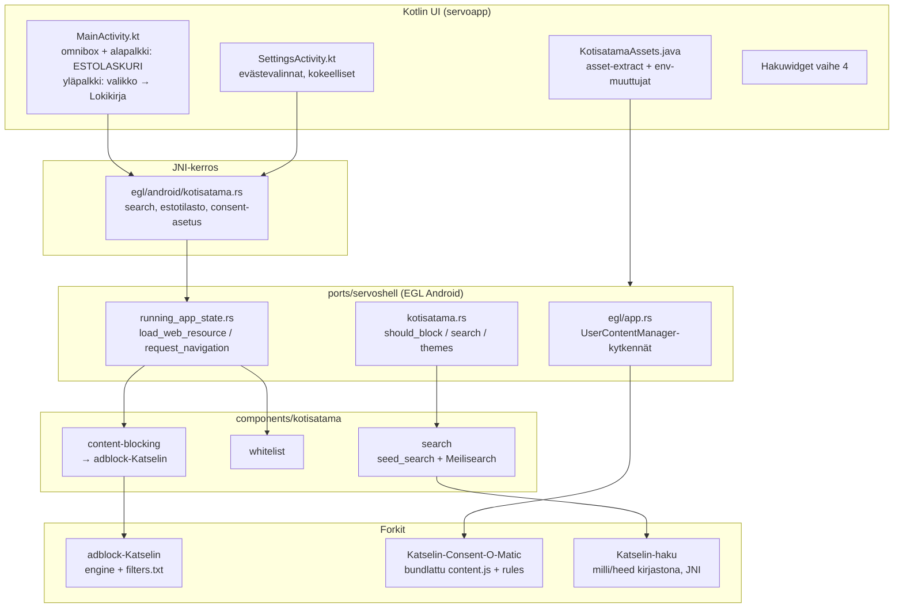

# Katselin Android – Integraatiosuunnitelma

**Päivämäärä:** 1.8.2026
**Haara:** `android-integraatio` (Kotisatama-repo)
**Perustuu:** [Testit/Android 0.1 testit.md](Testit/Android%200.1%20testit.md)

---

## 1. Tavoite

Android-versio on nyt toimivassa perusversiossa. Tässä haarassa integroidaan kolme forkkia yhdeksi toimivaksi kokonaisuudeksi Androidille ja ratkaistaan Android 0.1 -testausraportin havainnot:

| Forkki | Rooli | Testiraportin linkitys |
|---|---|---|
| `adblock-Katselin` | Seurannanesto (Brave adblock-rust 0.13.2) | #8 Cover Your Tracks (🔴) |
| `Katselin-Consent-O-Matic` | Evästeiden automaattinen käsittely (Consent-O-Matic 1.1.5) | #14 Evästeiden hyväksyntä (💡) |
| `Katselin-haku` | Meilisearch Androidille (Meilisearch 1.51.0) | Kokonaisarvio: "meilisearch pitää saada toimimaan androidilla" |

Lisäksi mukana testiraportin muut huomiot (nimi, kuvake, Google-kierontie, Satama/Telakka, emojit, välilehdet, hakuwidget, whitelist-lisäykset).

---

## 2. Lähtötilanne – kartoitus 1.8.2026

### 2.1 Mitä jo toimii Androidilla

- Whitelist-navigoinnin valvonta (`components/kotisatama/whitelist`, hook `running_app_state.rs::request_navigation()`) – sama Rust-polku desktopin kanssa.
- Hakusivu `servo:haku` + `seed_search`-varahaku (`components/kotisatama/search`).
- Huijausviestien blokkaus (testi #1, 10/10) ja linkkien blokkaus (#2).
- Asset-paketointi APK:hon (`copyKotisatamaAssets` `build.gradle.kts:143`) + ajonaikainen purku (`KotisatamaAssets.java`).

### 2.2 Seurannanesto – juurisyy löydetty 🔍

Testiraportin #8 (Cover Your Tracks: *Blocking tracking ads? No / Blocking invisible trackers? No*) ei johdu puuttuvasta moottorista vaan **suodatinlistan latautumisesta laitteella**:

- `components/kotisatama/content-blocking/src/filter_store.rs` muodostaa polun käännös**aikaisesta** `env!("CARGO_MANIFEST_DIR")`-makrosta ja lukee listan **tiedostojärjestelmästä ajonaikaisesti**.
- Android-laitteella tuo polku (build-koneen WSL-polkua vastaava merkkijono) ei ole olemassa → `load()` epäonnistuu → `service.rs::from_bundled_filters()` lokittaa varoituksen ja palauttaa `Self::inactive()` (**fail-open**).
- `copyKotisatamaAssets` (`build.gradle.kts:143–173`) kopioi whitelistin, documents.json:n, resource_protocolin ja meilisearch-binäärin – **mutta ei `filters.txt`:tä**. Ympäristömuuttujaa listalle ei ole.

Eli Androidilla estoja ei tehdä lainkaan. Moottori (`adblock`-crate, path-riippuvuus `../../../../adblock-Katselin`) ja sieppauspiste (`running_app_state.rs::load_web_resource()` → `kotisatama::should_block_web_resource()`) ovat alustariippumattomia ja toimivat, kun lista latautuu.

### 2.3 Consent-O-Matic – ei vielä kytkettyä

- Servossa on valmis injektiomekanismi: `UserContentManager::add_script()` (`components/servo/user_content_manager.rs`), kytketty **vain desktopilla** (`ports/servoshell/desktop/app.rs:115–124`, `--userscripts`-lippu).
- Android EGL-polulla (`ports/servoshell/egl/app.rs`) userskriptejä ei rekisteröidä lainkaan.
- Forkki on muuttamaton upstream v1.1.5. Ydinmoottori (`Extension/ConsentEngine.js` + `CMP/Detector/Action/Consent/Matcher/Tools`) on puhdasta DOM-JS:ää; WebExtension-riippuvuudet (`chrome.storage`, `chrome.runtime`-viestintä, sääntöjen haku GitHubista ajonaikaisesti) pitää shimata/bundlata.
- Hyvä uutinen: kategoriat A/B/D/E/F/X ovat oletuksena `false` (`GDPRConfig.defaultValues`) – eli "Hyväksy vain pakolliset" on jo moottorin oletuskäytös.

### 2.4 Meilisearch – binäärispawn ei toimi Androidilla

Vastaus testiraportin kokonaisarvion kysymykseen ("mitä tarkoitettiin, ettei meilisearch onnistu android-versiossa"):

1. Viralliset Meilisearch-binäärit on dynaamisesti linkitetty **glibc**:hen; Androidin **bionic**-libc ei suorita niitä → spawn epäonnistuu → haku käyttää `seed_search`-varahakua (dokumentoitu `support/android/README.md`).
2. Lisärajoite: Android 10+ (targetSdk 29+) estää SELinux-politiikalla koodin suorittamisen sovelluksen yksityisestä datahakemistosta. Vaikka NDK:lla käännetty binääri saataisiin APK:hon, `exec()` app-private-hakemistosta on epäluotettava. **Johtopäätös: binäärin spawn-malli on Androidilla umpikuja – Meilisearch pitää viedä prosessin sisään kirjastona (JNI).**
3. `Katselin-haku`-forkissa ei ole vielä mitään Android-build-tukea (ei target-konfiguraatiota, CI-jobia tai NDK-ohjeita). Forkin koodi-poikkeama upstreamista: MIT-only-lisenssi (LICENSE-EE poistettu) + tuotu EE-portainen network/sharding-kokeilu (CE-stubien takana) – ei Android-työtä.

Cross-käännöksen pääesteet (riippuvuuspuusta): `heed/lmdb-master-sys` (C-käännös, todennäköisesti tarvitsee `lmdb-posix-sem`-featuren bionicille), `onig_sys` (tokenizers), `libmimalloc-sys`, `candle/tokenizers`-ML-pino (koko/muisti), `actix-web`-palvelinmalli (korvattava kirjastorajapinnalla).

### 2.5 Komponenttien valmiustilanne

| Komponentti | Desktop | Android tänään | Pääpuute |
|---|---|---|---|
| Seurannanesto (verkko) | ✅ Toimii | 🔴 Fail-open (lista ei lataudu) | Listan paketointi + latauspolku |
| Estolaskuri-UI | ✅ Työkalurivissä | ❌ Ei UI:ta | JNI + alapalkki (`BlockingStatistics` on jo Rustissa) |
| Cosmetic-esto | ❌ Ei toteutettu | ❌ | Uusi työ (voi myöhemmäksi) |
| Whitelist-valvonta | ✅ | ✅ | – |
| Haku (seed) | ✅ | ✅ | Laatu/kattavuus (Satama-kohteet) |
| Haku (Meilisearch) | ✅ localhost:7700 | ❌ glibc-binääri | Kirjastomalli + NDK-käännös |
| JS-injektio | ✅ `--userscripts` | ❌ Ei kytketty | EGL-kytkennät + JNI |
| Consent-O-Matic | – | ❌ | Bundle + shimit + kytkennät |

---

## 3. Haarat ja repot

| Repo | Haara | Tarkoitus |
|---|---|---|
| `Kotisatama/Kotisatama` | **`android-integraatio`** ✅ luotu | Pääintegraatiohaara – kaikki Android-työ |
| `Katselin-Consent-O-Matic` | `katselin-bundle` (luodaan vaiheessa 2) | Standalone JS-bundlen build-kohde |
| `Katselin-haku` | `android-ndk` (luodaan vaiheessa 3) | NDK-käännös ja kirjastorajapinta |
| `adblock-Katselin` | ei muutoksia aluksi | Käytetään sellaisenaan path-riippuvuutena |

Huomioita:

- `kotisatama-content-blocking` riippuu forkista **path-riippuvuutena** `../../../../adblock-Katselin` → forkkien checkout-asettelu (`C:\Users\gigli\Kotisatama\*`) on säilytettävä myös WSL-buildissa. Dokumentoi vaatimus build-ohjeisiin; CI:ssä myöhemmin git-riippuvuus.
- Työskentely: ominaisuuskohtaiset alahaarat → `android-integraatio`. Testit 0.2 -kierros ennen mergeä mainiin.

---

## 4. Kokonaisarkkitehtuuri

---

## 5. Toteutus vaiheittain

### Vaihe 0 – Haara ja pikakorjaukset (testit #7, #10, #12, #3 väliaikainen)

1. **Sovelluksen nimi → Katselin** (#7, 🔴):
   - `support/android/apk/servoapp/src/main/res/values/strings.xml:2` ja `values-sv/strings.xml:2`: `app_name` → `Katselin`.
   - Tarkista samalla muut `Kotisatama`-merkkijonot res- ja manifest-tasoilla (mm. `AndroidManifest.xml` label viittaa `@string/app_name`, riittää).
2. **Sovelluskuvake** (#10): musta tausta – graafinen assets-päivitys (`res/mipmap*`), ei koodia.
3. **Whitelist-lisäykset** (#12): Servo-kirja, Kirja, kirjapino.fi, Finlandia Kirja → whitelist-lähdeputkeen (sync `index-data/cache/whitelist.json`, ks. `scripts/build-android.sh`).
4. **Google pois whitelistiltä** (#3, väliaikainen): poisto whitelististä → Googlen kautta ei pääse enää kiertämään Satamaa. Kokeillaan käytännössä (hakukokemus vs. tiukkuus), pidempi ratkaisu vaiheessa 4.

### Vaihe 1 – Seurannanesto Androidille (#8, 🔴 kriittinen)

**Tavoite:** Cover Your Tracks → *Yes/Yes*.

1. **Korjaa listan lataus** (ydinkorjaus):
   - `filter_store.rs`: ensisijaiseksi `include_str!("../assets/filters.txt")` (kääntyy binääriin, toimii kaikkialla).
   - Säilytä tiedostopolku valinnaisena ohituksena: `KOTISATAMA_FILTER_LIST_PATH` (OTA-päivityksiä ja testausta varten). Järjestys: env-polku → include_str.
   - Fail-open säilyy, mutta `status()` pitää näkyä: logi + UI-merkki ("Suojaus: pois") jotta regressio huomataan heti.
2. **Listan sisältö ja kattavuus**: varmista että `assets/filters.txt` sisältää trackerilistat (EasyPrivacy-taso) eikä vain demoa. Myöhemmin: päivitysputki `adblock-Katselin/data/update-lists.js` → CI → **serialisoitu engine** (`Engine::serialize()` / `deserialize()`) → nopeampi käynnistys ja pienempi parsintakuorma laitteella.
3. **Estolaskuri-UI** (testiraportin UI-toive):
   - Rust: `BlockingStatistics` (`record_block`, `blocked_count`, `reset_page`) on jo olemassa → lisää JNI-getteri `egl/android/kotisatama.rs`:hen (sivun estot + kokonaismäärä + tilan `Active/Inactive`).
   - Kotlin: **alapalkin Lokikirja-nappi korvautuu estolaskurilla**; klikkaus → yksityiskohtanäkymä (estot tällä sivulla / yhteensä / suojauksen tila).
   - **Lokikirja siirtyy yläpalkin kolmen pisteen valikon taakse** (`MainActivity.kt` + `strings.xml` uusi valikkoitemi). Raportointilogiikka (`KotisatamaUi.showReportDialog()`) pysyy.
4. **Varmistus**: `adb logcat` – ei enää "listaa ei voitu lukea" -varoitusta; Cover Your Tracks -uusinta; vertailu Windows-tulokseen.
5. **Myöhempänä (ei tämän vaiheen blokki):** cosmetic-esto (`url_cosmetic_resources` + `UserContentManager.add_stylesheet`).

### Vaihe 2 – Evästeautomaatti Consent-O-Matic (#14, 💡)

**Tavoite:** pakollisten evästeiden automaattinen hyväksyntä, oletuksena päällä.

1. **Forkkiin (`Katselin-Consent-O-Matic`, haara `katselin-bundle`)** uusi build-kohde, esim. `npm run build-katselin`:
   - Webpack-entry, joka bundleaa `ConsentEngine.js`-puun yhdeksi itsenäiseksi tiedostoksi (ei `background.js`/`popup.js`).
   - **Säännöt bundlataan build-aikana**: `rules-list.json` + ~204 kpl `rules/*.json` sulautetaan yhdeksi JSON:ksi bundleen → ei GitHub-hakua ajonaikaisesti (offline-ensimmäisyys + Satama-filosofia).
   - **Shimat**: `GDPRConfig` korvautuu kovakoodatulla/embedderin antamalla konfiguraatiolla (oletus A/B/D/E/F/X = `false` → "Hyväksy pakolliset"); `chrome.runtime`-viestintä no-opiksi tai embedder-callbackiin; `GetTabUrl` iframe-tapauksessa injektorilta.
2. **Kotisatama-kytkentä**:
   - `egl/app.rs`: rekisteröi bundle `UserContentManager::add_script()` -metodilla käynnistyksessä (peilaa `desktop/app.rs:115–124` -mallia). Injektio tapahtuu `<head>`-sidosvaiheessa ≈ `document_start` – sama ajoitus kuin laajennoksella.
   - Paketointi: bundle APK-assetteihin (`copyKotisatamaAssets`), purku `KotisatamaAssets`-luokassa, polku env-muuttujaan (esim. `KOTISATAMA_CONSENT_SCRIPT`).
3. **Asetukset** (testiraportin mukaisesti "asetuksiin valinta, oletuksena Hyväksy pakolliset"):
   - `SettingsActivity.kt`: uusi valinta *Evästeiden automaattikäsittely*: **Hyväksy pakolliset (oletus)** / Hyväksy kaikki / Pois käytöstä.
   - Asetus välitetään Rust-puolelle (env/JNI) → joko skriptiä ei rekisteröidä tai konsenttivalinnat annetaan injektoidulle bundlelle.
4. **Testit**: yle.fi, hs.fi, is.fi, terveyskirjasto (rules-valmiudet olemassa) + sivusto, jolla ei sääntöä (ei saa hajota sivua).

### Vaihe 3 – Meilisearch Androidille (`Katselin-haku`, kokonaisarvion vaatimus)

**Strateginen valinta (suositus):** ei spawnattavaa binääriä vaan **prosessin sisäinen kirjasto (JNI)**, koska
(a) glibc-binääri ei käynnisty bionicilla, ja
(b) Android 10+:n SELinux estää luotettavan `exec()`n app-private-hakemistosta myös NDK-binäärille.

Vaiheistus forkissa (haara `android-ndk`):

- **M1 – milli kääntymään:** `cargo build --target aarch64-linux-android` rajatulle joukolle crateja (milli + heed). Toimenpiteet: `lmdb-posix-sem`-feature päälle, `onig`-feature pois (tokenizers-fallback), embeddings/`candle` pois kokonaan aluksi (binary size + muisti), `mimalloc` → joko kääntyy NDK:lla tai vaihda system-allocatoriin Android-targetissa.
- **M2 – kirjastorajapinta:** ohut `meilisearch-embedded`-crate: avaa/luo indeksi, lisää dokumentit, hae → JSON. Ei actix-palvelinta (tai vaihtoehtoisesti actix localhostissa prosessin sisällä – pidä ensimmäisenä suorana rajapintana, yksinkertaisempi).
- **M3 – JNI ja APK:** cdylib `.so` nativelibs-kansioon; `KotisatamaAssets` asettaa DB-polun; `components/kotisatama/search` saa `#[cfg(target_os = "android")]`-polun joka kutsuu kirjastoa spawnin sijaan. `KOTISATAMA_MEILISEARCH_BIN` jää desktop-mekanismiksi.
- **M4 – indeksin elinkaari:** seed `documents.json`:sta ensikäynnistyksellä; myöhemmin CDN/OTA-synkkaus (`cdn.rs` valmis malli).
- **Vara- ja välivaihe:** `seed_search` pysyy fallbackina ja sitä parannetaan (ks. #6) – Android ei ole koskaan ilman hakua, vaikka M1–M4 venyisivät.

**Riskit (suurin epävarmuus koko työssä):** LMDB C-käännös NDK:lla, cratepuun feature-trimmays ilman että milli hajoaa, APK-koko. Jos M1 osoittautuu umpikujaksi, fallback-suunnitelma: rikastettu `seed_search` (esim. flesch-score/painotukset + enemmän dokumentteja) julkaisuun.

### Vaihe 4 – Satama ja käyttökokemus (#3, #4, #6, #11, #13, #15)

1. **#6 Satama/Telakka**:
   - Nopea korjaus: **käyttäjän omat Satama-lisäykset näkymään haussa** – user whitelist overlay (`whitelist/src/user.rs`) syötetään sekä `seed_search`ille että Meilisearch-seedaukselle (nyt vain kuratoitu lista + whitelist-domains).
   - Telakka-jatkokehitys (raportin ehdotuksen mukaisesti): Satama = suosikkilista, Meilisearch indeksoi käyttäjän omat kohteet, käyttäjä voi lisätä omia hakukohteita → eriytä omaksi suunnitelmaksi vaiheen 4 jälkeen.
2. **#6 Satama-portin avautuminen Qwantiin**: kyseessä on **Avomeri-gatewayn** (`servo:avomeri` → ulkoinen haku, oletus Qwant) suunniteltu käytös, ei bugi sinänsä. Päätettäväksi: säilyykö vai uudistetaanko UX (esim. selkeämpi välisivu "Poistut Satamasta").
3. **#3 Google-kierontien varsinainen ratkaisu**: whitelist-poiston (vaihe 0) lisäksi tutkitaan `google.com/url?...`-redirectien purku tai Googlen käsittely haun kautta. Dokumentoidaan havainto: ChatGPT-linkit menevät osoitepalkkipolun kautta (valvonta toimii), Google ei.
4. **#4 Emojit hakutuloksissa**: `resource_protocol/haku.html` – korvaa emoji-ikoni **SVG-kuvakkeilla** (luotettava kaikkialla, ei fonttiriippuvuutta). Vaihtoehto: Noto Color Emoji -fontin paketointi, mutta painavampi.
5. **#13 Välilehtien hallinta (max 20)**: Rust-toteutus servoshellin tab-elinkaareen – uutta välilehteä avattaessa jos määrä = 20, suljetaan vanhin (LRU). Raportin suunnitelmavaiheen mukaan: kartoita ensin onko Servossa/servoshellissä valjasta; muuten oma pieni moduuli.
6. **#11 Hakuwidget**: Android AppWidget (`AppWidgetProvider` + XML), avaa `MainActivity`-haun. Itsenäinen Kotlin-työ.
7. **#15 Whitelist jatkuvuus**: prosessi pysyy – lisäykset whitelist-lähteeseen, sync build-putkessa.

### Vaihe 5 – Varmistus ja julkaisuvalmius

1. **Testit 0.2**: kaikki 16 kohtaa uudelleen + tämän suunnitelman uudet osat (estolaskuri, consent-asetus, Meilisearch-kirjasto).
2. **Cover Your Tracks** laitteella ja emulatorilla – tavoite Yes/Yes.
3. Emulaattori **x86_64** + fyysinen laite **arm64** (kaksi APK-varianttia, ks. README).
4. Sideload-paketti + asennusohje. **#16 Katselin.fi**-sivuston muutokset (logo, Varustamo-maininnat, seurannanesto esille, sideload-ohjeet) on erillinen web-työ – linkitetään, ei toteuteta tässä haarassa.

---

## 6. Testihavainnot → toimenpiteet

| # | Testi / havainto | Tila | Toimenpide | Vaihe |
|---|---|---|---|---|
| 1 | Huijausviestin blokkaus | ✅ | Regressiona testattava 0.2-kierroksella | 5 |
| 2 | Linkkien blokkaus | ✅ | Regressiona | 5 |
| 3 | Google kiertää Sataman | 🟡 | Google pois whitelistiltä (0); redirect-purku myöhemmin | 0 + 4 |
| 4 | Emojit hakutuloksissa | 🟡 | SVG-ikonit `haku.html`:ään | 4 |
| 5 | Oikotie.fi | ✅ | Ei toimenpiteitä | – |
| 6 | Satama / Telakka + portti → Qwant | 🟡 | Omat kohteet hakuun; Telakka-suunnitelma; Avomeri-UX-päätös | 4 |
| 7 | Sovelluksen nimi | 🔴 | `app_name` → Katselin (fi+sv) | 0 |
| 8 | Cover Your Tracks | 🔴 | filters.txt include_str + env-ohitus; lista kattavaksi; estolaskuri-UI; Lokikirja valikkoon | 1 |
| 9 | Yle Areena | ✅ | Ei korjata (raportin mukaan) | – |
| 10 | Sovelluskuvake | 🟡 | Musta tausta | 0 |
| 11 | Hakuwidget | 💡 | AppWidgetProvider | 4 |
| 12 | Whitelist-lisäykset | 💡 | 4 kohdetta whitelistiin | 0 |
| 13 | Välilehdet max 20 | 💡 | LRU-sulku Rust-puolella | 4 |
| 14 | Evästeiden hyväksyntä | 💡 | Consent-O-Matic bundle + EGL-kytkennät + asetus (oletus: pakolliset) | 2 |
| 15 | Whitelist jatkuvuus | 💡 | Prosessi | 4 |
| 16 | Katselin.fi | 💡 | Erillinen web-työ (ei tässä haarassa) | ulkop. |
| – | Meilisearch Androidille | 🔴/💡 | Kirjastomalli JNI:llä, `Katselin-haku` M1–M4 | 3 |

---

## 7. Riskit ja niiden hallinta

| Riski | Vaikutus | Hallinta |
|---|---|---|
| LMDB/heed ei käännödy NDK:lla | Meilisearch-kirjasto viivästyy | M1 ensimmäisenä; fallback = rikastettu `seed_search` |
| Consent-bundlen chrome-shimit puutteelliset | Evästebannerit jäävät osin käsittelemättä | Vaihe 2 testijoukko; sääntöpäivitykset upstreamista säännöllisesti |
| Suljetut shadow root -DOM:t | Osa CMP:istä tavoittamatta | Hyväksytään aluksi (chrome.dom ei saatavilla Servossa) |
| Suodatinlistan koko / muistinkäyttö laitteella | Hitaus | Serialisoitu engine; profilointi arm64-laitteella |
| `path`-riippuvuus `adblock-Katselin` | Build hajoaa jos asettelu muuttuu | Dokumentoitu; CI:ssä git-pinni |
| Kaksi APK-varianttia (x86_64/arm64) | Testaustyö tupla | Testit 0.2 -checklist molemmille |

## 8. Avoimet päätökset (tarvitaan ennen vaiheiden loppuunviemistä)

1. **Satama-portin UX** (#6): säilyykö Avomeri→Qwant-käytös sellaisenaan vai muutetaanko? (Suositus: selkeämpi "Poistut Satamasta" -välisivu, toiminnallisuus säilyy.)
2. **Meilisearch-toteustapa** (vaihe 3): suositus prosessin sisäinen kirjasto; vaihtoehtona embedded actix localhostissa – päätös M1:n tulosten perusteella.
3. **Consent-sääntöjen lähde**: build-aikainen bundle (suositus, offline) vs. ajonaikainen haku upstreamista + cache.
4. **Cosmetic-esto** otetaanko julkaisuun vai myöhempään (verkko-esto riittää Cover Your Tracks -tavoitteeseen).
5. **Hakukokemus ilman Googlea** (#3): riittääkö whitelist-poisto vai tarvitaanko Satama-hakuun parannuksia ensin?

---

## Liite A – Avaintiedostot

| Asia | Polku |
|---|---|
| Estolistan lataus (korjattava) | `components/kotisatama/content-blocking/src/filter_store.rs` |
| Fail-open-palvelu | `components/kotisatama/content-blocking/src/service.rs` |
| Estotilasto (valmis) | `components/kotisatama/content-blocking/src/statistics.rs` |
| Sieppauspiste | `ports/servoshell/running_app_state.rs` (`load_web_resource`) |
| Estopäätöslogiikka | `ports/servoshell/kotisatama.rs` (`should_block_web_resource`) |
| Userskripti-mekanismi | `components/servo/user_content_manager.rs`, kytkentämalli `ports/servoshell/desktop/app.rs:115–124` |
| EGL-init (kytkennät tänne) | `ports/servoshell/egl/app.rs` |
| Android JNI | `ports/servoshell/egl/android/kotisatama.rs` |
| Asset-paketointi | `support/android/apk/servoapp/build.gradle.kts` (`copyKotisatamaAssets`) |
| Asset-purku + env | `support/android/apk/servoapp/src/main/java/org/servo/servoshell/KotisatamaAssets.java` |
| UI (palkit) | `.../servoshell/MainActivity.kt`, `KotisatamaUi.java` |
| Asetukset | `.../servoshell/SettingsActivity.kt` |
| Haku + varahaku | `components/kotisatama/search/src/lib.rs` (`SearchClient`, `seed_search`) |
| Meilisearch-fetch (korvautuu) | `support/android/fetch-meilisearch.sh` |
| Build-putki | `scripts/build-android.sh` |
| Consent-moottori | `Katselin-Consent-O-Matic/Extension/ConsentEngine.js`, `GDPRConfig.js` |
| Meilisearch-forkki | `Katselin-haku` (`crates/milli`, `heed`-riippuvuus `crates/milli/Cargo.toml`) |
